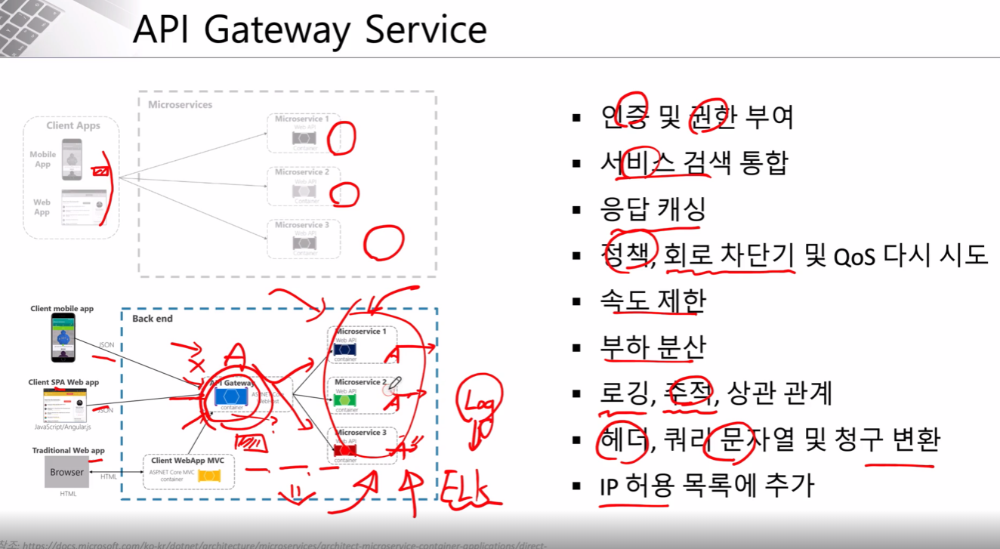

# API Gateway Service
- API Gateway 란 MSA 에서 언급되는 주요 컴포넌트 중 하나이며, 모든 클라이언트 요청에 대한 end-point 를 통합하는 서비스

- 프록시 서버처럼 동작하며, 인증 및 권한, 모니터링, logging 등의 추가적인 기능도 지원

- Spring Cloud Gateway는 클러스터 내부에서 서비스 간의 트래픽을 관리하고, 라우팅, 필터링, 인증 및 권한 부여 등의 역할을 수행합니다.


- Spring boot 3.x부터 Zuul은 현재 지원을 하지 않고 Spring Cloud Gateway 사용
```xml
pom.xml

<dependency>
    <groupId>org.springframework.cloud</groupId>
    <artifactId>spring-cloud-starter-gateway</artifactId>
</dependency>
```
```java
package com.example.apigatewayservice;

import org.springframework.boot.SpringApplication;
import org.springframework.boot.autoconfigure.SpringBootApplication;

@SpringBootApplication
public class ApigatewayServiceApplication {

    public static void main(String[] args) {
        SpringApplication.run(ApigatewayServiceApplication.class, args);
    }

}
```
```yaml
server:
  port: 8000 # 포트

eureka:
  client:
    register-with-eureka: true # 유레카 클라이언트로 정보 등록
    fetch-registry: true # 유레카 클라이언트로 정보 등록
    service-url:
      defaultZone: http://localhost:8761/eureka # 유레카 서버 주소

spring:
  application:
    name: apigateway-service # 서비스 이름
  cloud:
    gateway:
      default-filters:
        - name: GlobalFilter    # 글로벌 필터 지정
          args:
            baseMessage: Spring Cloud Gateway Global Filter
            preLogger: true
            postLogger: true
      routes:       # 서비스 라우팅
        - id: first-service # 서비스 명
          uri: lb://MY-FIRST-SERVICE # 유레카에 등록된 서비스 명
          predicates:
            - Path=/first-service/** # 경로 지정
          filters:  # 필터 지정
#            - AddRequestHeader=first-request, first-request-header2
#            - AddResponseHeader=first-response, first-response-header2
             - CustomFilter
        - id: second-service
          uri: lb://SECOND-SERVICE
          predicates:
            - Path=/second-service/**
          filters:
#            - AddRequestHeader=second-request, second-request-header2
#            - AddResponseHeader=second-response, second-response-header2
             - name: CustomFilter
             - name: LoggingFilter
               args:
                 baseMessage: Hi, there.
                 preLogger: true
                 postLogger: true
        - id: user-service
          uri: lb://USER-SERVICE
          predicates:
            - Path=/user-service/login # 경로
            - Method=POST   # 메소드
          filters:
            - RemoveRequestHeader=Cookie 
            - RewritePath=/user-service/(?<segment>.*), /$\{segment} # 요청 경로에 /user-service 제거
        - id: user-service
          uri: lb://USER-SERVICE
          predicates:
            - Path=/user-service/users
            - Method=POST
          filters:
            - RemoveRequestHeader=Cookie
            - RewritePath=/user-service/(?<segment>.*), /$\{segment}
        - id: user-service
          uri: lb://USER-SERVICE
          predicates:
            - Path=/user-service/**
            - Method=GET
          filters:
            - RemoveRequestHeader=Cookie
            - RewritePath=/user-service/(?<segment>.*), /$\{segment}
        - id: catalog-service
          uri: lb://CATALOG-SERVICE
          predicates:
            - Path=/catalog-service/**
        - id: order-service
          uri: lb://ORDER-SERVICE
          predicates:
            - Path=/order-service/**
```
- 커스텀 필터(사용자 정의 필터)
```java
@Component
@Slf4j
public class CustomFilter extends AbstractGatewayFilterFactory<CustomFilter.Config>{
    public CustomFilter() {
        super(Config.class);
    }

    public static class Config {
        // Put configuration properties here
    }

    @Override
    public GatewayFilter apply(Config config) {
        // Custom Pre Filter
        return (exchange, chain) -> {
            ServerHttpRequest request = exchange.getRequest();
            ServerHttpResponse response = exchange.getResponse();

            log.info("Custom Pre Filter: request id -> {}", request.getId());
            return chain.filter(exchange).then(Mono.fromRunnable(() -> {
                // Custom Post Filter
                log.info("Custom Post Filter: response code -> {}", response.getStatusCode());
            }));
        };

    }
}
- 글로벌 필터
```java
@Component
@Slf4j
public class GlobalFilter extends AbstractGatewayFilterFactory<GlobalFilter.Config>{
    public GlobalFilter() {
        super(Config.class);
    }

    @Data
    public static class Config {
        // Put configuration properties here
        private String BaseMessage;
        private boolean PreLogger;
        private boolean PostLogger;

    }

    @Override
    public GatewayFilter apply(Config config) {
        // Custom Pre Filter
        return (exchange, chain) -> {
            ServerHttpRequest request = exchange.getRequest();
            ServerHttpResponse response = exchange.getResponse();

            log.info("Global Filter baseMessage: {}", config.getBaseMessage());
            if(config.isPreLogger()){
                log.info("Global Filter Start: request id -> {}", request.getId());
            }

            return chain.filter(exchange).then(Mono.fromRunnable(() -> {

                if(config.isPostLogger()){
                    log.info("Global Filter End: response code -> {}", response.getStatusCode());
                }
            }));
        };

    }
}
```
- 로깅 필터
``` java
package com.example.apigatewayservice.filter;

import lombok.Data;
import lombok.extern.slf4j.Slf4j;
import org.springframework.cloud.gateway.filter.GatewayFilter;
import org.springframework.cloud.gateway.filter.OrderedGatewayFilter;
import org.springframework.cloud.gateway.filter.factory.AbstractGatewayFilterFactory;
import org.springframework.core.Ordered;
import org.springframework.http.server.reactive.ServerHttpRequest;
import org.springframework.http.server.reactive.ServerHttpResponse;
import org.springframework.stereotype.Component;
import reactor.core.publisher.Mono;

@Component
@Slf4j
public class LoggingFilter extends AbstractGatewayFilterFactory<LoggingFilter.Config>{
    public LoggingFilter() {
        super(Config.class);
    }

    @Data
    public static class Config {
        // Put configuration properties here
        private String BaseMessage;
        private boolean PreLogger;
        private boolean PostLogger;

    }

    @Override
    public GatewayFilter apply(Config config) {

        GatewayFilter filter = new OrderedGatewayFilter((exchange, chain) -> {
            ServerHttpRequest request = exchange.getRequest();
            ServerHttpResponse response = exchange.getResponse();

            log.info("Logging Filter baseMessage: {}", config.getBaseMessage());
            if(config.isPreLogger()){
                log.info("Logging PRE Filter : request id -> {}", request.getId());
            }

            return chain.filter(exchange).then(Mono.fromRunnable(() -> {

                if(config.isPostLogger()){
                    log.info("Logging POST Filter: response code -> {}", response.getStatusCode());
                }
            }));
        }, Ordered.LOWEST_PRECEDENCE);

        return filter;
    }

}
```
- 인증(JsonWebToken이 정상적인 토큰인지 Parser하여 확인)
``` java
@Component
@Slf4j
public class AuthorizationHeaderFilter extends AbstractGatewayFilterFactory<AuthorizationHeaderFilter.Config> {
    Environment env;

    public AuthorizationHeaderFilter(Environment env) {
        super(Config.class);
        this.env = env;
    }

    public static class Config {
        // Put configuration properties here
    }

    @Override
    public GatewayFilter apply(Config config) {
        return (exchange, chain) -> {
            ServerHttpRequest request = exchange.getRequest();

            if (!request.getHeaders().containsKey(HttpHeaders.AUTHORIZATION)) {
                return onError(exchange, "No authorization header", HttpStatus.UNAUTHORIZED);
            }

            String authorizationHeader = request.getHeaders().get(HttpHeaders.AUTHORIZATION).get(0);
            String jwt = authorizationHeader.replace("Bearer ", "");

            if (!isJwtValid(jwt)) {
                return onError(exchange, "JWT token is not valid", HttpStatus.UNAUTHORIZED);
            }

            return chain.filter(exchange);
        };
    }

    private Mono<Void> onError(ServerWebExchange exchange, String err, HttpStatus httpStatus) {
        ServerHttpResponse response = exchange.getResponse();
        response.setStatusCode(httpStatus);
        log.error(err);

        byte[] bytes = "The requested token is invalid.".getBytes(StandardCharsets.UTF_8);
        DataBuffer buffer = exchange.getResponse().bufferFactory().wrap(bytes);
        return response.writeWith(Flux.just(buffer));
    }

    private boolean isJwtValid(String jwt) {
        byte[] secretKeyBytes = Base64.getEncoder().encode(env.getProperty("token.secret").getBytes());
        SecretKey signingKey = new SecretKeySpec(secretKeyBytes, SignatureAlgorithm.HS512.getJcaName());

        boolean returnValue = true;
        String subject = null;

        try {
            JwtParser jwtParser = Jwts.parserBuilder()
                    .setSigningKey(signingKey)
                    .build();

            subject = jwtParser.parseClaimsJws(jwt).getBody().getSubject();
        } catch (Exception ex) {
            returnValue = false;
        }

        if (subject == null || subject.isEmpty()) {
            returnValue = false;
        }

        return returnValue;
    }

}
```