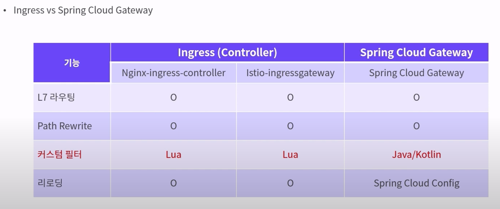

# Spring Cloud Gateway vs Istio Ingress 
**Istio Ingress**와 **Spring Cloud Gateway**는 둘 다 마이크로서비스 아키텍처에서 외부 요청을 처리하고 라우팅하는 데 사용되지만, 그 사용 목적과 기능은 다소 차이가 있습니다. 이 두 솔루션을 비교하면서, 각 솔루션이 어느 상황에서 더 적합한지에 대해 설명하겠습니다.

### NHN에서 설명한 자료

- 커스텀 필터(인증 등)가 중요할 경우 친숙한 자바나 코틀린을 지원하는 스프링 클라우드 게이트웨이 사용

### 기본 개념 비교

| **특징**                    | **Istio Ingress (Istio Gateway)**                        | **Spring Cloud Gateway**                         |
|-----------------------------|---------------------------------------------------------|-------------------------------------------------|
| **레벨**                    | 네트워크 레벨 (L4/L7)                                   | 애플리케이션 레벨 (L7)                          |
| **주요 역할**               | 트래픽 라우팅, 보안(인증/인가), 트래픽 제어, 로드 밸런싱  | API 게이트웨이, 필터링, 인증/인가, 라우팅        |
| **기반 아키텍처**            | Envoy Proxy를 사용한 서비스 메쉬                        | Spring Boot 및 Spring Cloud 에코시스템           |
| **설치 위치**               | 클러스터 외부 트래픽을 네트워크 레벨에서 제어             | 애플리케이션 내부에서 트래픽을 필터링하고 제어   |
| **보안 기능**               | mTLS, JWT 인증, Role-based 접근 제어                    | Spring Security와 연동한 인증/인가              |

### 주요 기능 비교

#### 1. **트래픽 관리 및 라우팅**
- **Istio Ingress (Istio Gateway)**
  - Istio는 **VirtualService**와 **DestinationRule**을 사용하여 HTTP, gRPC, TCP 등 다양한 프로토콜을 기반으로 트래픽 라우팅을 세밀하게 제어할 수 있습니다.
  - A/B 테스트, 카나리 배포, 트래픽 스플리팅, 서킷 브레이킹 등 고급 트래픽 관리 기능을 제공합니다.
  - 네트워크 레벨에서의 로드 밸런싱과 트래픽 제어가 뛰어나며, 이를 통해 서비스 간의 트래픽을 효율적으로 분배할 수 있습니다.

- **Spring Cloud Gateway**
  - Spring Cloud Gateway는 경로, HTTP 메서드, 헤더, 파라미터 등의 조건에 따라 **세밀한 라우팅 규칙**을 설정할 수 있습니다.
  - 애플리케이션 레벨에서의 API 라우팅이 주된 역할이며, 세밀한 필터링과 데이터 변환이 가능합니다.
  - 로드 밸런싱은 기본적으로 Spring Cloud LoadBalancer와 통합하여 이루어집니다.

#### 2. **필터링 기능**
- **Istio Ingress (Istio Gateway)**
  - Istio는 **Envoy 필터**와 **WebAssembly(WASM)**를 사용하여 네트워크 레벨에서 트래픽을 필터링할 수 있습니다.
  - 기본적으로 Lua 스크립트나 WASM을 사용하여 요청 및 응답을 처리할 수 있으며, 이러한 필터는 네트워크 성능에 최적화되어 있습니다.
  - 트래픽을 네트워크 레벨에서 제어하기 때문에 애플리케이션 코드와 독립적입니다.

- **Spring Cloud Gateway**
  - Spring Cloud Gateway는 **커스텀 필터**를 사용하여 요청 및 응답을 세밀하게 조작할 수 있습니다.
  - Spring Security와 통합하여 애플리케이션 레벨에서의 인증/인가, 데이터 변환, 로깅, 모니터링을 쉽게 구현할 수 있습니다.
  - Java 코드로 관리할 수 있어 비즈니스 로직과의 연동이 매우 용이하며, 복잡한 로직 구현에 적합합니다.

#### 3. **보안**
- **Istio Ingress (Istio Gateway)**
  - Istio는 **Mutual TLS (mTLS)**, JWT 인증, 정책 기반 접근 제어, 그리고 Role-based 접근 제어를 네이티브로 지원합니다.
  - 네트워크 레벨에서 강력한 보안 설정이 가능하며, 서비스 간 통신을 자동으로 암호화합니다.
  - 중앙 집중식 보안 관리로 보안 정책을 서비스 전체에 일관되게 적용할 수 있습니다.

- **Spring Cloud Gateway**
  - Spring Security와의 통합을 통해 다양한 인증/인가 메커니즘(JWT, OAuth2, Basic Auth 등)을 쉽게 구현할 수 있습니다.
  - 요청과 응답을 애플리케이션 레벨에서 세밀하게 제어할 수 있어 사용자 정의 보안 로직을 구현하는 데 용이합니다.
  - 보안 로직을 쉽게 확장하고 변경할 수 있어 다양한 비즈니스 요구사항에 유연하게 대응할 수 있습니다.

### 확장성 및 성능 비교

| **측면**                     | **Istio Ingress (Istio Gateway)**                        | **Spring Cloud Gateway**                         |
|------------------------------|---------------------------------------------------------|-------------------------------------------------|
| **확장성**                   | 네트워크 레벨에서 대규모 트래픽 처리에 최적화            | 애플리케이션 레벨에서 확장성 제약이 있을 수 있음 |
| **성능**                     | 네트워크 레벨에서 동작하여 낮은 오버헤드와 높은 성능 제공 | 추가적인 필터링과 로깅으로 인해 오버헤드 발생 가능 |
| **로드 밸런싱**               | 네이티브 로드 밸런싱 및 복잡한 트래픽 제어 제공          | Spring Cloud LoadBalancer와의 기본 통합          |

### 언제 Istio Ingress (Istio Gateway)를 선택해야 할까?
- **네트워크 레벨**에서의 고급 트래픽 관리와 성능 최적화가 필요할 때.
- **Mutual TLS(mTLS)**와 같은 네트워크 보안 기능이 필수적일 때.
- 대규모 마이크로서비스 아키텍처에서 일관된 보안 정책과 트래픽 관리가 필요한 경우.
- A/B 테스트, 카나리 배포, 트래픽 스플리팅 등 고급 기능이 필요할 때.

### 언제 Spring Cloud Gateway를 선택해야 할까?
- **세밀한 인증 및 커스텀 필터링 로직**이 애플리케이션 레벨에서 필요한 경우.
- Spring 생태계와 깊은 통합이 요구되며, Spring Boot 및 Spring Security를 활용하고자 할 때.
- API 게이트웨이 역할이 주로 인증/인가, 데이터 변환, 로깅 등의 필터링에 집중될 때.
- 고급 필터링과 사용자 정의 로직을 애플리케이션 레벨에서 구현하고자 할 때.

### 결론
- **Istio Ingress (Istio Gateway)**는 네트워크 레벨에서의 강력한 트래픽 관리, 보안, 확장성을 제공하며, 대규모 트래픽 환경에서 성능 최적화에 유리합니다.
- **Spring Cloud Gateway**는 애플리케이션 레벨에서 고급 필터링과 인증/인가 기능을 제공하며, Spring 생태계와 통합된 애플리케이션에서 유리합니다.

따라서, **네트워크 보안 및 트래픽 관리**가 중요한 경우에는 **Istio Ingress**가 더 적합하며, **애플리케이션 레벨에서의 필터링**과 **인증 로직**이 중요하다면 **Spring Cloud Gateway**를 사용하는 것이 더 좋습니다. 두 솔루션은 상호 보완적으로 함께 사용할 수도 있습니다. 예를 들어, Istio를 네트워크 레벨의 트래픽 제어 및 보안을 위해 사용하고, Spring Cloud Gateway를 내부 API 게이트웨이로 사용하여 애플리케이션 레벨의 필터링과 인증을 처리할 수 있습니다.