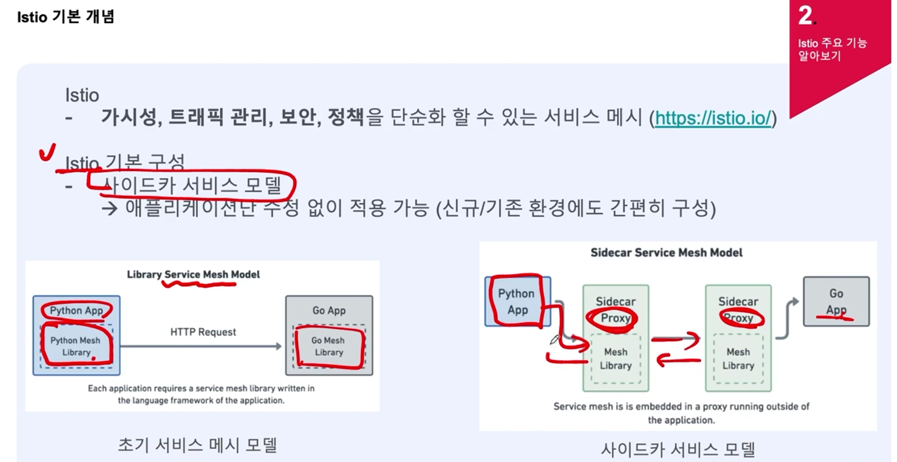
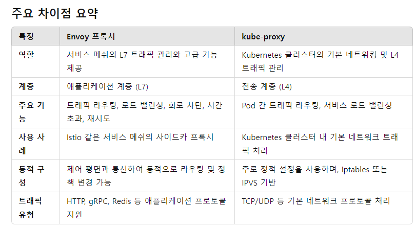
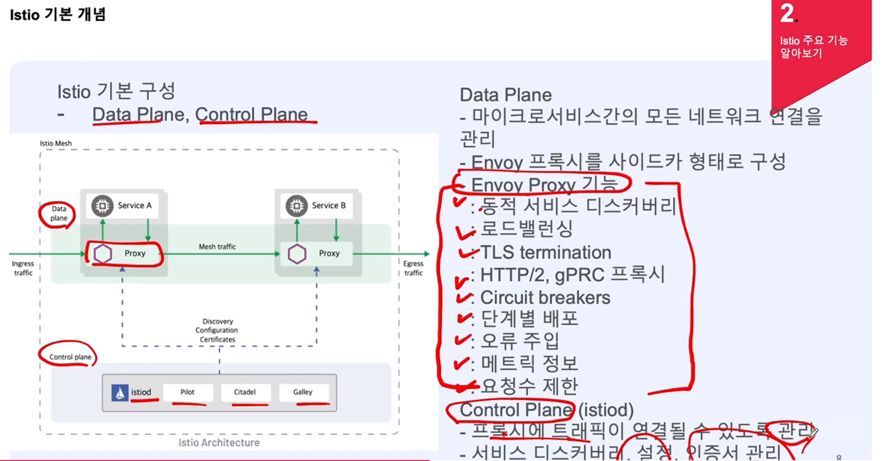
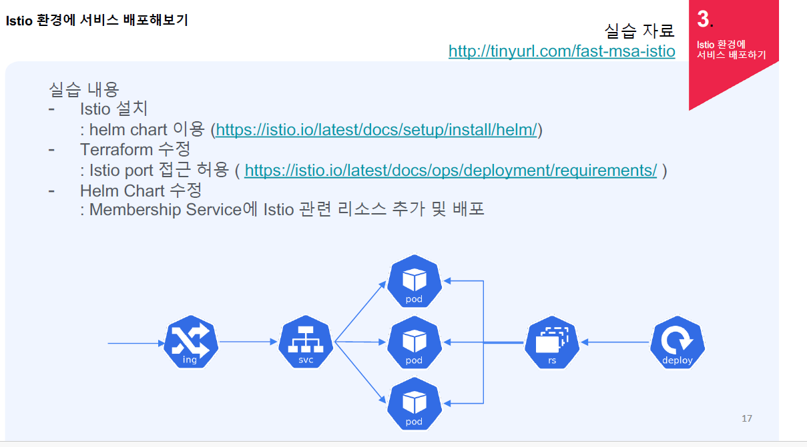
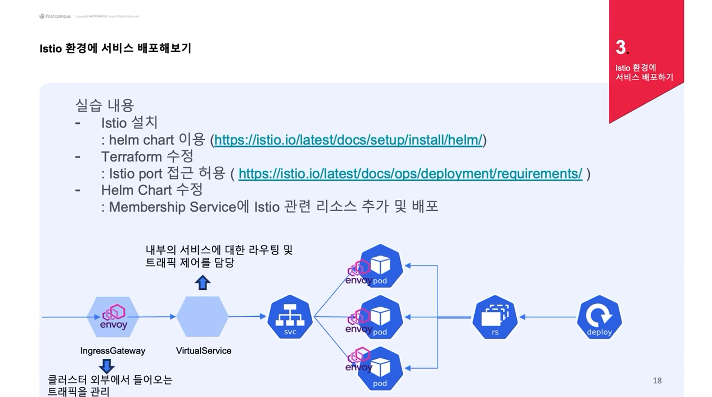
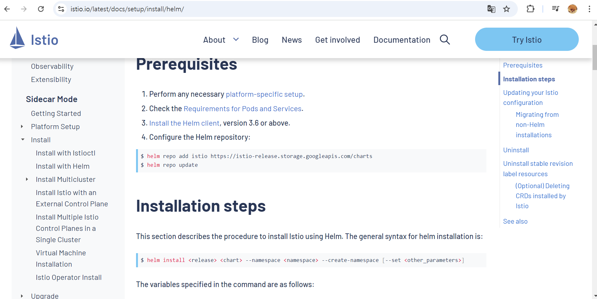
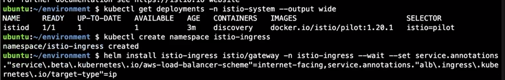
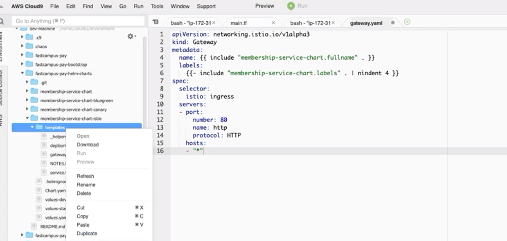
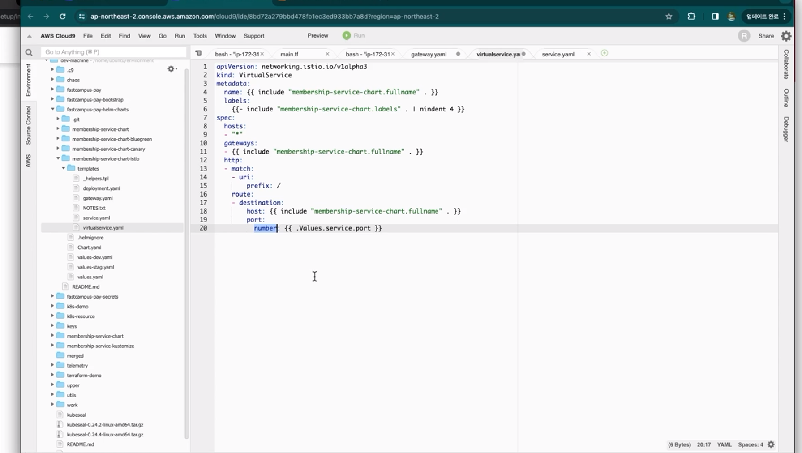
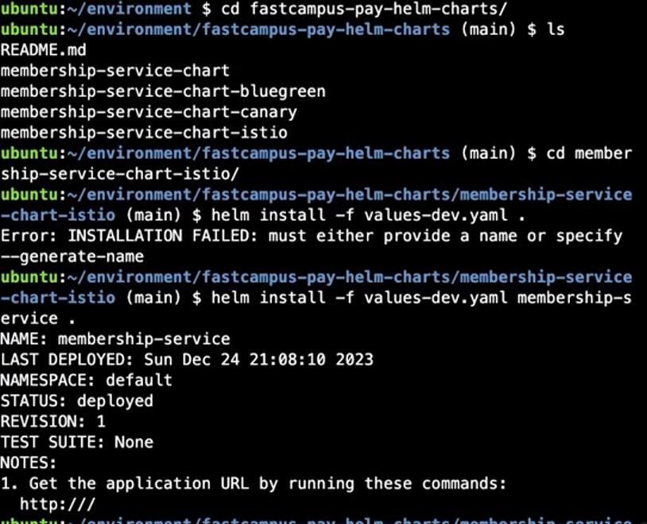

# Istio
- 가시성, 트래픽 관리, 보안, 정책을 단순화할 수 있는 서비스 메시
- 사이드카 서비스 모델
  - 애플리케이션 단 수정 없이 적용 가능 (신규/기존 환경에도 간편히 구성)
  - 각 서비스 애플리케이션 앞단에 Envoy 프록시가 있어 해당 부분을 사용하여 통신
  - 애플리케이션의 네트워크 트래픽을 관리합니다.
  - 사이드카 프록시는 Mesh Library를 사용하여 서비스 메쉬의 트래픽 제어, 보안, 정책 적용 등의 기능을 수행
  - pod 구성이 될 때 사이드카 프록시 구성






## Istio 구성
  - Data Plane
    - 마이크로서비스간의 모든 네트워크 연결을 관리
    - Envoy 프록시를 사이드카 형태로 구성
    - Envoy Proxy 기능
      : 동적 서비스 디스커버리
      : 로드밸런싱
      : TLS termination
      : HTTP/2, gPRC 프록시
      : Circuit breakers 
      : 단계별 배포
      : 오류 주입
      : 메트릭 정보
      : 요청수 제한
  - Control Plane (istiod)
    - 프록시에 트래픽이 연결될 수 있도록 관리
    - 서비스 디스커버리, 설정, 인증서 관리



## Istio 주요 기능
- Istio 주요 기능 : 트래픽 관리
  - 트래픽 분리
    - 복수개의 버전으로 트래픽을 라우팅할 수 있음
    - 활용 예) A/B Test, Canary 배포, Blue/green 배포 등
    - Canary 배포는 새로운 소프트웨어 버전을 배포할 때 점진적으로 배포하여 시스템의 안정성을 평가하고, 잠재적인 문제를 빠르게 감지할 수 있도록 하는 배포 전략
    - 블루-그린 배포는 두 개의 환경(블루와 그린) 중 하나에서 전체 전환하는 배포 전략

- Istio 주요 기능 : 트래픽 관리
  - 실패 주입 : 애플리케이션 테스트를 위한 네트워크 레벨의 장애 주입 딜레이 주입, 연결 실패 주입 -> 어플리케이션 실패의 일부 케이스를 모사 가능

- Istio 주요 기능 : 트래픽 관리
  - Circuit Breaker : Istio의 사이드카 프록시(주로 Envoy)를 통해 애플리케이션 트래픽을 제어하며, 네트워크 요청의 상태를 모니터링하고 실패가 감지되면 요청을 차단합니다.
  - 스프링 클라우드 Spring Cloud Resilience (Resilience4j, Hystrix)
동작 방식 : 애플리케이션 코드 내부에서 네트워크 요청을 감싸고, 요청이 실패하거나 시간이 초과될 때 회로를 열어 더 이상의 요청을 보내지 않도록 제어합니다.
  - 애플리케이션 코드 수정 없이 빠르게 배포하고 싶을 때: Istio Circuit Breaker를 사용하는 것이 더 나을 수 있습니다.
Istio는 애플리케이션 레벨이 아니라 네트워크 레벨에서 동작하기 때문에, 언어에 관계없이 모든 마이크로서비스에 일관되게 적용할 수 있습니다.
  - 코드에서 세밀한 제어가 필요할 때: Spring Cloud Resilience(Resilience4j, Hystrix 등)를 사용하는 것이 좋습니다.
코드 내부에서 트랜잭션에 따라 회로 차단을 보다 세밀하게 제어할 수 있으며, 복잡한 비즈니스 로직과 통합할 수 있습니다.
  - 둘 다 사용하는 경우: 복잡한 마이크로서비스 아키텍처에서는 Istio와 Spring Cloud Resilience를 함께 사용하여 멀티 레이어 보호를 설정할 수 있습니다.
Istio는 네트워크 레벨에서 전체적인 트래픽을 제어하고, Spring Cloud Resilience는 애플리케이션 레벨에서 세밀한 요청 제어와 회복 패턴을 관리합니다.

## Istio 환경에 서비스 배포




- Istio 설치
  - helm chart 이용 (https://istio.io/latest/docs/setup/install/helm/)
 
  
```
  헬름 차트 등록 및 업데이트
  $ helm repo add istio https://istio-release.storage.googleapis.com/charts
  $ helm repo update
  네임스페이스 생성
  kubectl create namespace istio-system 

  Istio base 설치(Istio 동작에 관련한 컨트롤 리소스)
  helm install istio-base istio/base -n istio-system --set defaultRevision=default

  생성 확인
  $ helm ls -n istio-system

  컨트롤 플레인의 역할을 하는 Istiod 설치
  helm install istiod istio/istiod -n istio-system --wait

  설치 확인
  helm ls -n istio-system

  Istiod 동작 확인
  kubectl get deployments -n istio-system --output wide

  Ingress 설치
  kubectl create namespace istio-ingress
  helm install istio-ingress istio/gateway -n istio-ingress --wait --set service.annotation."로드밸런서 컨트롤러

```
 
- gateway.yaml
 
- virtualservice.yaml


- 디폴트 네임스페이스에 생성되는 파드들을 사이드카를 자동으로 주입
```
kubectl label namespace default istio-injection=enabled
```
- 어플리케이션 디플로이


- 요청 지연 발생 방법
  - virtualservice에서 fault를 만들고 delay : percentage: value:50 (절반 딜레이)
  - fixedDelay : 3s

