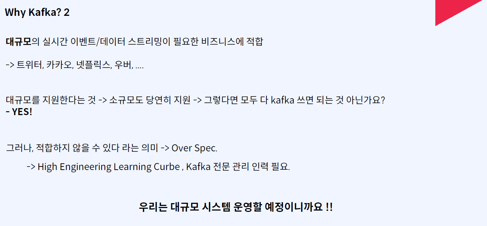
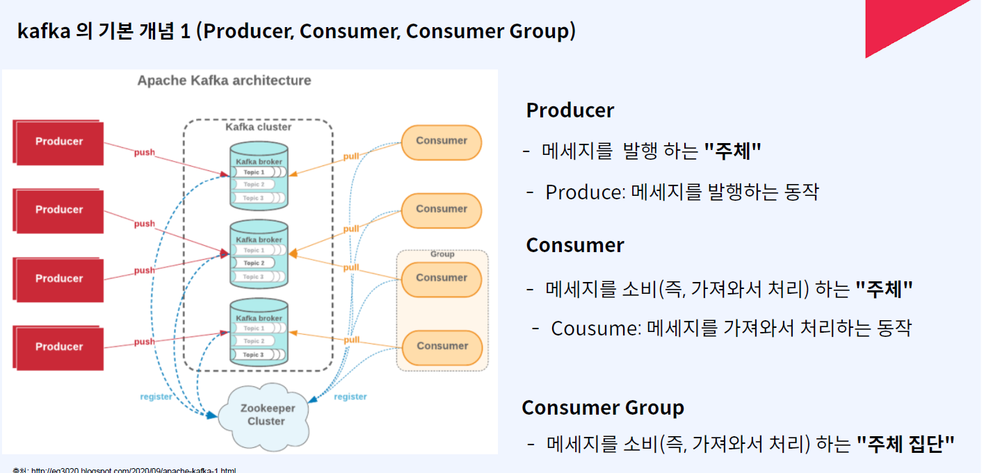
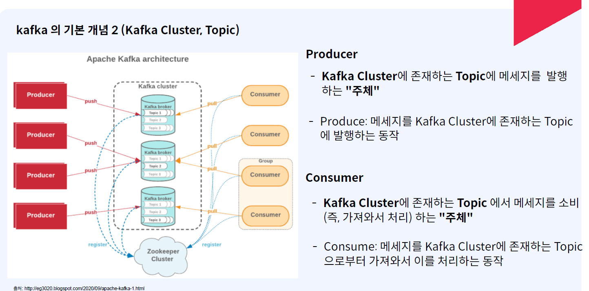
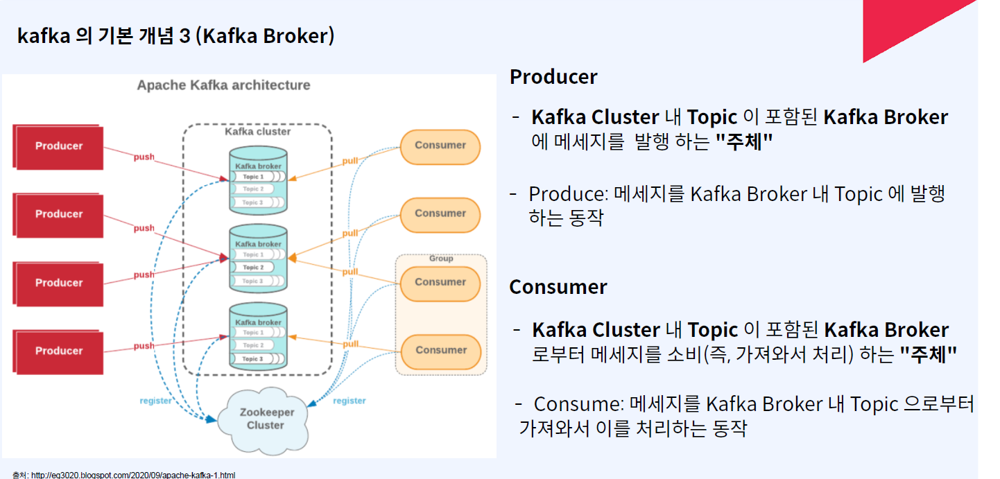
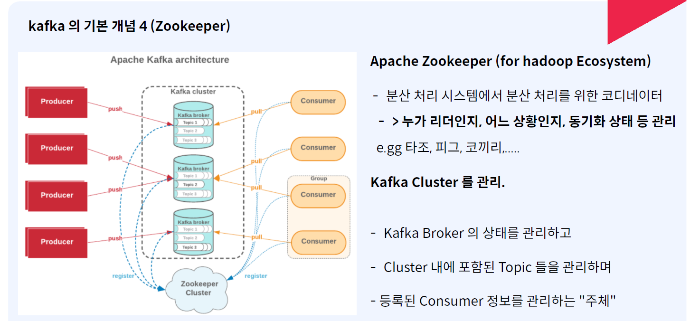
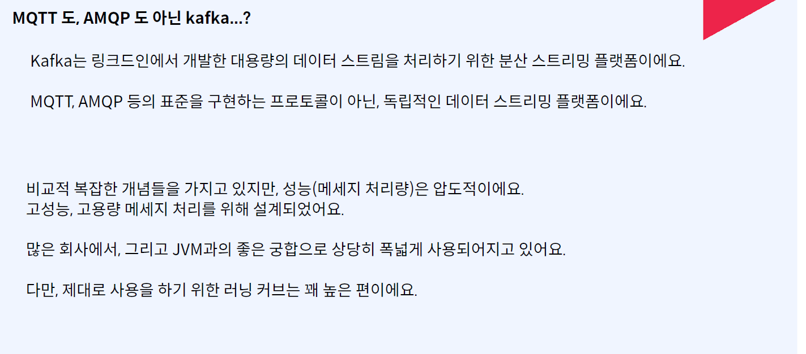

# Kafka를 이용한 데이터베이스 동기화 및 아키텍처 구성

## Kafka란
실시간으로 스트리밍 데이터를 수집하고 처리하는 데 최적화된 분산 스트리밍 플랫폼







- 서비스 데이터 동기화 문제
    - 동일한 서비스를 수평적으로 확장할 때 데이터베이스에 저장되는 데이터의 동기화 문제가 발생할 수 있습니다.
    - 데이터 동기화 문제를 해결하는 방법:
        - 하나의 데이터베이스 사용: 트랜잭션 관리를 통해 데이터 일관성을 유지.
        - 데이터베이스 동기화: Apache Kafka를 사용하여 데이터를 동기화.
        - Kafka + 단일 데이터베이스: 서비스 -> Kafka -> 데이터베이스로 데이터 흐름을 관리.

## Kafka를 이용한 데이터 흐름
- Kafka를 사용하여 실시간 데이터 피드를 관리하고 높은 처리량과 낮은 지연 시간을 제공합니다.
- 데이터 전송에 있어 전송하는 쪽은 Producer, 데이터를 받는 쪽은 Consumer로 역할을 나눕니다.
- Kafka는 여러 대의 서버(클러스터)로 구성하며, Zookeeper를 사용하여 서버 간의 코디네이터 역할을 수행합니다.

## Kafka 설치 및 실행
- Zookeeper 실행
```
C:\kafka>bin\windows\zookeeper-server-start.bat config\zookeeper.properties
```
- Kafka 실행
```
C:\kafka>bin\windows\kafka-server-start.bat config\server.properties
```
- 메시지 생산 (Producer)
```
C:\kafka>bin\windows\kafka-console-producer.bat --broker-list localhost:9092 --topic quickstart-events
```
- 메시지 소비 (Consumer)
```
C:\kafka>bin\windows\kafka-console-consumer.bat --bootstrap-server localhost:9092 --topic quickstart-events
```

## Kafka Connect를 이용한 데이터 이동
- Kafka Connect를 사용하여 코드 작성 없이 데이터를 임포트 및 익스포트할 수 있습니다.
- 데이터 이동 아키텍처
```
소스 시스템 -> Kafka Connect Source -> Kafka 클러스터 -> Kafka Connect Sink -> 타겟 시스템
```

## Kafka와 MariaDB 연동 설정
- MariaDB 설치: mariadb.org
- Kafka Connect 설치: Confluent Kafka Connect
- JDBC 커넥터 설치: Confluent JDBC Connector

## Kafka Connect 설정 예시
- connect-distributed.properties 파일에서 jdbc 경로 설정
```
plugin.path=C\\confluentinc-kafka-connect-jdbc-10.7.12\\lib
```
## Source Connector 설정
- Source Connector를 설정하여 MariaDB에서 데이터를 읽어 Kafka로 전송
```json
{
    "name" : "my-source-connect",
    "config" : {
        "connector.class" : "io.confluent.connect.jdbc.JdbcSourceConnector",
        "connection.url":"jdbc:mysql://localhost:3307/mydb",
        "connection.user":"root",
        "connection.password":"test1357",
        "mode": "incrementing",
        "incrementing.column.name" : "id",
        "table.whitelist":"users", 
        "topic.prefix" : "my_topic_",
        "tasks.max" : "1"
    }
}
```
## Sink Connector 설정
- Sink Connector를 설정하여 Kafka 데이터를 타겟 시스템으로 전송
```json
{
    "name":"my-sink-connect",
    "config":{
        "connector.class":"io.confluent.connect.jdbc.JdbcSinkConnector",
        "connection.url":"jdbc:mysql://localhost:3307/mydb",
        "connection.user":"root",
        "connection.password":"test1357",
        "auto.create":"true",
        "auto.evolve":"true",
        "delete.enabled":"false",
        "tasks.max":"1",
        "topics":"my_topic_users"
    }
}
```
## Kafka Producer와 Consumer 설정
- Producer 설정
```java
@Bean
public ProducerFactory<String, String> producerFactory() {
    Map<String, Object> properties = new HashMap<>();
    properties.put(ProducerConfig.BOOTSTRAP_SERVERS_CONFIG, "127.0.0.1:9092");
    properties.put(ProducerConfig.KEY_SERIALIZER_CLASS_CONFIG, StringSerializer.class);
    properties.put(ProducerConfig.VALUE_SERIALIZER_CLASS_CONFIG, StringSerializer.class);
    return new DefaultKafkaProducerFactory<>(properties);
}
```
## Consumer 설정
```java
@Bean
public ConsumerFactory<String, String> consumerFactory() {
    Map<String, Object> properties = new HashMap<>();
    properties.put(ConsumerConfig.BOOTSTRAP_SERVERS_CONFIG, "127.0.0.1:9092");
    properties.put(ConsumerConfig.GROUP_ID_CONFIG, "consumerGroupId");
    properties.put(ConsumerConfig.AUTO_OFFSET_RESET_CONFIG, "earliest");
    properties.put(ConsumerConfig.KEY_DESERIALIZER_CLASS_CONFIG, StringDeserializer.class);
    properties.put(ConsumerConfig.VALUE_DESERIALIZER_CLASS_CONFIG, StringDeserializer.class);
    return new DefaultKafkaConsumerFactory<>(properties);
}
```
## Kafka Data Transfer Object (DTO) 클래스 예시
- KafkaOrderDto 클래스 정의
```java
@Data
@AllArgsConstructor
public class KafkaOrderDto implements Serializable {
    private Schema schema;
    private Payload payload;
}
```
- Schema 클래스
```java
@Data
@Builder
public class Schema {
    private String type;
    private List<Field> fields;
    private boolean optional;
    private String name;
}
```
- Field 클래스
```java
@Data
@AllArgsConstructor
public class Field {
    private String type;
    private boolean optional;
    private String field;
}
```
- Payload 클래스
```java
@Data
@Builder
public class Payload {
    private String order_id;
    private String user_id;
    private String product_id;
    private int qty;
    private int unit_price;
    private int total_price;
}
```
## 데이터 전송 예시
- OrderProducer 클래스에서 데이터를 Kafka로 전송
```java
@EnableKafka
@Configuration
public class KafkaProducerConfig {
    @Bean
    public ProducerFactory<String, String> producerFactory() {
        Map<String, Object> properties = new HashMap<>();
        properties.put(ProducerConfig.BOOTSTRAP_SERVERS_CONFIG, "127.0.0.1:9092");
        properties.put(ProducerConfig.KEY_SERIALIZER_CLASS_CONFIG, StringSerializer.class);
        properties.put(ProducerConfig.VALUE_SERIALIZER_CLASS_CONFIG, StringSerializer.class);

        return new DefaultKafkaProducerFactory<>(properties);
    }

    @Bean
    public KafkaTemplate<String, String> kafkaTemplate() {
        return new KafkaTemplate<>(producerFactory());
    }
}
```
```java
@Autowired
public OrderProducer(KafkaTemplate<String, String> kafkaTemplate) {
    this.kafkaTemplate = kafkaTemplate;
}

public OrderDto send(String topic, OrderDto orderDto) {
    Payload payload = Payload.builder()
            .order_id(orderDto.getOrderId())
            .user_id(orderDto.getUserId())
            .product_id(orderDto.getProductId())
            .qty(orderDto.getQty())
            .unit_price(orderDto.getUnitPrice())
            .total_price(orderDto.getTotalPrice())
            .build();

    KafkaOrderDto kafkaOrderDto = new KafkaOrderDto(schema, payload);
    ObjectMapper mapper = new ObjectMapper();
    String jsonInString = "";

    try {
        jsonInString = mapper.writeValueAsString(kafkaOrderDto);
    } catch(JsonProcessingException ex) {
        ex.printStackTrace();
    }

    kafkaTemplate.send(topic, jsonInString);
}
```
```json
{
    "name":"my-order-connect",
    "config":{
        "connector.class":"io.confluent.connect.jdbc.JdbcSinkConnector",
        "connection.url":"jdbc:mysql://localhost:3307/mydb",
        "connection.user":"root",
        "connection.password":"test1357",
        "auto.create":"true",
        "auto.evolve":"true",
        "delete.enabled":"false",
        "tasks.max":"1",
        "insert.mode":"upsert",  // upsert 모드로 설정
        "pk.mode":"record_key",  // Kafka 메시지의 키를 DB의 Primary Key로 사용
        "pk.fields":"order_id",   // Primary Key로 사용할 필드명 (DB의 필드 이름)
        "topics":"orders"
    }
}
```

- 예시처럼 DTO클래스를 직렬화하여 사용 가능
``` java
@Data
public class OrderDto implements Serializable {
    private String productId;
    private Integer qty;
    private Integer unitPrice;
    private Integer totalPrice;

    private String orderId;
    private String userId;
}

...

이걸 그냥 jsonInString = mapper.writeValueAsString(orderDto);

...

해서 kafkaTemplate.send(topic, jsonInString);
```

## 아키텍처 구성

- 주요 구성 요소
    - 오더 서비스 -> Kafka -> 데이터베이스 순서로 데이터 전송
    - Kafka를 사용하여 Producer에서 데이터를 큐잉하고, Consumer가 이를 수신하여 데이터베이스에 저장
- @EnableKafka: Kafka 사용 설정
- @KafkaListener: 특정 토픽을 리스닝하여 데이터를 수신

## 카프카 yaml파일을 이용한 설정
- application.yaml
``` yaml
spring:
  datasource:
    driver-class-name: com.mysql.cj.jdbc.Driver
    url: jdbc:mysql://${MYSQL_HOST}:${MYSQL_PORT}/sns
    username: ${MYSQL_USER}
    password: ${MYSQL_PASSWORD}
  kafka:
    bootstrap-servers: ${KAFKA_HOST}:${KAFKA_PORT}
    properties:
      security:
        protocol: ${KAFKA_SASL_PROTOCOL}
      sasl:
        mechanism: ${KAFKA_SASL_MECHANISM}
        jaas:
          config:
            org.apache.kafka.common.security.scram.ScramLoginModule required username="${KAFKA_USER}" password="${KAFKA_PASSWORD}";
    producer:
      key-serializer: org.apache.kafka.common.serialization.StringSerializer
      value-serializer: org.apache.kafka.common.serialization.StringSerializer
```
- configMap.yaml
``` yaml
apiVersion: v1
kind: ConfigMap
metadata:
  name: kafka-config
  namespace: sns
data:
  KAFKA_HOST: "kafka.infra.svc.cluster.local"
  KAFKA_PORT: "9092"
  KAFKA_SASL_PROTOCOL: "SASL_PLAINTEXT"
  KAFKA_SASL_MECHANISM: "PLAIN"
```    
- secret.yaml
``` yaml
apiVersion: v1
kind: ConfigMap
metadata:
  name: kafka-config
  namespace: sns
data:
  KAFKA_HOST: "kafka.infra.svc.cluster.local"
  KAFKA_PORT: "9092"
  KAFKA_SASL_PROTOCOL: "SASL_PLAINTEXT"
  KAFKA_SASL_MECHANISM: "PLAIN"
```
