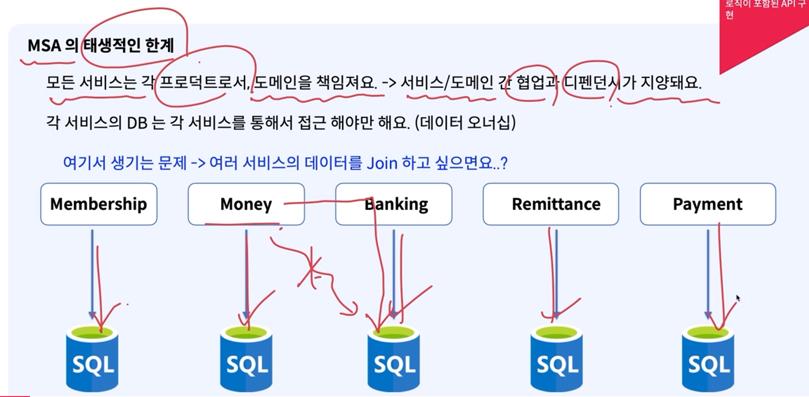
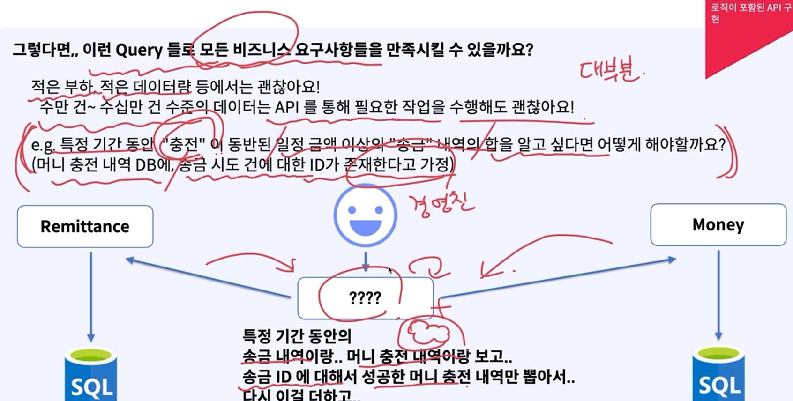
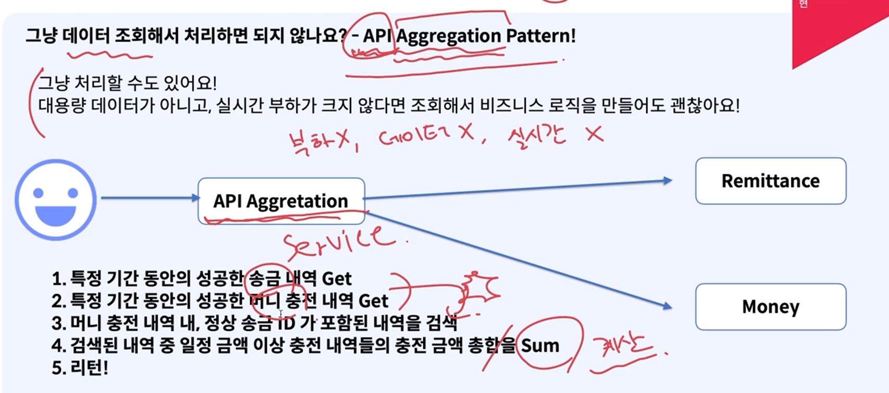
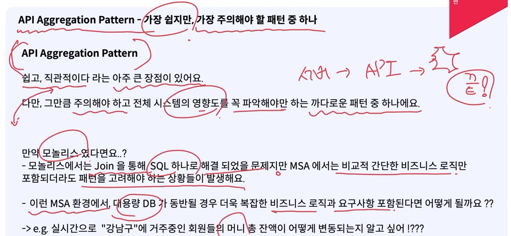
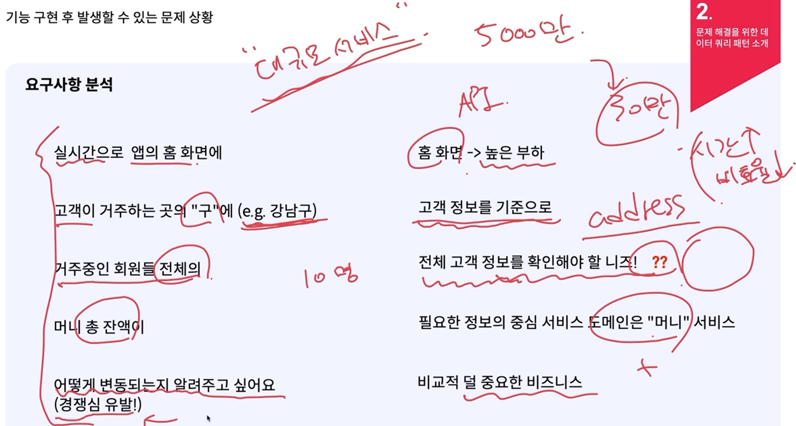
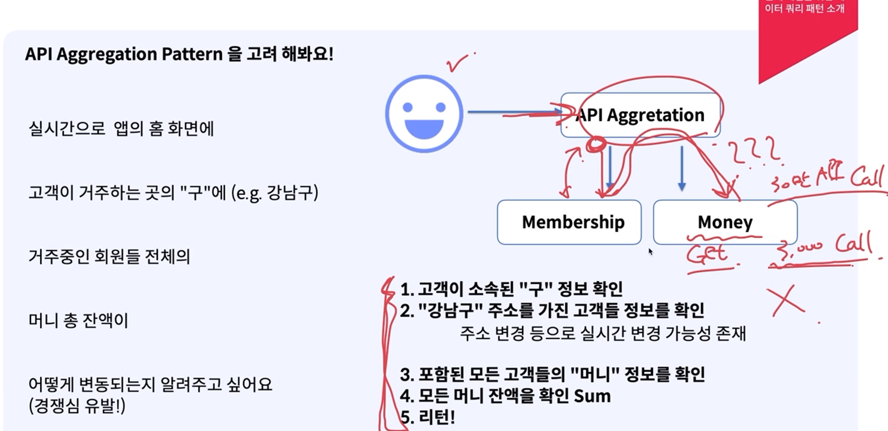
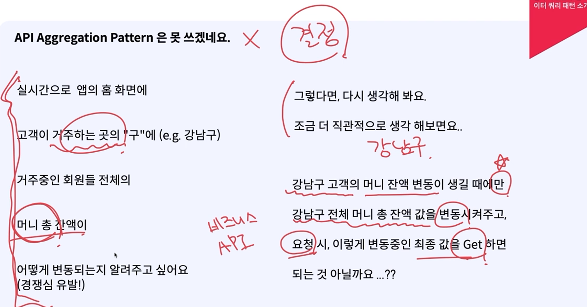
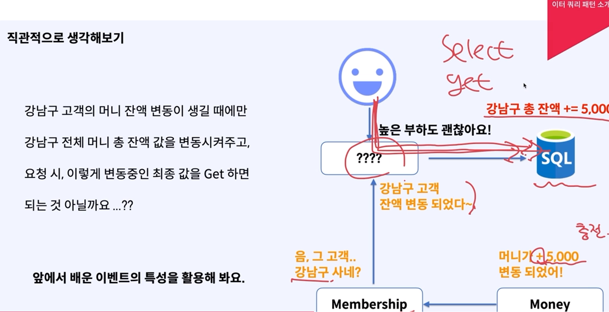
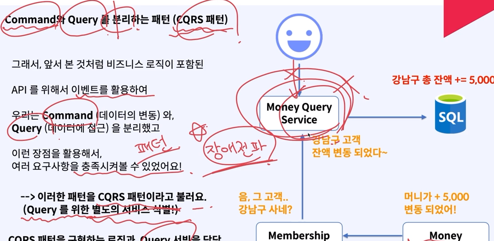

# MSA 환경에서 데이터 쿼리

### MSA의 한계
- 모든 서비스는 각 프로덕트로서, 도메인을 책임져요. -> 서비스/도메인 간 협업과 디펜던시가 지양
- 각 서비스의 DB 는 각 서비스를 통해서 접근 해야만 해요. (데이터 오너십)

    

- 여러 서비스의 데이터를 Join을 하지 못함(MSA 원칙으로 인하여)

### 비즈니스 요구사항이 복잡할 경우
- 여러번 호출해서 필요한 정보들을 만든다음 리턴(매우 복잡)
    

### API Aggregation Pattern
- API를 여러개를 사용해서 가져온 데이터들을 가공을 통한 정보를 만드는 것
    

- 주의할 점
    - 비즈니스 로직이 포함된 API 호출 빈도 파악
        -   너무 자주 호출되는 경우라면, Aggregation을 위한 각 서비스의 API 가 부하를 받기 어려움
        - 대용량 DB의 경우, 추가적으로 호출되는 API 로 인해 DB의 부하 또는 다른 서비스들에 장애를 전파 가능성 존재

    - Aggregation API의 중요도
        - 여러번의 API 호출 중, 한 번이라도 실패 시 그 호출은 실패가 되어야 해요. 이를 고려
        - 그리고 여러번의 호출로 인해, 다른 서비스 API 보다 훨씬 긴 Latency 를 가지게 될 것
        - N번 호출 + 내부 로직 실행 시간
    

### 문제 상황 예시
- 요구 사항 분석
    
    - 비효율적 + 많은 부하
    
    - 구에 인원이 30만명일경우 30만번 api call, 100건씩 묶어도 3,000번 api call하는 상황
- 다른 관점으로 생각
    

    

### Command와 Query 를 분리하는 패턴 (CQRS 패턴)
- 비즈니스 로직이 포함된 API 를 위해서 이벤트를 활용하여 우리는 Command (데이터의 변동) 와 Query (데이터에 접근) 을 분리
    

<details>
<summary>예시</summary>
**CQRS 패턴**을 사용하는 것은 **조인문을 해결하는 방법** 중 하나로 유용할 수 있습니다. 특히 **MSA(Microservices Architecture)** 환경에서 **조인**을 사용하는 상황을 해결하기 위해, **CQRS**는 **읽기와 쓰기 작업을 분리**하고, **읽기 전용 데이터 저장소**를 사용하는 방식으로 **복잡한 조인 문제**를 해결할 수 있습니다.

### 1. **조인 문제와 MSA에서의 어려움**

#### MSA에서의 조인 문제:
- **모놀리식** 애플리케이션에서는 다양한 테이블 간의 **조인(join)**을 사용하여 **복잡한 조회 쿼리**를 쉽게 처리할 수 있습니다. 하지만 **MSA**로 전환할 경우, **각 서비스가 개별적으로 자신의 데이터베이스**를 관리하고 있기 때문에, **서비스 간 조인**이 직접적으로 불가능합니다.
- 예를 들어, **Order Service**와 **User Service**가 각각 **자신의 데이터베이스**를 사용하고 있을 때, 두 서비스의 테이블을 조인하는 **단일 SQL 쿼리**를 사용할 수 없습니다.

### 2. **CQRS로 조인 문제 해결**

CQRS 패턴을 활용하면 **조인 문제**를 **데이터 읽기 쪽**에서 해결할 수 있습니다. **읽기 저장소**를 조인 쿼리로 구성하여 **비동기적으로 데이터를 미리 준비**해두고, 실제 조회 시 **빠르게 읽어오는 방식**을 사용할 수 있습니다.

### 방법 1: **읽기 저장소에서 데이터 Denormalization**
- **CQRS 패턴**에서는 **읽기 모델과 쓰기 모델을 분리**하기 때문에, **읽기 쪽 데이터**는 **조회 성능을 최적화**하기 위해 **미리 조인된 상태**로 저장할 수 있습니다. 
- 즉, **읽기 전용 데이터베이스**나 **캐시**에서 **데이터를 Denormalize**하여 **조인 쿼리 없이** 데이터를 조회할 수 있습니다.
- **쓰기 쪽 서비스**는 **각각의 서비스**가 자신의 데이터베이스에서 데이터를 변경하되, **읽기 서비스**는 두 서비스의 데이터를 **비동기적으로 수집 및 결합**해서 **읽기 전용 저장소**에 저장합니다.

#### 예시: **주문 정보와 사용자 정보 조인**

1. **Command Service**에서는 **Order**와 **User**가 각각 **자신의 서비스와 데이터베이스**에서 데이터를 관리합니다.
2. **Order 생성 시**, **주문 서비스**가 주문 이벤트를 발행하고, **사용자 정보**를 포함한 데이터를 **Query 저장소**로 전송합니다.
3. **Query Service**는 이 정보를 기반으로 **사용자 정보와 주문 정보를 미리 조인**해서 **읽기 전용 데이터베이스**에 저장합니다. 
   - 즉, 읽기 쪽에서는 두 테이블을 조인할 필요가 없이, 이미 조인된 데이터가 저장됩니다.

#### CQRS 예시 코드 (조인 해결)

##### 1. **Order Command Service (주문 생성 시 이벤트 발행)**

```java
@Service
public class OrderCommandService {

    private final KafkaTemplate<String, OrderEvent> kafkaTemplate;
    private final OrderRepository orderRepository;

    public OrderCommandService(OrderRepository orderRepository, KafkaTemplate<String, OrderEvent> kafkaTemplate) {
        this.orderRepository = orderRepository;
        this.kafkaTemplate = kafkaTemplate;
    }

    @Transactional
    public OrderDto createOrder(OrderDto orderDto) {
        OrderEntity orderEntity = new OrderEntity();
        orderEntity.setOrderId(UUID.randomUUID().toString());
        orderEntity.setProductId(orderDto.getProductId());
        orderEntity.setUserId(orderDto.getUserId());
        orderEntity.setQty(orderDto.getQty());
        orderEntity.setTotalPrice(orderDto.getQty() * orderDto.getUnitPrice());
        
        orderRepository.save(orderEntity);

        // 주문 생성 이벤트 발행
        OrderEvent orderEvent = new OrderEvent(orderEntity.getOrderId(), orderEntity.getUserId(), "ORDER_CREATED");
        kafkaTemplate.send("order-events", orderEvent);

        return new ModelMapper().map(orderEntity, OrderDto.class);
    }
}
```

##### 2. **Order Query Service (이벤트 수신 후 읽기 모델 업데이트)**

```java
@Service
public class OrderQueryService {

    private final OrderReadRepository orderReadRepository;
    private final UserServiceClient userServiceClient; // 사용자 서비스와 통신

    public OrderQueryService(OrderReadRepository orderReadRepository, UserServiceClient userServiceClient) {
        this.orderReadRepository = orderReadRepository;
        this.userServiceClient = userServiceClient;
    }

    @KafkaListener(topics = "order-events", groupId = "order-query")
    public void handleOrderEvent(OrderEvent orderEvent) {
        if (orderEvent.getEventType().equals("ORDER_CREATED")) {
            // 사용자 서비스에서 사용자 정보 조회
            Mono<UserDto> userMono = userServiceClient.getUserById(orderEvent.getUserId());

            userMono.subscribe(userDto -> {
                // 사용자 정보와 함께 읽기 모델로 저장
                OrderReadModel readModel = new OrderReadModel();
                readModel.setOrderId(orderEvent.getOrderId());
                readModel.setUserId(userDto.getUserId());
                readModel.setUserName(userDto.getName()); // 사용자 이름 추가
                readModel.setProductId(orderEvent.getProductId());
                readModel.setQty(orderEvent.getQty());

                orderReadRepository.save(readModel).subscribe();
            });
        }
    }
}
```

##### 3. **User Service와 통신하는 FeignClient (외부 서비스 호출)**

```java
@FeignClient(name = "user-service")
public interface UserServiceClient {
    @GetMapping("/users/{id}")
    Mono<UserDto> getUserById(@PathVariable("id") String userId);
}
```

##### 4. **읽기 저장소에서 조회**

```java
@Service
public class OrderQueryService {

    private final OrderReadRepository orderReadRepository;

    @Autowired
    public OrderQueryService(OrderReadRepository orderReadRepository) {
        this.orderReadRepository = orderReadRepository;
    }

    // 주문 ID로 주문 정보 조회
    public Mono<OrderDto> getOrderById(String orderId) {
        return orderReadRepository.findByOrderId(orderId)
            .map(order -> new ModelMapper().map(order, OrderDto.class))
            .switchIfEmpty(Mono.error(new OrderNotFoundException("Order not found")));
    }

    // 사용자 ID로 해당 사용자의 모든 주문 정보 조회
    public Flux<OrderDto> getOrdersByUserId(String userId) {
        return orderReadRepository.findAllByUserId(userId)
            .map(order -> new ModelMapper().map(order, OrderDto.class));
    }
}

```

##### 5. **OrderQueryController**
```java
@RestController
@RequestMapping("/orders")
public class OrderQueryController {

    private final OrderQueryService orderQueryService;

    @Autowired
    public OrderQueryController(OrderQueryService orderQueryService) {
        this.orderQueryService = orderQueryService;
    }

    // 주문 ID로 주문 정보 조회 API
    @GetMapping("/{orderId}")
    public Mono<OrderDto> getOrderById(@PathVariable String orderId) {
        return orderQueryService.getOrderById(orderId);
    }

    // 사용자 ID로 해당 사용자의 모든 주문 조회 API
    @GetMapping("/user/{userId}")
    public Flux<OrderDto> getOrdersByUserId(@PathVariable String userId) {
        return orderQueryService.getOrdersByUserId(userId);
    }
}
```

### 3. **Query Side 데이터 Denormalization**

위의 코드는 **읽기 서비스에서 사용자 정보와 주문 정보를 미리 조인**해서 **읽기 전용 데이터베이스**에 저장하는 방식입니다. 이를 통해 **실시간 조인 쿼리**를 하지 않고도 **조인된 상태의 데이터를 조회**할 수 있습니다.

- **Command Side**는 여전히 개별 마이크로서비스로 운영되며, 각 서비스의 데이터베이스에서 데이터를 관리합니다.
- **Query Side**에서는 필요한 정보를 **조인된 형태로 미리 준비**해두기 때문에, **고성능으로 데이터를 조회**할 수 있습니다.

### 4. **CQRS 패턴의 조인 해결 요약**

1. **쓰기 서비스**(Command Service)는 각 마이크로서비스가 자신의 데이터베이스에서 데이터를 저장하고 관리합니다.
2. **읽기 서비스**(Query Service)는 **다른 서비스의 데이터와 결합**하여 **조인된 형태의 읽기 모델**을 유지합니다.
3. 이를 통해, **MSA 환경에서 직접적인 조인 쿼리를 피할 수 있으며**, 복잡한 조인 문제를 **CQRS 패턴**으로 해결할 수 있습니다.
4. **Kafka**와 같은 **이벤트 스트리밍**을 통해 **비동기적으로 데이터 동기화**가 이루어지며, **최종적 일관성**을 보장합니다.

이 방식으로 MSA 환경에서 **조인 문제**를 해결할 수 있으며, **성능 최적화**와 **확장성**도 함께 얻을 수 있습니다.

**OrderQueryService**는 **Order 서비스**에 속합니다. 이 서비스는 **주문 정보를 조회**하는 역할을 담당하며, **유저 서비스**와의 통신을 통해 **주문 정보와 사용자 정보**를 결합하여 **읽기 전용 저장소(예: Redis)**에 저장하고, **조인된 상태**로 데이터를 조회할 수 있도록 합니다.

### 흐름 정리:
1. **Order 서비스**에서 주문이 생성되면, **OrderCommandService**가 이를 처리하고, **주문 생성 이벤트**를 Kafka와 같은 **메시지 브로커**로 발행합니다.
   
2. **OrderQueryService**는 **주문 생성 이벤트**를 수신하고, **유저 서비스**로부터 해당 **유저 정보**를 조회합니다.
   
3. **유저 정보**와 **주문 정보**를 **결합**하여 **읽기 전용 저장소**(예: Redis)에 **조인된 형태**로 저장합니다.

4. 이후 **조회 요청**이 들어오면, **OrderQueryService**는 **조인된 상태의 데이터**를 **Redis** 또는 다른 **읽기 전용 저장소**에서 빠르게 읽어옵니다.

### 요약:
- **OrderQueryService**는 **Order 서비스**에 속하며, 주문 정보와 유저 정보를 **조인된 형태**로 **읽기 전용 저장소**에 저장합니다.
- 나중에 **조인된 데이터를 빠르게 조회**할 수 있도록 설계되어 있으며, **Redis** 같은 캐시 저장소를 활용할 수 있습니다.

이 방식으로 MSA 환경에서 **실시간 조인 쿼리**를 피하고, **성능을 최적화**할 수 있습니다.
</details>
