# Spring Cloud Bus
- 환경설정이 변경되었을 떄 적용 방안
    1. 재기동(다운타임 발생)
    2. Actuator refresh(다수의 서비스일 경우 비효율적 각자 서비스별로 수동으로 가져옴)
    3. Spring cloud bus 사용
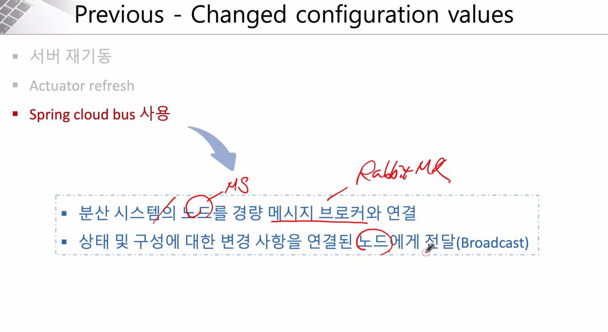
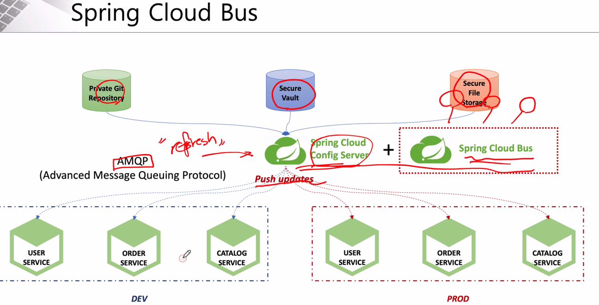

- AMQP
    - 메시지 지향 미들웨어를 위한 개방형 표준 응용 계층 프로토콜
    - 메시지 지향, 큐잉, 라우팅, 신뢰성, 보안
    - Erlang, RabbitMQ에서 사용
- Kafka
    - Apache Software Foundation이 Scalar 언어로 개발한 오픈 소스 메시지 브로커 프로젝트
    - 분산형 스트리밍 플랫폼
    - 대용량의 데이터를 처리 가능한 메시징 시스템

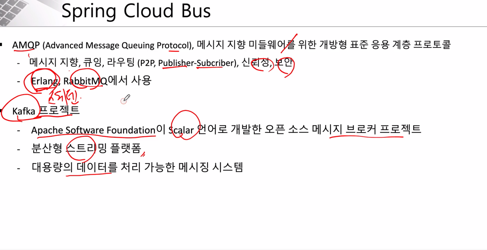

- Spring Cloud Bus
    - 분산 시스템의 노드를 경량 메시지 브로커와 연결
    - 상태 및 구성에 대한 변경 사항을 연결된 노드에게 전달(Broadcast)
    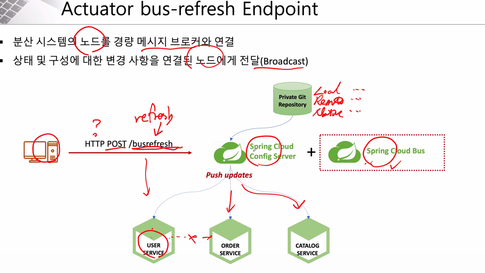

- Dependencies 추가
```xml
각 서비스 pom.xml

<dependency>
    <groupId>org.springframework.boot</groupId>
    <artifactId>spring-boot-starter-actuator</artifactId>
</dependency>

<dependency>
    <groupId>org.springframework.cloud</groupId>
    <artifactId>spring-cloud-starter-bus-amqp</artifactId>
</dependency>
```
``` yaml
applcation.yaml

spring:
 rabbitmq:
    host: 127.0.0.1
    port: 5672
    username: guest
    password: guest

management:
  endpoints:
    web:
      exposure:
        include: health, busrefresh, refresh, metrics
```
- 게이트웨이 설정(actuator 지정)
```yaml
- id: user-service
    uri: lb://USER-SERVICE
    predicates:
    - Path=/user-service/actuator/**
    - Method=GET,POST
    filters:
    - RemoveRequestHeader=Cookie
    - RewritePath=/user-service/(?<segment>.*), /$\{segment}
```    
- 테스트
    1. 현재 설정된 시크릿 값
    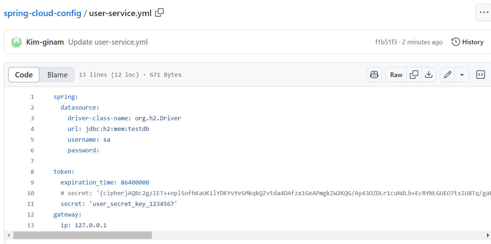
    2. 로그인
    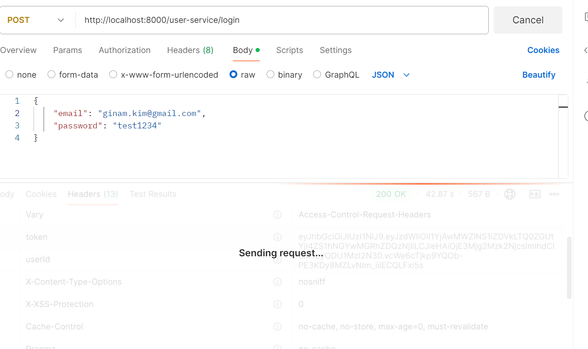
    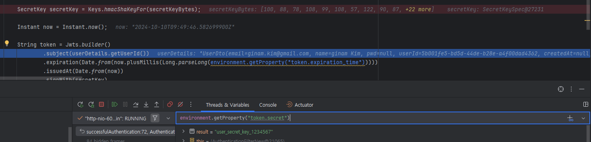
    - environment.getProperty("token.secret") = user_secret_key_1234567
    3. API Gateway 테스트
    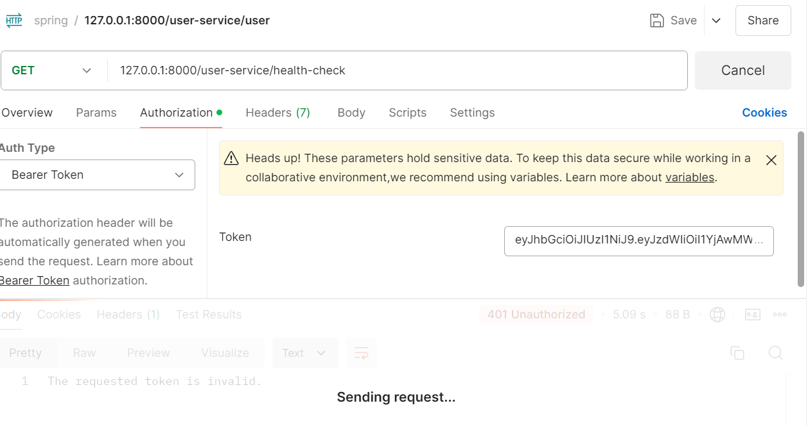
    - env.getProperty("token.secret") = user_secret_key_1234567
    4. 성공
    
    5. 시크릿 변경
    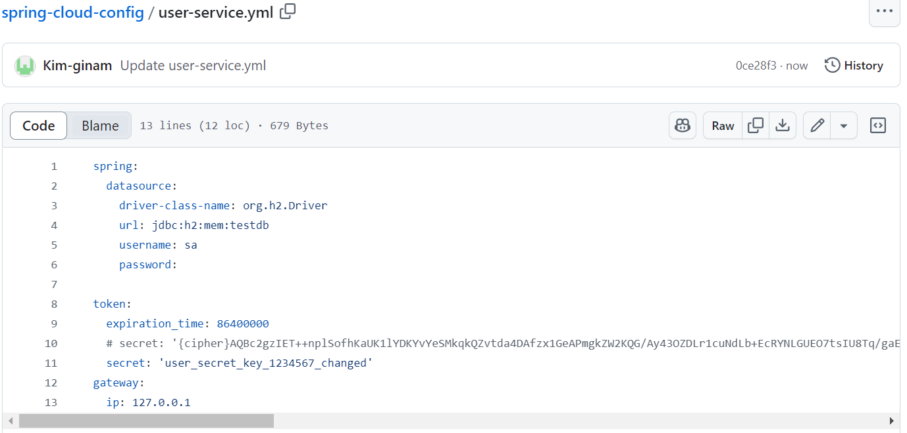
    6. busrefresh
    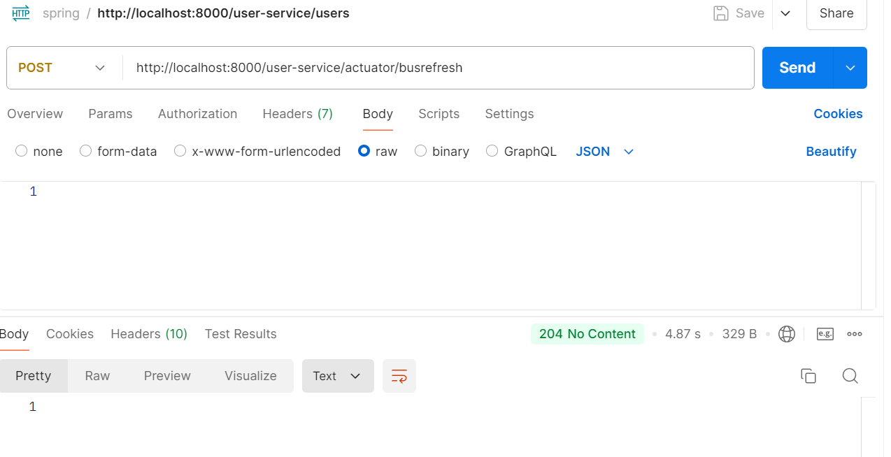
    - 204는 정상적으로 성공이지만 서버로부터 응답이 없음을 뜻함
    7. refresh 확인
    
    - API Gateway
        - 2024-10-10T18:55:23.031+09:00  INFO 16712 --- [apigateway-service] [nfoReplicator-0] com.netflix.discovery.DiscoveryClient    : DiscoveryClient_APIGATEWAY-SERVICE/host.docker.internal:apigateway-service:8000: registering service...
    - USER-SERVICE        
        - 2024-10-10T18:55:23.559+09:00  INFO 28104 --- [user-service] [nfoReplicator-0] [                                                 ] com.netflix.discovery.DiscoveryClient    : DiscoveryClient_USER-SERVICE/user-service:f9278900d40313b2f2e44d2ae0b84ef3 - registration status: 204
    - 
    8. 로그인
    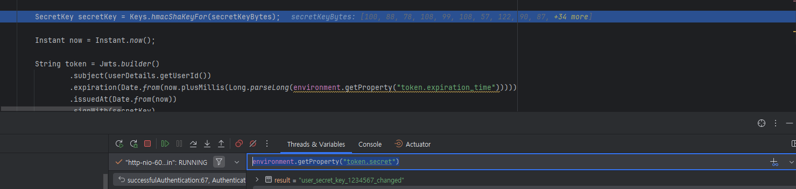
    - env.getProperty("token.secret") = user_secret_key_1234567_changed
    9. API Gateway 테스트
    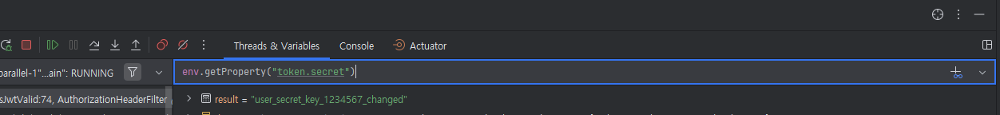
    - env.getProperty("token.secret") = user_secret_key_1234567_changed
    10. 성공
    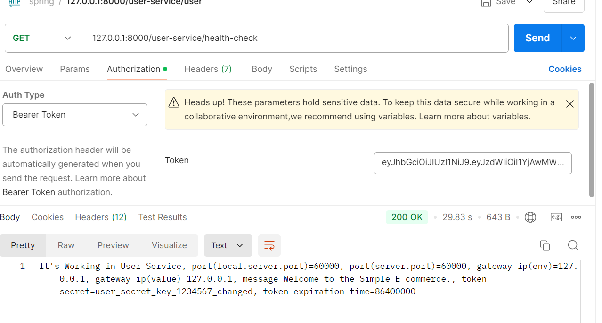
