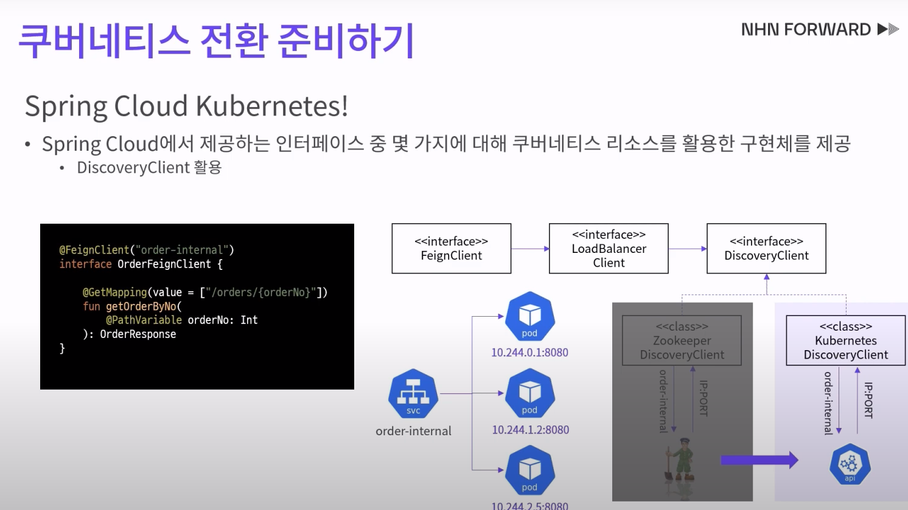
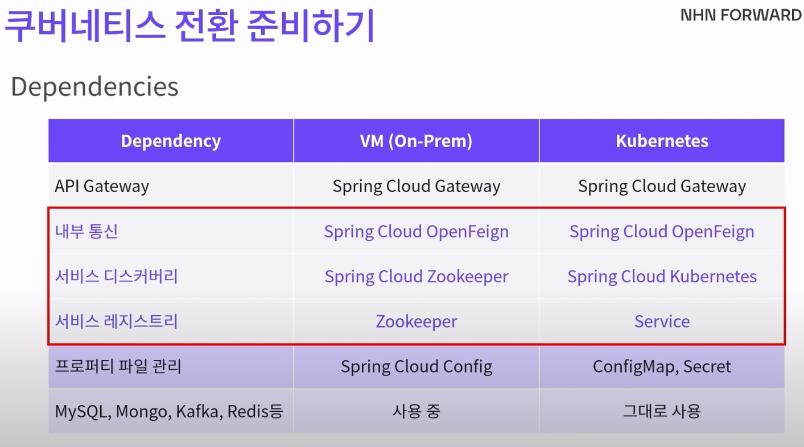
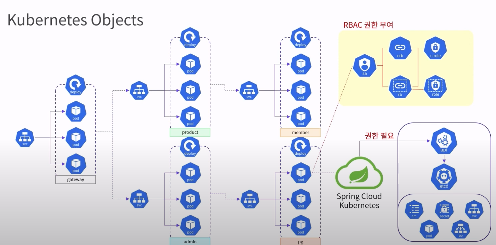
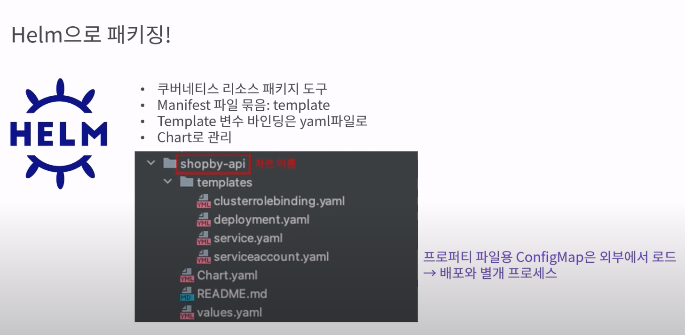
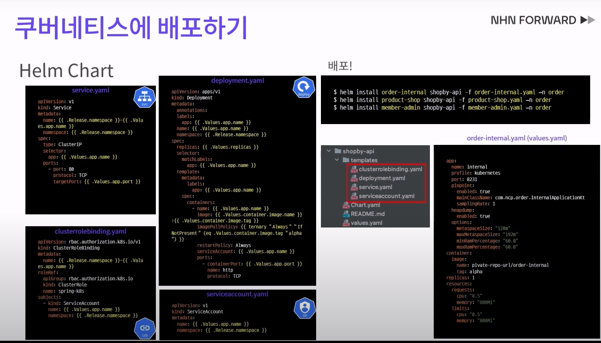
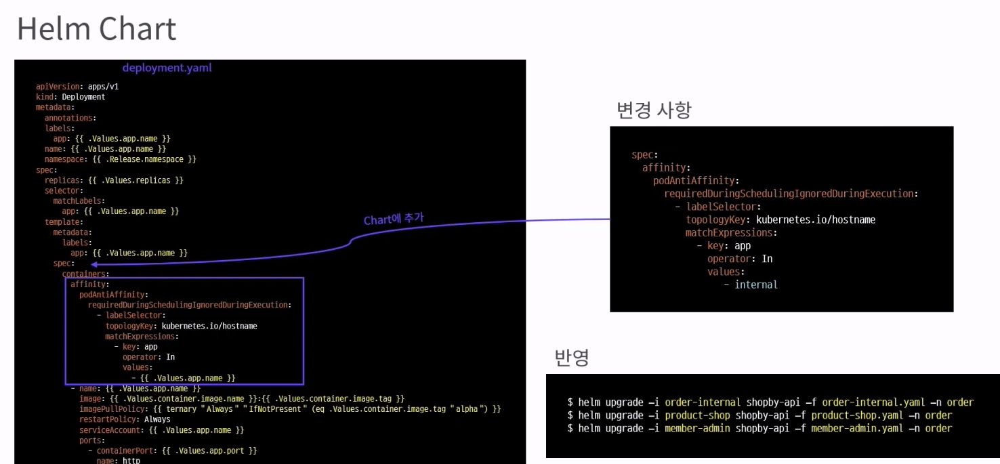
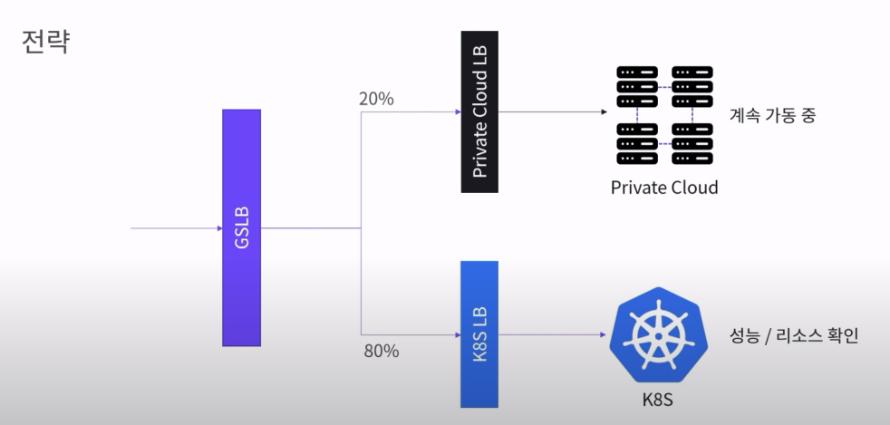
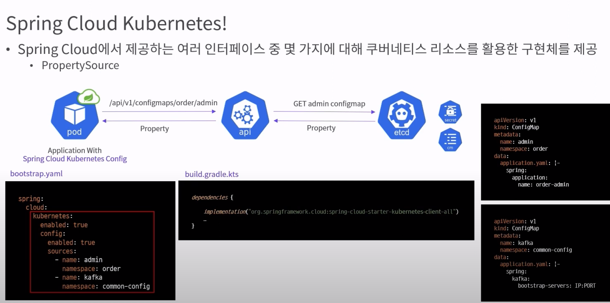
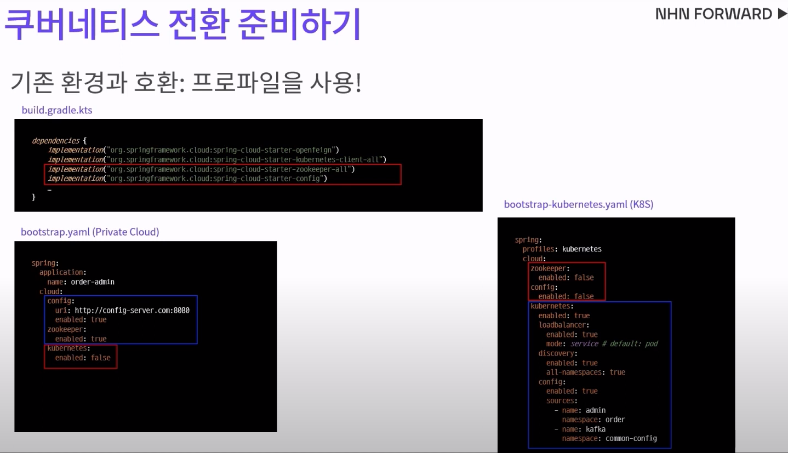

## Spring Cloud Kubernetes
**Spring Cloud Kubernetes**는 Kubernetes 환경에서 Spring Cloud의 기능을 더 효과적으로 사용할 수 있도록 지원하는 프로젝트입니다. 이 프로젝트는 Kubernetes의 기본 기능과 Spring Cloud의 기능을 통합하여, 마이크로서비스를 Kubernetes 클러스터에 배포할 때 더욱 쉽게 설정 관리, 서비스 디스커버리, 그리고 컨피그레이션 관리 등을 할 수 있게 해줍니다.




### Spring Cloud Kubernetes의 주요 기능
1. **ConfigMap 및 Secret 통합**
   - **Spring Cloud Kubernetes Config**: Kubernetes의 **ConfigMap**과 **Secret**을 Spring Cloud의 환경 설정에 자동으로 통합해 줍니다.
   - 애플리케이션에서 Kubernetes ConfigMap과 Secret을 이용하여 환경 설정을 동적으로 로드할 수 있습니다.
   - `@ConfigurationProperties`와 같은 Spring Boot 기능을 사용하여 Kubernetes ConfigMap의 값을 직접 바인딩할 수 있습니다.

2. **Service Discovery (서비스 디스커버리)**
   - Kubernetes의 네이티브 **서비스 디스커버리** 기능을 사용하여 마이크로서비스 간 통신을 관리합니다.
   - Spring Cloud Kubernetes는 Eureka 같은 별도의 서비스 레지스트리 없이도 Kubernetes의 DNS 시스템을 통해 서비스 간 통신이 가능하게 합니다.
   - 애플리케이션이 Kubernetes의 서비스 이름을 이용하여 자동으로 다른 서비스와 통신할 수 있습니다.

3. **Spring Cloud LoadBalancer 지원**
   - Spring Cloud LoadBalancer와 통합되어 Kubernetes의 서비스 이름을 기반으로 부하 분산을 처리할 수 있습니다.
   - 이를 통해 Eureka나 Ribbon을 사용하지 않고도 로드 밸런싱이 가능해집니다.

4. **Pod Health Check 및 리소스 모니터링**
   - Kubernetes의 **Liveness** 및 **Readiness 프로브**와 통합하여 애플리케이션의 상태를 모니터링하고, 필요한 경우 자동으로 재시작합니다.
   - 이 기능을 통해 클러스터의 상태와 Pod의 헬스 체크를 쉽게 관리할 수 있습니다.

### Spring Cloud Kubernetes의 주요 컴포넌트
1. **Spring Cloud Kubernetes Config**:
   - Kubernetes의 ConfigMap과 Secret을 Spring 애플리케이션에 쉽게 통합할 수 있도록 지원합니다.
   - 변경 감지와 실시간 업데이트를 통해 Spring 애플리케이션에서 설정값을 동적으로 반영할 수 있습니다.

2. **Spring Cloud Kubernetes Discovery**:
   - Kubernetes의 네이티브 DNS 및 서비스 디스커버리 기능을 사용하여 Eureka 같은 서비스 레지스트리 없이도 서비스 간의 통신이 가능합니다.
   - OpenFeign이나 RestTemplate 같은 HTTP 클라이언트와 쉽게 통합할 수 있습니다.

3. **Spring Cloud Kubernetes Ribbon** (이전 버전에서 사용됨):
   - Ribbon을 통해 클라이언트 측 로드 밸런싱을 지원했지만, 현재는 Spring Cloud LoadBalancer로 대체되는 추세입니다.

### Spring Cloud Kubernetes 사용의 장점
- **Kubernetes 네이티브 통합**: Kubernetes의 네이티브 기능과 통합되어 별도의 서비스 디스커버리 솔루션(Eureka 등)이 필요 없습니다.
- **실시간 설정 관리**: Spring Cloud Kubernetes Config를 통해 ConfigMap의 변경 사항을 실시간으로 반영할 수 있습니다.
- **간편한 설정**: Spring Cloud 프로젝트와의 통합으로 개발자가 익숙한 Spring Cloud 방식으로 Kubernetes 기능을 쉽게 사용할 수 있습니다.

### Spring Cloud Kubernetes vs. Spring Cloud
- **Spring Cloud**: 기본적으로 Eureka, Spring Cloud Config, Spring Cloud Gateway 등을 사용하여 마이크로서비스를 관리합니다.
- **Spring Cloud Kubernetes**: Kubernetes의 기능(ConfigMap, Secret, DNS 기반 서비스 디스커버리 등)을 활용하여 Spring Cloud 기능을 Kubernetes 환경에 최적화합니다.

### 예시: Spring Cloud Kubernetes Config 사용 예시
```yaml
spring:
  cloud:
    kubernetes:
      config:
        name: my-configmap
        namespace: default
        sources:
          - name: additional-configmap
```
이 예시는 `my-configmap`과 `additional-configmap`이라는 ConfigMap을 Spring 애플리케이션의 설정으로 사용하는 설정입니다.

### 결론
Spring Cloud Kubernetes는 Kubernetes와 Spring Cloud의 기능을 통합하여, 클라우드 네이티브 환경에서 더욱 유연하고 효율적으로 마이크로서비스를 관리할 수 있도록 도와줍니다. Kubernetes 환경에서 Spring Cloud의 기능을 사용할 때, Kubernetes의 네이티브 기능과의 긴밀한 통합을 가능하게 하여 설정 관리, 서비스 디스커버리, 로드 밸런싱 등을 더욱 쉽게 구현할 수 있습니다.

<details>
<summary> 아키텍쳐 </summary>



이 그림은 Kubernetes 환경에서 **Spring Cloud Kubernetes**와 다양한 **Kubernetes 객체**들이 어떻게 배포되고 동작하는지를 시각적으로 설명하고 있습니다. 그림을 통해 애플리케이션 배포, 서비스 간 통신, 권한 관리, 그리고 Spring Cloud Kubernetes의 역할에 대한 전반적인 아키텍처를 나타내고 있습니다.

### 주요 구성 요소 설명

1. **Deployments와 Pods**
   - 그림에는 여러 **Deployment**와 **Pod**가 표시되어 있으며, 각 애플리케이션 또는 서비스가 독립적인 배포 단위로 관리되고 있습니다.
   - 각 Deployment는 여러 개의 Pod 인스턴스를 관리하고 있으며, 이는 애플리케이션의 확장성과 고가용성을 보장합니다.

2. **서비스(Service)**
   - 각 Deployment와 Pod는 **Service** 객체를 통해 트래픽을 처리하고 있습니다.
   - Service는 클러스터 내에서 로드 밸런싱을 담당하며, 클러스터 외부 및 내부의 요청을 Pod로 라우팅합니다.
   - 예를 들어, `gateway`, `product`, `member`, `admin` 등과 같은 서비스가 다양한 Pod와 연결되어 있습니다.

3. **RBAC 권한 부여**
   - 오른쪽 상단에는 **RBAC(Role-Based Access Control)** 설정이 표시되어 있으며, Kubernetes의 보안 및 권한 관리를 설명합니다.
   - `Role`, `ClusterRole`, `RoleBinding`, `ClusterRoleBinding`, 그리고 `ServiceAccount`(sa)를 통해 세분화된 접근 권한을 부여하고 관리할 수 있습니다.
   - 이 접근 권한을 통해 특정 리소스에 대한 읽기, 쓰기, 실행 권한을 설정하여 보안을 강화합니다.

4. **Spring Cloud Kubernetes**
   - 그림 하단에는 **Spring Cloud Kubernetes**가 표시되어 있으며, Kubernetes API 서버와 통신하기 위해 필요한 권한이 요구됨을 나타내고 있습니다.
   - Spring Cloud Kubernetes는 Kubernetes 환경에서 ConfigMap, Secret, 서비스 디스커버리 등을 활용할 수 있게 해주며, 애플리케이션의 설정과 환경 변수를 동적으로 관리합니다.

5. **Kubernetes API 및 etcd**
   - Kubernetes API 서버와 **etcd** 데이터 저장소가 중앙에 표시되어 있으며, 이는 Kubernetes 클러스터의 핵심 관리 요소입니다.
   - etcd는 클러스터의 모든 구성 및 상태 정보를 저장하며, Kubernetes API 서버는 이 데이터를 이용해 클러스터 리소스와 애플리케이션을 제어합니다.

6. **Spring Cloud Kubernetes와 API 통신**
   - Spring Cloud Kubernetes는 Kubernetes API 서버와 통신하여, ConfigMap, Secret, Pod 정보 등을 읽어오거나 업데이트하는 작업을 수행합니다.
   - 이를 통해 애플리케이션이 Kubernetes 환경에 최적화된 상태로 동작하며, 설정 변경 시 자동으로 이를 반영할 수 있습니다.

### 그림의 주요 포인트

- **RBAC**: Spring Cloud Kubernetes와 같은 애플리케이션이 Kubernetes API 서버와 상호 작용하기 위해서는 적절한 권한이 필요합니다. 이를 위해 RBAC 설정이 필수적입니다.
- **Spring Cloud Kubernetes의 역할**: 이 솔루션은 Kubernetes 환경에서 Spring Boot 애플리케이션이 효과적으로 동작할 수 있도록 지원하며, 클러스터의 네이티브 기능을 활용하여 설정 관리 및 서비스 디스커버리를 구현합니다.
- **Deployment와 Service의 통합**: 애플리케이션은 Deployment를 통해 관리되고, Service를 통해 외부 및 내부 트래픽을 Pod로 라우팅합니다.

### 결론
이 아키텍처는 Kubernetes 클러스터에서 **Spring Cloud Kubernetes**와 다양한 애플리케이션이 어떻게 상호 작용하며, RBAC를 통해 보안을 유지하고, API 서버와 통신하는 방식을 잘 나타내고 있습니다. 이를 통해 Spring 기반 애플리케이션이 Kubernetes 환경에서 유연하고 안전하게 동작할 수 있게 합니다.

### 쿠버네티스를 관리하기 위한 Helm 패키징
 Kubernetes 환경에서 **Helm**을 사용하여 애플리케이션을 배포하는 방법을 시각적으로 설명하고 있습니다. Helm은 Kubernetes 리소스를 패키징하고 배포하는 데 널리 사용되는 도구로, 복잡한 Kubernetes 애플리케이션을 쉽고 일관되게 관리할 수 있도록 해줍니다.




### 첫 번째 이미지 설명
- **Helm 패키지 구조**: `shopby-api`라는 Helm 차트가 표시되어 있으며, 이 차트는 여러 템플릿 파일(`deployment.yaml`, `service.yaml`, `serviceaccount.yaml`, 등)과 기본 설정 파일(`values.yaml`)로 구성되어 있습니다.
- **템플릿 파일**: `templates` 폴더 내에는 Kubernetes 리소스의 템플릿 파일들이 있으며, 이 파일들은 배포 시 동적으로 변수들을 바인딩하여 실제 리소스로 생성됩니다.
- **ConfigMap 사용**: 프로퍼티 파일을 ConfigMap으로 로드하여 외부에서 관리하며, 이를 통해 배포와 별개로 설정을 변경할 수 있음을 나타냅니다.




### 두 번째 이미지 설명
- **Helm 차트 배포 명령어**: `helm install` 명령어를 사용하여 다양한 환경(`order-internal`, `product-shop`, `member-admin`)에 대한 애플리케이션을 설치하고 있습니다.
- **Deployment와 Service 템플릿**: `deployment.yaml`, `service.yaml` 등의 파일은 각각 애플리케이션 배포 및 서비스 설정을 정의합니다.
- **values 파일**: `order-internal.yaml`과 같은 values 파일에서 환경별 설정을 관리하며, 이를 통해 다양한 배포 환경에 대한 설정을 개별적으로 정의할 수 있습니다.



### 세 번째 이미지 설명
- **Affinity 추가**: `deployment.yaml` 파일에서 affinity 설정을 통해 Pod의 배치 전략을 조정하고 있습니다. 이 설정은 특정 노드나 호스트에서만 실행되도록 제어할 수 있습니다.
- **변경 사항 적용**: 변경된 affinity 설정은 배포 시에 Helm을 사용하여 `helm upgrade` 명령어로 애플리케이션에 반영됩니다.
- **업그레이드 명령어**: `helm upgrade` 명령어를 통해 기존 배포된 애플리케이션의 설정이나 리소스를 업데이트하고 있습니다.

### Helm 사용의 장점
1. **템플릿화된 구성**: YAML 템플릿과 values 파일을 사용하여 배포 환경에 따라 유연한 설정 관리가 가능합니다.
2. **쉽고 일관된 배포**: `helm install`과 `helm upgrade` 명령어를 통해 Kubernetes 리소스를 일관되게 관리하고 배포할 수 있습니다.
3. **복잡한 애플리케이션 관리**: 다양한 Kubernetes 리소스(예: Deployment, Service, ConfigMap 등)를 하나의 차트로 묶어 관리함으로써 배포와 유지보수를 단순화합니다.

### 결론
- Helm은 Kubernetes 리소스를 패키징하고 배포하는 데 매우 효과적인 도구로, 복잡한 애플리케이션을 쉽게 관리할 수 있도록 도와줍니다.
- 이 구조를 통해 템플릿화된 구성과 values 파일을 활용하여, 배포 환경에 따라 다양한 설정을 일관되게 관리할 수 있습니다.
- Helm 차트와 values 파일을 사용함으로써, 배포와 설정 변경이 매우 유연해지고 효율적으로 관리될 수 있습니다.

### 트래픽 전환



- GSLB를 사용하여 모니터링 하면서 점차적으로 트래픽 양을 증가시키며 전환
- 안전한 전환방법

</details>

<details>
<summary> Config 기능 </summary>

**Spring Cloud Kubernetes**의 **Config 기능**은 Kubernetes의 **ConfigMap**과 **Secret**을 활용하여 애플리케이션의 환경 설정을 관리하고 동적으로 로드할 수 있도록 해주는 기능입니다. 이 기능은 Kubernetes 네이티브 설정 관리 기능을 Spring Cloud의 방식으로 통합해주어, Spring Boot 애플리케이션이 Kubernetes 환경에서 보다 유연하게 동작할 수 있도록 합니다.

### Spring Cloud Kubernetes Config 기능의 주요 특징
1. **Kubernetes ConfigMap과 통합**
   - Spring Cloud Kubernetes는 **ConfigMap**을 Spring 환경 설정으로 자동으로 가져와 애플리케이션에서 사용할 수 있습니다.
   - ConfigMap의 값을 Spring의 `@ConfigurationProperties`와 같은 방식으로 바인딩하여, 코드에서 쉽게 접근할 수 있습니다.
   - 공통 설정 중앙 집중화 가능

2. **Kubernetes Secret과 통합**
   - **Secret**도 동일하게 Spring Boot 애플리케이션의 설정으로 통합할 수 있습니다.
   - 이는 보안에 민감한 정보를 애플리케이션에 안전하게 전달할 때 유용합니다.

3. **동적 리로드**
   - Spring Cloud Kubernetes는 ConfigMap이나 Secret이 변경되었을 때 이를 자동으로 감지하고, 애플리케이션의 설정을 동적으로 업데이트할 수 있습니다.
   - 기존 ConfigMap은 새로 적용할려면 파드를 다시 띄워야 함(리로딩 기능이 없음)
   - `@RefreshScope`와 같은 애너테이션을 사용하여 설정이 변경될 때 특정 빈을 다시 로드하도록 설정할 수 있습니다.



### Spring Cloud Kubernetes Config 설정 예시

#### 1. Kubernetes ConfigMap 생성
다음은 Kubernetes에서 ConfigMap을 생성하는 예시입니다:
```yaml
apiVersion: v1
kind: ConfigMap
metadata:
  name: my-config
data:
  database.url: jdbc:mysql://localhost:3306/mydb
  database.username: admin
  database.password: password123
```
Kubernetes에서 Secret을 생성하는 예시입니다:
```yaml
apiVersion: v1
kind: Secret
metadata:
  name: my-secret
type: Opaque
data:
  api-key: c2VjcmV0S2V5MTIz  # "secretKey123"의 Base64 인코딩

```
#### 2. application.yaml 설정
Spring Boot 애플리케이션에서 ConfigMap을 사용하는 설정 예시입니다:
```yaml
spring:
  cloud:
    kubernetes:
      config:
        enabled: true
        sources:
          - name: my-config
            namespace: default
          - name: another-config
            namespace: other-namespace

```

이 설정은 Kubernetes의 `my-config` ConfigMap을 가져와 Spring Boot 애플리케이션의 환경 설정으로 사용하도록 합니다.

#### 3. Spring 애플리케이션에서 ConfigMap 값 사용하기
Spring Boot 애플리케이션에서 ConfigMap의 값을 가져오는 코드 예시입니다:
```java
@Value("${database.url}")
private String databaseUrl;

@Value("${database.username}")
private String databaseUsername;
```

### 동적 리로드 설정
Spring Cloud Kubernetes는 Kubernetes ConfigMap이나 Secret이 변경되면 자동으로 설정을 업데이트할 수 있는 Config Watcher 기능을 제공합니다. 이를 통해 ConfigMap이나 Secret이 변경될 때 애플리케이션을 재시작하지 않고도 동적으로 설정을 반영할 수 있습니다.
```yaml
spring:
  cloud:
    kubernetes:
      config:
        enabled: true
        name: my-config  # ConfigMap 이름
      secrets:
        enabled: true
        name: my-secret  # Secret 이름   
      reload:
        enabled: true
        mode: polling  # 변경 사항을 주기적으로 체크하여 반영
        period: 15000  # 15초마다 ConfigMap/Secret의 변경을 확인

}
```

이 설정은 ConfigMap이 변경될 때 `/actuator/refresh` 엔드포인트를 호출하여 Spring 애플리케이션의 설정을 동적으로 업데이트합니다.

### Spring Cloud Kubernetes Config 기능의 장점
- **중앙 집중식 설정 관리**: Kubernetes ConfigMap과 Secret을 통해 애플리케이션 설정을 중앙에서 관리할 수 있습니다.
- **실시간 업데이트**: 설정 값이 변경될 때 애플리케이션을 재배포하지 않고도 동적으로 업데이트할 수 있습니다.
- **Spring Boot와의 통합**: Spring Cloud Config와 동일한 방식으로 Spring Boot와 쉽게 통합됩니다.

### Config 기능 사용하지 않는 방법
만약 OpenFeign만을 위한 Spring Cloud Kubernetes를 사용하고 싶고, Config 기능을 사용하고 싶지 않다면, Config 기능을 명시적으로 비활성화할 수 있습니다:
```yaml
spring:
  cloud:
    kubernetes:
      config:
        enabled: false
```

이 설정을 통해 Config 기능을 사용하지 않고, OpenFeign을 위한 서비스 디스커버리 기능만 활성화할 수 있습니다.

### 결론
Spring Cloud Kubernetes의 Config 기능은 Kubernetes 환경에서 애플리케이션 설정을 보다 유연하게 관리할 수 있게 해줍니다. 그러나 필요한 경우 이 기능을 비활성화하고 OpenFeign과 같은 특정 기능만 사용할 수도 있습니다. 이를 통해 Kubernetes 환경에 최적화된 방식으로 Spring Cloud 기능을 조정할 수 있습니다.
</details>

<details>
<summary> 기존 환경과 호환 </summary>



**Spring Cloud Kubernetes**를 사용하여 로컬 환경에서는 기존 Spring Cloud 설정을 그대로 사용하고, Kubernetes 환경에서는 Kubernetes의 네이티브 기능을 활용하여 애플리케이션을 구동할 수 있게 구성하는 방법에 대한 설명입니다.

### 핵심 내용 요약
1. **프로파일 사용**: Spring Boot의 **프로파일(Profile)** 기능을 활용하여, 로컬 환경과 Kubernetes 환경에 따라 다른 설정을 적용할 수 있습니다. 예를 들어, `bootstrap.yaml`에서 로컬 환경과 Kubernetes 환경에 따라 별도의 설정을 구분해 두는 방식입니다.
   - **로컬 환경**에서는 기존의 Spring Cloud Config 서버나 다른 설정을 사용할 수 있습니다.
   - **Kubernetes 환경**에서는 Spring Cloud Kubernetes Config를 통해 Kubernetes의 ConfigMap이나 Secret을 직접 사용할 수 있습니다.

2. **Spring Cloud Kubernetes의 사용**:
   - Kubernetes 환경에서는 **Spring Cloud Kubernetes**를 통해 ConfigMap, Secret, 그리고 네이티브 서비스 디스커버리 기능을 사용하여 애플리케이션 설정과 통신을 관리합니다.
   - 이를 통해 애플리케이션이 배포 환경에 따라 동적으로 설정을 적용받아 동작할 수 있습니다.

3. **환경 구분 설정**:
   - `bootstrap.yaml` 파일을 Kubernetes 환경에 맞게 `bootstrap-kubernetes.yaml`로 구성하여, 각 환경에 맞는 설정 파일을 따로 관리할 수 있습니다.
   - 이 방식으로 개발자는 환경에 따라 다른 설정을 적용하여, 애플리케이션을 유연하게 구동할 수 있습니다.

### 장점
- **환경별 설정 관리**: 프로파일을 통해 로컬, 개발, 테스트, 프로덕션 등 다양한 환경에 맞춘 설정을 쉽게 관리할 수 있습니다.
- **Kubernetes 네이티브 통합**: Kubernetes 환경에서 Spring Cloud Kubernetes를 사용하여 ConfigMap과 Secret을 통합 관리할 수 있으며, Kubernetes의 서비스 디스커버리 기능을 활용할 수 있습니다.
- **유연성**: 각 환경에 따라 애플리케이션의 설정을 구분하여 배포할 수 있기 때문에, 배포 환경에 맞는 최적의 설정을 쉽게 적용할 수 있습니다.

### 결론
- **Spring Cloud Kubernetes**를 사용하면 로컬 환경에서는 기존의 설정을 유지하면서도, Kubernetes 클러스터에서는 Kubernetes의 네이티브 기능을 활용할 수 있습니다.
- Spring Boot의 **프로파일 기능**을 통해 각 환경에 맞는 설정을 관리함으로써 애플리케이션이 다양한 환경에서 유연하게 동작할 수 있도록 지원합니다.

이러한 접근 방식은 마이크로서비스를 다양한 환경에 배포할 때 매우 유용하며, 특히 Kubernetes와 같은 클라우드 네이티브 플랫폼을 사용할 때 그 장점이 극대화됩니다.
</details>

<details>
<summary> 서비스 디스커버리 기능 </summary>

**Spring Cloud Kubernetes**를 사용하여 **OpenFeign**만을 위해 **서비스 디스커버리** 기능만 활성화하고, ConfigMap이나 Secret과 같은 다른 기능들은 사용하지 않도록 설정할 수 있습니다. Spring Cloud Kubernetes는 모듈화되어 있어, 필요한 기능만 선택적으로 사용할 수 있습니다.

### Spring Cloud Kubernetes를 OpenFeign만을 위해 설정하는 방법

Spring Cloud Kubernetes의 서비스 디스커버리 기능만 활성화하고, ConfigMap이나 Secret과 같은 구성 관련 기능은 비활성화하는 설정 방법은 다음과 같습니다:

#### 1. **의존성 추가**
Spring 프로젝트에서 OpenFeign과 Spring Cloud Kubernetes Discovery 기능만을 사용하도록 의존성을 추가할 수 있습니다. 다른 ConfigMap 관련 기능은 추가하지 않도록 설정합니다.


**Gradle 예시**:
```gradle
implementation 'org.springframework.cloud:spring-cloud-starter-kubernetes-client-discovery'
implementation 'org.springframework.cloud:spring-cloud-starter-openfeign'
```


**Maven 예시**:
```xml
<dependency>
    <groupId>org.springframework.cloud</groupId>
    <artifactId>spring-cloud-starter-kubernetes-client-discovery</artifactId>
</dependency>
<dependency>
    <groupId>org.springframework.cloud</groupId>
    <artifactId>spring-cloud-starter-openfeign</artifactId>
</dependency>
```

위 설정은 **Kubernetes 서비스 디스커버리** 기능만을 사용하도록 하고, **ConfigMap**이나 **Secret**에 대한 의존성을 추가하지 않습니다.

#### 2. **application.yaml 설정**
ConfigMap과 Secret 관련 설정은 제외하고, 서비스 디스커버리만 활성화되도록 Spring Cloud Kubernetes의 설정을 최소화할 수 있습니다:
</detail>
```yaml
spring:
  cloud:
    kubernetes:
      enabled: true
      discovery:
        enabled: true
      config:
        enabled: false
      secrets:
        enabled: false
```

이 설정에서는 `discovery` 기능만 활성화하고, ConfigMap과 Secret 기능은 비활성화했습니다. 이렇게 하면 OpenFeign을 위한 서비스 디스커버리만 사용되고, 나머지 기능은 적용되지 않습니다.

### Istio와 Spring Cloud Kubernetes의 통합 구조
Istio와 함께 Spring Cloud Kubernetes를 사용하는 경우, OpenFeign은 Istio의 네트워크 구조와 자연스럽게 통합되어 작동합니다. 요청 흐름은 다음과 같습니다:

1. **Ingress Gateway**: 외부 요청을 Istio의 가상서비스(VirtualService)로 전달합니다.
2. **VirtualService**: 요청을 Kubernetes 서비스로 라우팅합니다.
3. **Kubernetes 서비스**: 해당 요청을 올바른 Pod로 전달합니다.
4. **Pod 내부의 OpenFeign**: Kubernetes 서비스 이름을 사용하여 다른 마이크로서비스와 통신합니다. 이때, Spring Cloud Kubernetes Discovery 기능을 사용하여 Eureka 없이 서비스 디스커버리를 처리합니다.

### 장점
- **최소화된 설정**: OpenFeign에 필요한 서비스 디스커버리 기능만 활성화하여, 설정을 최소화하고 불필요한 리소스 소비를 줄일 수 있습니다.
- **Istio와의 자연스러운 통합**: Istio는 트래픽 제어, 인증, 보안을 담당하고, OpenFeign은 Kubernetes 서비스 이름을 사용해 네이티브 서비스 디스커버리를 수행합니다.

### 요약
- Spring Cloud Kubernetes를 사용하여 **OpenFeign**만을 위한 **서비스 디스커버리** 기능만 활성화할 수 있습니다.
- ConfigMap, Secret 등 다른 기능은 비활성화하여 불필요한 리소스 사용을 줄이고, 필요한 기능만 활용할 수 있습니다.
- Istio와 Kubernetes의 기본 네트워킹 기능과 통합하여 OpenFeign을 효율적으로 사용할 수 있습니다.

이렇게 하면 OpenFeign과 Istio를 조합하여 최적화된 마이크로서비스 아키텍처를 구성할 수 있으며, Spring Cloud Kubernetes의 서비스 디스커버리 기능만 활용하면서도 불필요한 설정은 최소화할 수 있습니다.
</details>

<details>
<summary> OpenFegin 서비스 흐름 </summary>

### 아키텍처 개요
1. **Kubernetes 서비스**는 네트워크 레벨에서 마이크로서비스 간의 트래픽을 분기하고 라우팅합니다.
2. **OpenFeign**을 위한 **Spring Cloud Kubernetes 서비스 디스커버리**는 Eureka 없이 Kubernetes의 네이티브 DNS 기능을 이용해, 마이크로서비스 간 통신을 관리합니다.

이 조합을 사용하면 Istio와 Kubernetes 서비스가 네트워크 레벨의 트래픽 제어와 라우팅을 처리하고, OpenFeign은 Spring Cloud Kubernetes를 통해 애플리케이션 레벨에서 간단하게 마이크로서비스 간의 호출을 관리할 수 있습니다.

### 구체적인 요청 흐름
1. **외부 요청**: 클라이언트로부터 들어오는 외부 요청이 Istio의 **Ingress Gateway**를 통해 들어옵니다.
2. **Istio VirtualService**: Istio는 이 요청을 가상서비스(VirtualService)를 통해 분석하고, 해당 요청을 적절한 **Kubernetes 서비스**로 라우팅합니다.
3. **Kubernetes 서비스**: 각 마이크로서비스에 대한 트래픽을 분기하고, 라운드 로빈 방식으로 여러 Pod에 로드 밸런싱을 수행합니다.
4. **OpenFeign 통신**: 마이크로서비스가 다른 마이크로서비스를 호출할 때, OpenFeign은 Spring Cloud Kubernetes의 서비스 디스커버리 기능을 사용하여 다른 서비스의 위치를 자동으로 찾아서 호출합니다.

### 설정 요약
- **Istio와 Kubernetes 서비스**는 외부 요청과 내부 트래픽을 라우팅하고, 네트워크 레벨에서 부하를 분산합니다.
- **Spring Cloud Kubernetes 서비스 디스커버리**는 OpenFeign을 통해 마이크로서비스 간 통신을 Eureka 없이 Kubernetes DNS 이름을 기반으로 처리합니다.

### 장점
1. **모듈화된 설정**: Kubernetes와 Istio는 네트워크 레벨에서 트래픽 제어를 담당하고, OpenFeign과 Spring Cloud Kubernetes는 애플리케이션 레벨의 서비스 디스커버리를 담당하므로 역할이 명확히 분리됩니다.
2. **Eureka 제거**: Eureka를 제거하면서도 OpenFeign을 계속 사용할 수 있어, Spring Cloud와 Kubernetes의 네이티브 기능을 최대한 활용할 수 있습니다.
3. **유연한 아키텍처**: Spring Cloud Kubernetes의 설정은 필요한 기능만 활성화할 수 있어, 불필요한 리소스를 줄이면서도 원하는 기능을 효율적으로 사용할 수 있습니다.

### 결론
- **Kubernetes 서비스**는 네트워크 레벨에서 마이크로서비스 간의 트래픽을 라우팅하는 역할을 합니다.
- **Spring Cloud Kubernetes**는 OpenFeign을 위한 서비스 디스커버리를 담당하여, Eureka 없이도 Kubernetes의 네이티브 DNS를 활용해 마이크로서비스 간 통신을 관리합니다.

이 방식으로 구성하면 Istio, Kubernetes, Spring Cloud의 각 요소가 역할을 분담하여 최적화된 마이크로서비스 아키텍처를 구축할 수 있습니다.
</details>
