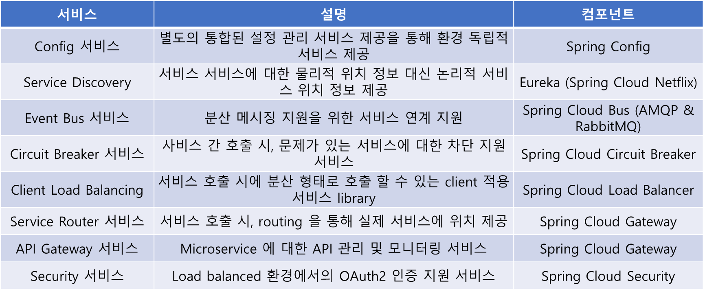

# Spring 클라우드
## Service Mesh
- 각 서비스 마이크로서비스 간 통신을 최적화 하고 다운타임을 방지하며 전체 서비스를 관리하는 Outer Architecture 를 Service Mesh 라고 한다. 

- Service Mesh 는 복잡한 내부 네트워크를 추상화를 통해 서비스 간의 통신이 빠르고, 안정적이며, 신뢰성을 보장한다.

- Service Mesh 특징

    - Configuration Management : 설정변경 시 서비스의 재빌드와 재부팅 없이 즉시 반영
    - Service Discovery : API Gateway 가 서비스를 검색하는 매커니즘
    - Load Balancing : 서비스간 부하 분산
    - API Gateway : API 서버 앞단에서 API 엔드포인트 단일화 및 인증, 인가, 라우팅 기능 담당
    - Centralized Logging : 서비스별 로그의 중앙집중화
    - Centralized Metrics : 서비스별 메트릭 정보의 중앙집중화
    - Distributed Tracing : 서비스간 호출 추적과 성능, 분석 관리
    - Resilience & Fault Tolerance : 서비스간 장애 전파 차단
    - Auto Scaling & Self Healing : 자동 스케일아웃과 복구 자동화
    - Packaging, Deployment & Scheduling : 패키징, 빌드 및 배포 자동화
    - Test Automation : 서비스 테스트 자동화

## Spring Cloud
- Spring Cloud 는 애플리케이션 스택의 일부로 모든 MSA 관심사를 해결하도록 잘 통합된 다양한 자바 라이브러리들의 묶음
    - 구성관리(Spring Cloud Config)
    - Service Discovery(Eureka)
    - Circuit Breakers(Resilience4j) 
    - 지능형 라우팅(Spring Cloud Gateway) 등 기능 제공