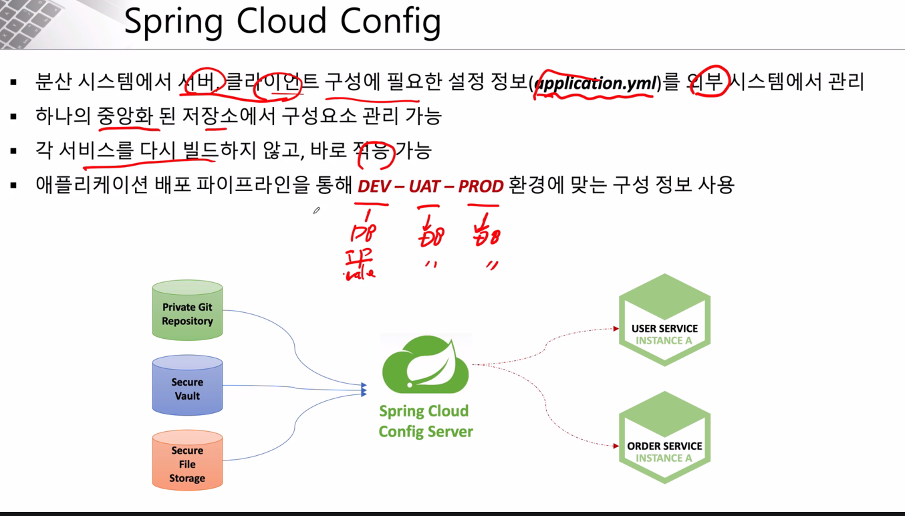
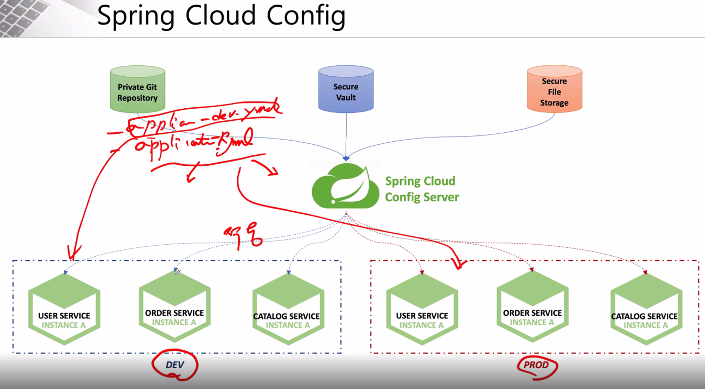

# Spring Config
- Spring Config

    - 분산시스템에서 애플리케이션의 환경설정정보 특히 서비스, 비즈니스 로직과 연관성 있는 정보들을 애플리케이션과 분리해 외부에서 관리하도록 한 환경설정 서버

    - 환경설정 속성정보를 중앙에서 관리

    - 환경설정 속성정보란 DB 접속 정보나 미들웨어(연계서버) 접속정보, 애플리케이션을 구성하는 각종 메타데이터

    - 서비스 운영 중에 설정파일을 변경 해야 할 경우에는 Spring Cloud Bus 를 이용하여 모든 마이크로 서비스의 환경설정을 업데이트

    - Spring Cloud Bus로 RabbitMQ 같은 경량 메시지 브로커들을 사용


```xml
pom.xml

<dependency>
    <groupId>org.springframework.cloud</groupId>
    <artifactId>spring-cloud-config-server</artifactId>
</dependency>
```
```java
@SpringBootApplication
@EnableConfigServer
public class ConfigServiceApplication {

    public static void main(String[] args) {
        SpringApplication.run(ConfigServiceApplication.class, args);
    }

}
```
``` yaml
server:
  port: 8888

spring:
#  profiles:
#    active: native
  application:
    name: config-service
  cloud:
    config:
      server:
        native:
          search-locations: file:///C://work//git-local-repo
        #search-locations: ${search.location:file:///${user.home}/workspace.edu/egovframe-msa-edu/spring-cloud-config-master}
        git: #default
         # uri: https://github.com/joneconsulting/spring-cloud-config
         uri: https://github.com/Kim-ginam/spring-cloud-config
         default-label: master
#          username: <github-id>
#          password: <gihub-accessToken>
        bootstrap: true
  rabbitmq:
    host: 127.0.0.1
    port: 5672
    username: guest
    password: guest

management:
  endpoints:
    web:
      exposure:
        include: health, busrefresh, refresh, metrics
---
#  profiles:
#    active: native
으로 인해 git을 실행
```
```yaml
기본 설정
server:
  port: 8888
서버 포트 설정: 애플리케이션이 8888 포트에서 실행되도록 설정.

Spring Cloud Config 설정
spring:
  application:
    name: config-service
  cloud:
    config:
      server:
        native:
          search-locations: file:///C://work//git-local-repo

Spring Cloud Config: 애플리케이션 이름을 config-service로 설정.
네이티브 모드: 로컬 파일 시스템(file:///C://work//git-local-repo)에서 구성 파일을 찾도록 설정.
이 설정은 외부 Git 리포지토리를 사용하지 않고 로컬 파일에서 설정을 로드할 때 사용됨.


        git:
          uri: https://github.com/Kim-ginam/spring-cloud-config
          default-label: master
Git 설정: Git 리포지토리(https://github.com/Kim-ginam/spring-cloud-config)를 Spring Cloud Config 서버의 설정 소스로 사용.
default-label: Git 리포지토리의 기본 브랜치를 master로 설정.
주석 처리된 부분에서는 GitHub 인증을 위한 사용자 이름과 액세스 토큰을 설정할 수 있음.

        bootstrap: true
부트스트랩 설정: 애플리케이션이 부트스트랩 과정에서 설정 파일을 로드하도록 함.

RabbitMQ 설정

spring:
  rabbitmq:
    host: 127.0.0.1
    port: 5672
    username: guest
    password: guest
RabbitMQ: 메세지 브로커로 RabbitMQ를 사용하고, 로컬 호스트(127.0.0.1)의 기본 포트(5672)로 설정.
기본 인증 정보로 사용자 이름과 비밀번호를 guest로 설정.

관리 및 모니터링 설정

management:
  endpoints:
    web:
      exposure:
        include: health, busrefresh, refresh, metrics
관리 엔드포인트 노출 설정: 웹에서 접근 가능한 관리 엔드포인트로 다음을 포함함:
health: 애플리케이션 상태를 확인.
busrefresh: Spring Cloud Bus를 통해 설정 정보를 갱신.
refresh: 애플리케이션의 설정을 동적으로 갱신.
metrics: 애플리케이션의 성능 및 상태에 관한 메트릭 정보를 제공.
```
- 다른 서비스에서 컨피그 서버 연동을 위한 설정
    - 의존성 추가
    - 부트스트랩으로 먼저 실행되게하여 읽어옴
```xml
pom.xml

<dependency>
    <groupId>org.springframework.cloud</groupId>
    <artifactId>spring-cloud-starter-config</artifactId>
</dependency>
<dependency>
    <groupId>org.springframework.cloud</groupId>
    <artifactId>spring-cloud-starter-bootstrap</artifactId>
</dependency>
```
```yaml
bootstap.yaml

spring:
  cloud:
    config:
      uri: http://127.0.0.1:8888
      name: user-service
```
- 프로필에 따른 설정 활성화
    - 문제 설명
        ```
        application.yaml에는
        spring:
        config:
            activate:
            on-profile: default

        bootstrap.yaml
        spring:
        cloud:
            config:
            uri: http://127.0.0.1:8888
            name: user-service
        profiles: 
            active: dev
        ```

        - bootstrap은 dev프로필이 활성화 되어있고 appliction은 default가 활성화 되어 있어 설정값을 적용하지 못함
- 해결방법
    1. default, dev 적용
    ```
    spring:
        profiles:
            active: default,dev
    ```
    2. application-dev.yaml 파일 생성
    3. 깃에 있는 해당 서비스에 적용되는 설정파일 변경(오버라이딩)
    ```
    spring:
        config:
            activate:
            on-profile: dev
    ```


    