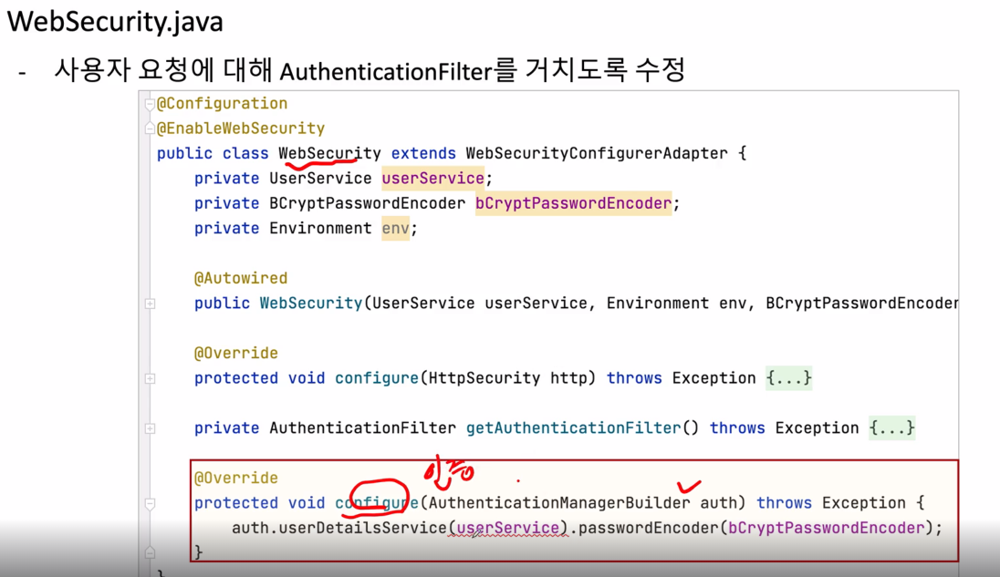
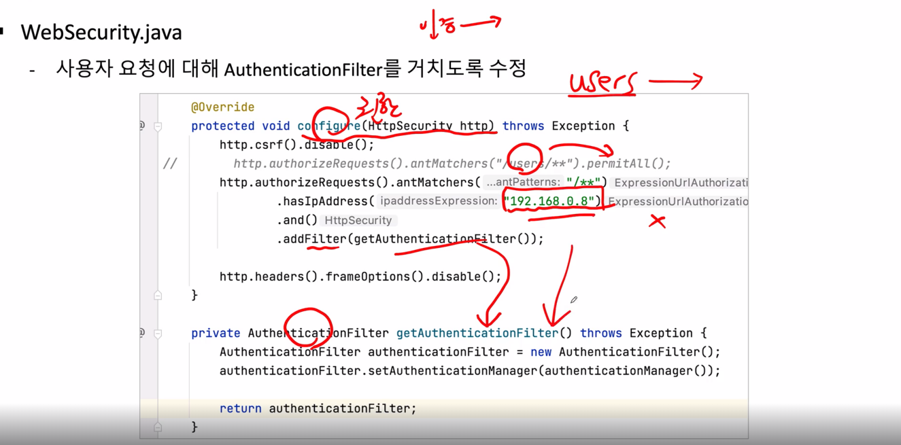
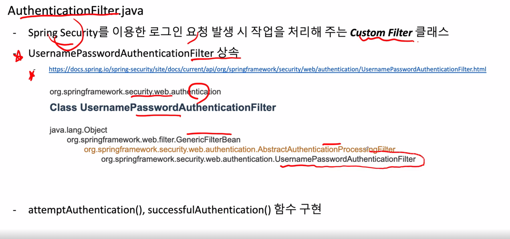
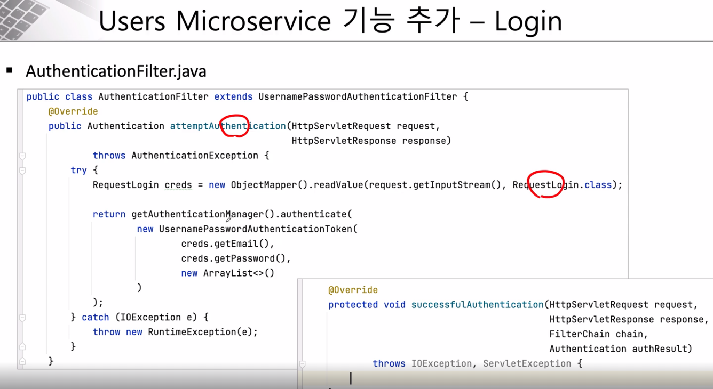

# Spring Security
- Spring Security는 스프링 기반 애플리케이션에서 강력하고 유연한 보안 기능을 제공하는 프레임워크로, 인증 및 권한 부여, 세션 관리, CSRF 방어, 암호화 기능 등을 지원합니다. 이를 통해 개발자는 표준 보안 기능을 손쉽게 구현하고 관리할 수 있으며, 높은 수준의 애플리케이션 보안을 유지할 수 있습니다.
- Authentication + Authorization
    - Step 1 : 애플리케이션에 spring security jar을 Dependency에 추가
    - Step 2 : WebSecurityConfigureAdapter를 상속받는 Security Configuration 클래스 생성
    - Step 3 : Security Configuration 클래스에 @EnableWebSecurity 추가
    - Step 4 : Authentication -> configure(AuthenticationManagerBuilder auth) 메서드를 재정의
    - Step 5 : Password encode를 위한 BCryprtPasswordEncoder 빈 정의
    - Step 6 : Authorization -> configure(HttpSecurity http)메서드를 재정의

```xml
pom.xml
<dependency>
    <groupId>org.springframework.boot</groupId>
    <artifactId>spring-boot-starter-security</artifactId>
</dependency>
<dependency>
    <groupId>org.springframework.security</groupId>
    <artifactId>spring-security-config</artifactId>
</dependency>
```
## WebSecurity


```java
@Configuration
@EnableWebSecurity
public class WebSecurityNew {
    private UserService userService;
    private BCryptPasswordEncoder bCryptPasswordEncoder;
    private Environment env;

    public static final String ALLOWED_IP_ADDRESS = "127.0.0.1";
    public static final String SUBNET = "/32";
    public static final IpAddressMatcher ALLOWED_IP_ADDRESS_MATCHER = new IpAddressMatcher(ALLOWED_IP_ADDRESS + SUBNET);

    public WebSecurityNew(Environment env, UserService userService, BCryptPasswordEncoder bCryptPasswordEncoder) {
        this.env = env;
        this.userService = userService;
        this.bCryptPasswordEncoder = bCryptPasswordEncoder;
    }

    @Bean
    protected SecurityFilterChain configure(HttpSecurity http) throws Exception {
        // Configure AuthenticationManagerBuilder
        AuthenticationManagerBuilder authenticationManagerBuilder =
                http.getSharedObject(AuthenticationManagerBuilder.class);
        authenticationManagerBuilder.userDetailsService(userService).passwordEncoder(bCryptPasswordEncoder);

        AuthenticationManager authenticationManager = authenticationManagerBuilder.build();

        http.csrf( (csrf) -> csrf.disable());
//        http.csrf(AbstractHttpConfigurer::disable);

        http.authorizeHttpRequests((authz) -> authz
                        .requestMatchers(new AntPathRequestMatcher("/actuator/**")).permitAll()
                        .requestMatchers(new AntPathRequestMatcher("/h2-console/**")).permitAll()
                        .requestMatchers(new AntPathRequestMatcher("/users", "POST")).permitAll()
                        .requestMatchers(new AntPathRequestMatcher("/welcome")).permitAll()
                        .requestMatchers(new AntPathRequestMatcher("/health-check")).permitAll()
                        .requestMatchers(new AntPathRequestMatcher("/swagger-ui/**")).permitAll()
                        .requestMatchers(new AntPathRequestMatcher("/swagger-resources/**")).permitAll()
                        .requestMatchers(new AntPathRequestMatcher("/v3/api-docs/**")).permitAll()
//                        .requestMatchers("/**").access(this::hasIpAddress)
                        .requestMatchers("/**").access(
                                new WebExpressionAuthorizationManager("hasIpAddress('localhost') or hasIpAddress('127.0.0.1') or hasIpAddress('172.30.96.94')")) // host pc ip address
                        .anyRequest().authenticated()
                )
                .authenticationManager(authenticationManager)
                .sessionManagement((session) -> session
                        .sessionCreationPolicy(SessionCreationPolicy.STATELESS));

        http.addFilter(getAuthenticationFilter(authenticationManager));
        http.headers((headers) -> headers.frameOptions((frameOptions) -> frameOptions.sameOrigin()));

        return http.build();
    }

    private AuthorizationDecision hasIpAddress(Supplier<Authentication> authentication, RequestAuthorizationContext object) {
        return new AuthorizationDecision(ALLOWED_IP_ADDRESS_MATCHER.matches(object.getRequest()));
    }

    private AuthenticationFilterNew getAuthenticationFilter(AuthenticationManager authenticationManager) throws Exception {
        return new AuthenticationFilterNew(authenticationManager, userService, env);
    }

}


```

- 주요 필드
    - ALLOWED_IP_ADDRESS: 허용된 IP 주소(127.0.0.1)를 정의합니다.
    - SUBNET: 서브넷 마스크로 32를 사용합니다. 이는 정확히 127.0.0.1에 대한 접근만 허용하는 설정입니다.
    - ALLOWED_IP_ADDRESS_MATCHER: IP 주소 매칭을 위한 IpAddressMatcher 객체입니다.
- 생성자
    - 생성자에서는 Environment, UserService, BCryptPasswordEncoder를 초기화합니다. 이 객체들은 이후 인증 설정 및 환경 구성을 위해 사용됩니다.
- configure() 메소드
    - Spring Security의 보안 필터 체인을 설정하는 핵심 메소드입니다. 이 메소드에서 애플리케이션의 인증과 권한 부여 방식을 정의합니다.

- AuthenticationManagerBuilder 설정
    - AuthenticationManagerBuilder를 사용하여 사용자 서비스(userService)와 비밀번호 인코더(bCryptPasswordEncoder)를 통해 인증 관리자를 생성합니다.

- http 보안 설정

    - http.csrf().disable(): CSRF 보호를 비활성화합니다.
    - http.authorizeHttpRequests(): 특정 경로에 대한 접근 권한을 설정합니다.
        - /actuator/**, /h2-console/**, /users (POST 메소드), /welcome, /health-check, /swagger-ui/** 등 특정 경로에 대해 누구나 접근할 수 있도록 설정 (permitAll()).
        - 그 외의 모든 경로 (/**)에 대해서는 지정된 IP 주소에서의 접근만 허용합니다.
            - WebExpressionAuthorizationManager를 사용하여 localhost, 127.0.0.1, 172.30.96.94 IP 주소에서의 접근을 허용합니다.
        - 나머지 요청(anyRequest())은 인증된 사용자만 접근 가능하게 설정합니다 (authenticated()).

- 세션 관리
    - SessionCreationPolicy.STATELESS 설정을 통해 세션을 사용하지 않도록 합니다. 주로 RESTful API를 위한 설정입니다.

- HTTP 헤더 설정

    - frameOptions().sameOrigin(): h2-console과 같은 페이지를 사용할 때 동일 출처에서만 iframe으로 페이지를 열 수 있도록 설정합니다.

- 필터 추가

    - 사용자 정의 인증 필터(AuthenticationFilterNew)를 추가합니다. 이 필터는 사용자 인증을 처리합니다.
- hasIpAddress() 메소드
    - 주어진 요청의 IP 주소가 허용된 IP와 일치하는지 확인합니다.
    - AuthorizationDecision 객체를 사용하여 일치 여부에 따라 권한 결정을 반환합니다.
- getAuthenticationFilter() 메소드
    - 사용자 정의 인증 필터를 생성하는 메소드입니다. 이 필터는 인증을 처리하며, AuthenticationManager, userService, env를 사용합니다.

## AuthenticationFilter



```java
@Slf4j
public class AuthenticationFilterNew  extends UsernamePasswordAuthenticationFilter {

    private UserService userService;
    private Environment environment;

    public AuthenticationFilterNew(AuthenticationManager authenticationManager,
                                   UserService userService, Environment environment) {
        super(authenticationManager);
        this.userService = userService;
        this.environment = environment;
    }

    @Override
    public Authentication attemptAuthentication(HttpServletRequest req, HttpServletResponse res)
            throws AuthenticationException {
        try {

            RequestLogin creds = new ObjectMapper().readValue(req.getInputStream(), RequestLogin.class);

            return getAuthenticationManager().authenticate(
                    new UsernamePasswordAuthenticationToken(creds.getEmail(), creds.getPassword(), new ArrayList<>()));

        } catch (IOException e) {
            throw new RuntimeException(e);
        }
    }

    @Override
    protected void successfulAuthentication(HttpServletRequest req, HttpServletResponse res, FilterChain chain,
                                            Authentication auth) throws IOException, ServletException {

        String userName = ((User) auth.getPrincipal()).getUsername();
        UserDto userDetails = userService.getUserDetailsByEmail(userName);

        byte[] secretKeyBytes = Base64.getEncoder().encode(environment.getProperty("token.secret").getBytes());

        SecretKey secretKey = Keys.hmacShaKeyFor(secretKeyBytes);

        Instant now = Instant.now();

        String token = Jwts.builder()
                .subject(userDetails.getUserId())
                .expiration(Date.from(now.plusMillis(Long.parseLong(environment.getProperty("token.expiration_time")))))
                .issuedAt(Date.from(now))
                .signWith(secretKey)
                .compact();

        res.addHeader("token", token);
        res.addHeader("userId", userDetails.getUserId());
    }
}
```
- 주요 클래스 및 패키지
    - AuthenticationFilterNew는 UsernamePasswordAuthenticationFilter를 상속받아 기본적인 인증 흐름을 커스터마이즈합니다.
    - UserService, Environment를 주입받아 사용자 정보 검색과 환경 변수에 접근합니다.

- 생성자

    - AuthenticationFilterNew(AuthenticationManager, UserService, Environment)
        - AuthenticationManager를 부모 클래스 생성자로 전달하여 인증 관리를 위임합니다.
        - UserService와 Environment는 사용자 인증과 JWT 토큰 생성에 사용됩니다.
- attemptAuthentication() 메소드

    - 사용자가 인증을 시도할 때 호출됩니다.
    - 요청에서 사용자가 입력한 이메일과 비밀번호 정보를 읽고, 이를 통해 인증 토큰을 생성하여 인증을 시도합니다.
    - 요청은 RequestLogin 객체로 파싱되며, 여기에는 사용자의 이메일과 비밀번호가 포함됩니다.
    - getAuthenticationManager().authenticate()를 호출하여  UsernamePasswordAuthenticationToken을 사용해 인증을 처리합니다.

- successfulAuthentication() 메소드
    - 사용자가 성공적으로 인증되었을 때 호출되는 메소드입니다.
    - 인증 성공 후 JWT 토큰을 생성하고, 응답 헤더에 추가합니다.
- 필드
    - userService: 사용자 정보를 가져오는 서비스 객체로, 인증을 위해 사용자의 이메일로 사용자 정보를 가져옵니다.
    - environment: 애플리케이션의 환경 변수에 접근하기 위해 사용됩니다. 예를 들어, JWT 토큰 생성 시 필요한 비밀 키와 만료 시간을 환경에서 가져옵니다.
- JWT 토큰 생성
    - JWT (JSON Web Token)는 사용자의 인증 정보를 토큰으로 발행하여 클라이언트에게 전달하는 방식입니다.
    - 토큰에는 subject (사용자 ID), expiration (만료 시간), issuedAt (발급 시각) 등이 포함됩니다.
    - 비밀 키는 환경 설정(token.secret)에서 가져오며, 이는 토큰 서명에 사용됩니다.

- loadUserByUsername 인증 떔에 사용(UserDetailsService)
    - UsernamePasswordAuthenticationToken
        - UsernamePasswordAuthenticationToken은 Spring Security에서 사용자 인증 정보를 담는 객체입니다.
        - 여기에서는 사용자가 로그인 화면에서 입력한 이메일(또는 사용자 이름)과 비밀번호를 담고 있습니다.
    - creds.getEmail()은 사용자가 입력한 이메일을 의미하고, creds.getPassword()는 사용자가 입력한 비밀번호입니다.
    - 세 번째 인자인 new ArrayList<>()는 인증에 사용되는 권한(roles)을 나타내지만, 로그인 시점에서는 비어있습니다. 이 부분은 보통 인증 후에 결정됩니다.

- getAuthenticationManager().authenticate(...)
    - authenticate() 메서드는 실제 인증을 수행하는 부분입니다.
    - Spring Security는 AuthenticationManager를 통해 제공된 AuthenticationToken을 기반으로 사용자 인증을 시도합니다.
    - 기본적으로 이메일(또는 사용자 이름)과 비밀번호가 데이터베이스나 설정된 인증 소스와 일치하는지 확인합니다.

- 인증 과정

    - 이 메서드는 이메일(또는 사용자 이름)과 비밀번호가 일치하면, 인증을 성공적으로 수행하고 인증된 Authentication 객체를 반환합니다.
    - 만약 이메일이나 비밀번호가 일치하지 않으면, BadCredentialsException과 같은 예외를 발생시켜 인증 실패를 알립니다.
```java
@Override
    public UserDetails loadUserByUsername(String username) throws UsernameNotFoundException {
        UserEntity userEntity = userRepository.findByEmail(username);

        if (userEntity == null)
            throw new UsernameNotFoundException(username + ": not found");

        return new User(userEntity.getEmail(), userEntity.getEncryptedPwd(),
                true, true, true, true,
                new ArrayList<>());
    }
서비스 만들어서 있는지 찾고 
사용자 엔티티를 찾아 UserDetails 객체로 변환하여 반환

getAuthenticationManager().authenticate에서 비밀번호 비교    
```
## JWT
- JWT
    - JWT는 클라이언트와 서버 간의 인증 정보를 주고받기 위한 토큰 기반 인증 방식입니다. 서명을 통해 무결성을 보장하고, 무상태로 동작하므로 서버 확장에 유리하지만, 보안상 주의가 필요합니다. 주로 REST API 인증을 위해 널리 사용되고 있습니다.
- JWT 토큰 생성 과정
    - 사용자 정보 가져오기:
        - 인증된 사용자 정보를 이용해 사용자 이메일을 가져옵니다.
        - userService.getUserDetailsByEmail()을 호출하여 사용자 상세 정보를 가져옵니다.
    - 비밀 키 생성:
        - environment.getProperty("token.secret")에서 비밀 키를 가져와 Base64로 인코딩합니다.
        - Keys.hmacShaKeyFor(secretKeyBytes)를 이용해 JWT 토큰 서명을 위한 SecretKey 객체를 생성합니다.
    - JWT 토큰 빌드:
        - JWT 토큰을 생성합니다.
        - subject는 사용자 식별자 (userId)로 설정됩니다.
        - expiration은 환경 설정에 정의된 시간 이후로 만료되도록 설정됩니다 (token.expiration_time).
        - issuedAt은 현재 시각으로 설정됩니다.
        - signWith(secretKey)로 토큰에 서명을 합니다.
        - 마지막으로 compact()를 호출하여 JWT 문자열로 만듭니다.
    - 생성된 토큰과 사용자 식별자를 응답 헤더(token, userId)에 추가합니다.
- API Gateway 연관성
    - API Gateway에서 요청 헤더에 포함된 jwt를 파서하여 올바른 jwt인지 확인 하는 작업을 진행

```xml
pom.xml
<!-- https://mvnrepository.com/artifact/io.jsonwebtoken/jjwt-api -->
<dependency>
    <groupId>io.jsonwebtoken</groupId>
    <artifactId>jjwt-api</artifactId>
    <version>0.12.3</version>
</dependency>

<!-- https://mvnrepository.com/artifact/io.jsonwebtoken/jjwt-impl -->
<dependency>
    <groupId>io.jsonwebtoken</groupId>
    <artifactId>jjwt-impl</artifactId>
    <version>0.12.3</version>
    <scope>runtime</scope>
</dependency>
<!-- https://mvnrepository.com/artifact/io.jsonwebtoken/jjwt-jackson -->
<dependency>
    <groupId>io.jsonwebtoken</groupId>
    <artifactId>jjwt-jackson</artifactId>
    <version>0.12.3</version>
    <scope>runtime</scope>
</dependency>
```        
```yaml
application.yaml

token:
 expiration_time: 86400000
 secret: user_token_test

스프링 컨피그 서버에서 설정하여 배포하는 형식으로 변환 필요
```
