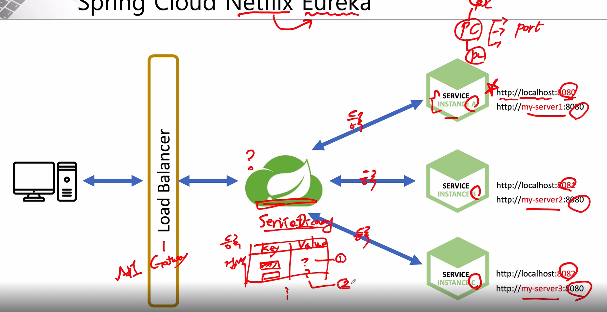

# Spring Discovery

- 각각의 마이크로 서비스를 등록 관리
- key, value 형식으로 되어 각 서비스가 어느 ip 및 포트를 사용하고 있는지 저장(위치 정보 등록)
- 사용자의 요청이 올 경우 해당 서비스로 있는지 검색 후 어느 서버로 가야하는지 알려 줌
- Eureka 는 MSA 의 장점 중 하나인 동적인 서비스 증설 및 축소를 위하여 필수적으로 필요한 서비스의 자가 등록, 탐색 및 부하 분산에 사용될 수 있는 라이브러리
- 마이크로 서비스들의 정보를 레지스트리 서버에 등록할 수 있도록 기능을 제공

- eureka 설정
```xml
pom.xml
<dependency>
    <groupId>org.springframework.cloud</groupId>
    <artifactId>spring-cloud-starter-netflix-eureka-server</artifactId>
</dependency>
```
```java
@SpringBootApplication
@EnableEurekaServer
public class ServiceDiscoveryApplication {

    public static void main(String[] args) {
        SpringApplication.run(ServiceDiscoveryApplication.class, args);
    }

}
```
```yaml
application.yaml

server:
  port: 8761 # 포트 지정

spring:
  application:
    name: discoveryservice

eureka:
  client:
    register-with-eureka: false # 유레카 클라이언트의 역할로 서비스 등록하지 않기 위해
    fetch-registry: false # 유레카 클라이언트의 역할로 서비스 등록하지 않기 위해
```