### **🔹 Keycloak이란?**
Keycloak은 **오픈소스 ID 및 접근 관리(Identity and Access Management, IAM) 솔루션**으로, **Single Sign-On(SSO), OIDC, OAuth2.0, SAML 2.0** 등을 지원하는 인증 및 인가 시스템입니다.

✅ **Keycloak의 주요 기능**
- **SSO (Single Sign-On)**: 한 번 로그인하면 여러 애플리케이션을 다시 로그인할 필요 없이 사용할 수 있음.
- **OAuth 2.0 & OpenID Connect 지원**: JWT 기반의 인증 및 토큰 발급.
- **SAML 2.0 지원**: 기업 환경에서 SSO를 구성할 때 유용.
- **LDAP 및 Active Directory 연동 가능**: 기존 조직의 사용자 디렉터리와 통합.
- **RBAC (Role-Based Access Control)**: 역할(Role) 기반 접근 제어.
- **MFA (Multi-Factor Authentication) 지원**: 2단계 인증 추가 가능.
- **소셜 로그인**: Google, Facebook 등과 연동하여 로그인 가능.
- **Admin UI 제공**: 직관적인 웹 인터페이스를 통한 관리 가능.

---

## **🔹 Keycloak의 주요 개념**
Keycloak을 이해하기 위해 알아야 할 중요한 개념들을 정리했습니다.

### **1️⃣ Realm (영역)**
Keycloak에서 사용자를 그룹화하는 단위입니다.  
- 기본적으로 `master` Realm이 존재하며, 여러 개의 Realm을 만들 수 있음.
- **각 Realm은 독립적인 인증 및 인가 관리**가 가능함.
- **Realm은 인증, 인가의 범위**
- **예시**
  - `company-a` Realm → A 회사의 사용자 및 서비스 관리
  - `company-b` Realm → B 회사의 사용자 및 서비스 관리

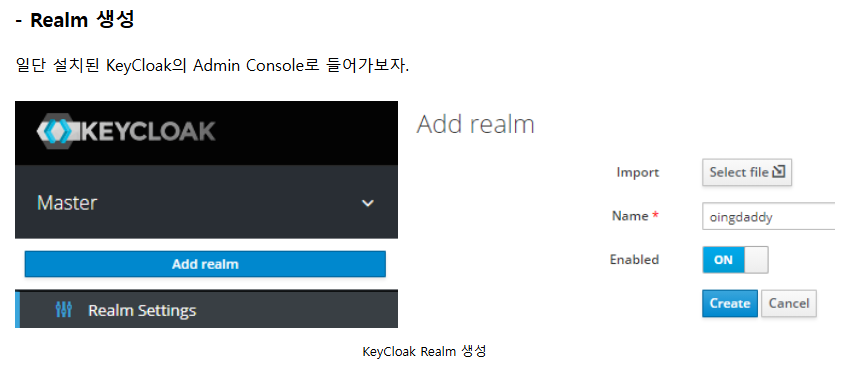
### **2️⃣ Client (클라이언트)**
Keycloak에 등록된 애플리케이션 또는 서비스입니다.  
- 클라이언트는 Keycloak을 통해 **인증 및 인가를 수행**함.
- **예시**
  - `mobile-app-client`: 모바일 앱에서 Keycloak을 통해 인증
  - `web-app-client`: 웹 애플리케이션에서 OIDC를 이용하여 로그인

- **MSA 환경에서는 모든 서비스(Client)를 개별 등록하지 않고, API Gateway(Istio Ingress Gateway)를 단일 Client로 등록하는 방식을 주로 사용**

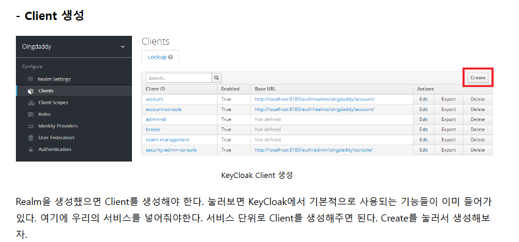
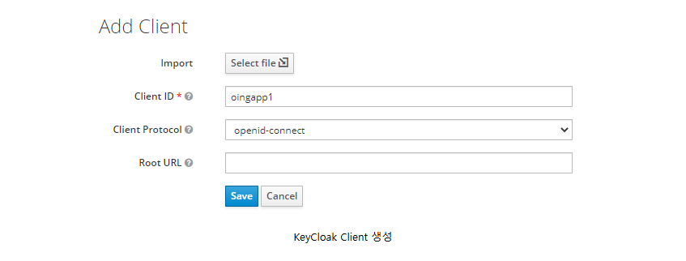


### **🔹 Keycloak Client 설정 설명**
Keycloak에서 **Client**를 생성하는 과정이며, **ReaIm(Realm)** 안에 서비스(Client)를 등록하는 작업이 맞습니다.

## **2️⃣ 이미지에서 설정한 Keycloak Client의 주요 항목**
### **✅ Client 생성 (Oingapp1)**
1. **Client ID**: `oingapp1`
   - Keycloak에 등록할 서비스의 고유한 ID.
   - API, 웹 애플리케이션, 모바일 앱 등 특정 애플리케이션을 대표하는 ID.

2. **Client Protocol**: `openid-connect`
   - OIDC(OpenID Connect)를 사용하여 인증을 수행.

---

### **✅ Client 설정 (세부 설정)**
1. **Access Type**: `confidential`
   - `confidential`: 클라이언트가 보안이 필요한 애플리케이션(예: 백엔드 서버)에서 사용됨. **Client Secret을 사용 키클락을 통한 로그인 필요**하여 인증.
   - `public`: SPA, 모바일 앱 등 Client Secret을 저장할 수 없는 애플리케이션에서 사용됨.
   - `bearer-only`: Keycloak을 통한 직접 로그인 없이, 토큰만 검증하는 API에서 사용.

2. **Standard Flow Enabled**: ✅ `ON`
   - **Authorization Code Flow**를 활성화 (OIDC 표준 로그인 방식)
   - `code`를 받아서 Access Token을 교환하는 방식

3. **Implicit Flow Enabled**: ✅ `ON`
   - **Implicit Flow**를 활성화 (SPA 등에서 사용)
   - Access Token을 직접 받아오는 방식 (보안 취약 가능성이 있어 일반적으로 비권장)

4. **Direct Access Grants Enabled**: ✅ `ON`
   - 클라이언트가 `grant_type=password`를 사용하여 **사용자명/비밀번호 기반 로그인**을 허용.

5. **Valid Redirect URIs**: `http://localhost:8081/*`
   - 사용자가 Keycloak 로그인 후 **리디렉션되는 URL**을 지정.
   - OIDC 로그인 후 이 URL로 리다이렉트됨.
   - 예: `http://localhost:8081/callback`으로 리다이렉트 가능.

6. **Web Origins**: `http://localhost:8081/*`
   - CORS 정책에 따라 허용할 웹 애플리케이션의 도메인.
   - 웹에서 Keycloak 요청을 허용할 Origin을 지정.

---

## **3️⃣ Keycloak Client가 수행하는 역할**
- **서비스가 Keycloak과 통신하는 역할을 담당**  
- **사용자가 Keycloak에서 로그인 후, Redirect URL을 통해 서비스로 이동**
- **API Gateway(예: Istio, Spring Cloud Gateway)가 JWT를 검증하여 서비스로 라우팅 가능**

---
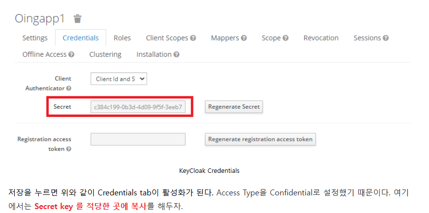

### **3️⃣ User (사용자)**
Keycloak에서 관리하는 사용자 계정입니다.  
- 사용자는 **Username/Password** 또는 **소셜 로그인**을 통해 인증할 수 있음.
- 관리자가 직접 사용자를 추가할 수도 있음.

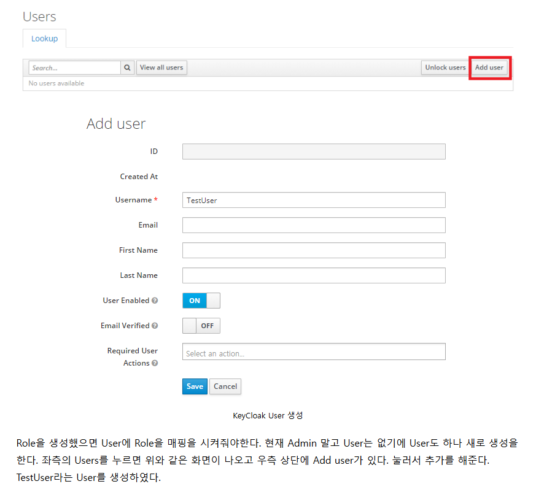

### **4️⃣ Role (역할)**
사용자에게 부여되는 권한 단위입니다.  
- **Realm Role**: 전체 Realm에서 사용할 수 있는 역할
- **Client Role**: 특정 클라이언트(서비스)에만 적용되는 역할
- **예시**
  - `admin`: 관리자 권한
  - `user`: 일반 사용자 권한
  - `manager`: 특정 클라이언트에서만 적용되는 권한

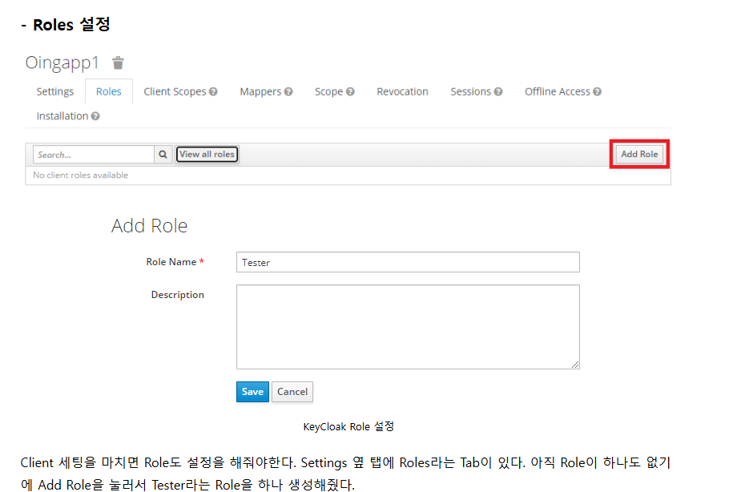
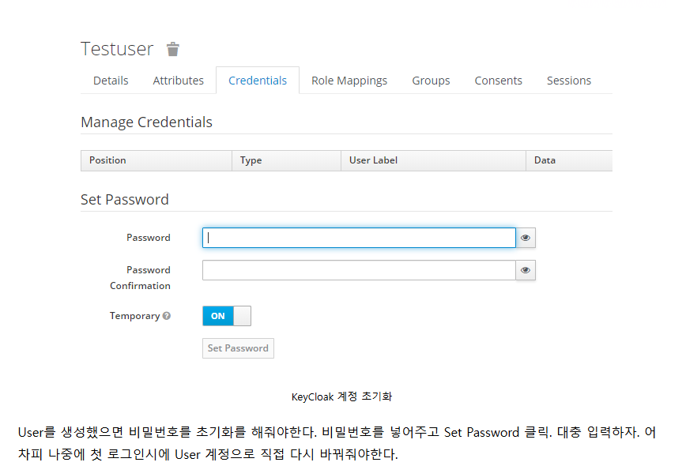
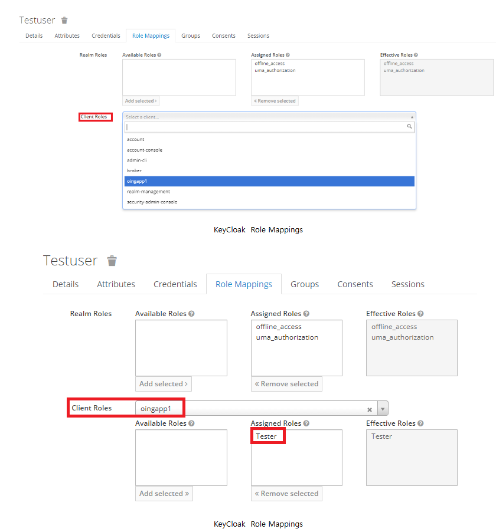

### **5️⃣ Group (그룹)**
여러 사용자를 그룹화하는 기능입니다.  
- 사용자는 그룹에 속할 수 있으며, 그룹에 Role을 할당할 수 있음.
- **예시**
  - `students`: 학생 그룹
  - `teachers`: 교사 그룹

### **6️⃣ Token (토큰)**
Keycloak은 JWT (JSON Web Token)를 사용하여 인증 및 인가 정보를 전달합니다.  
- **Access Token**: 사용자가 서비스에 접근할 수 있는 권한을 나타냄.
- **Refresh Token**: Access Token이 만료될 경우, 새로 갱신하는 데 사용됨.
- **ID Token**: OIDC(OpenID Connect)에서 사용자 정보를 포함한 토큰.

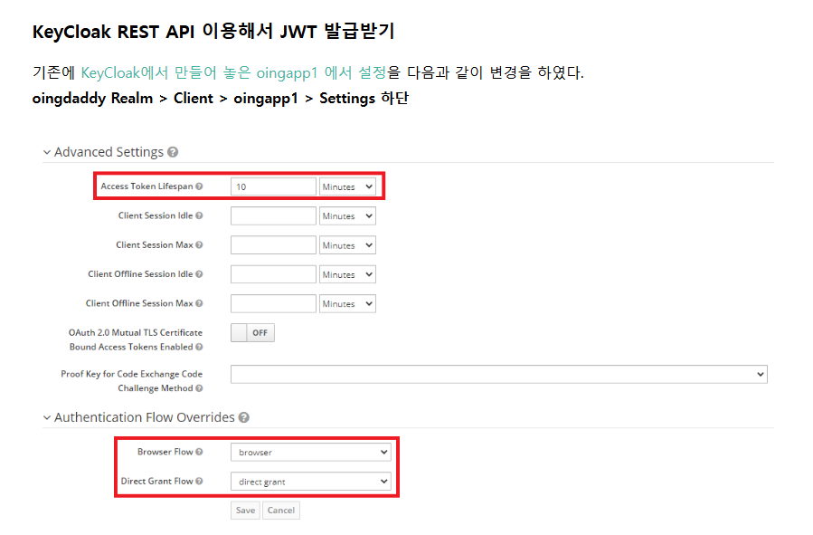
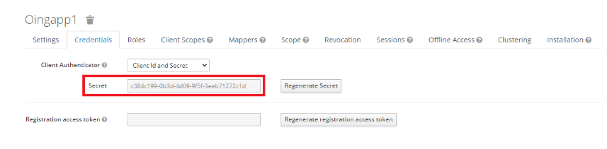
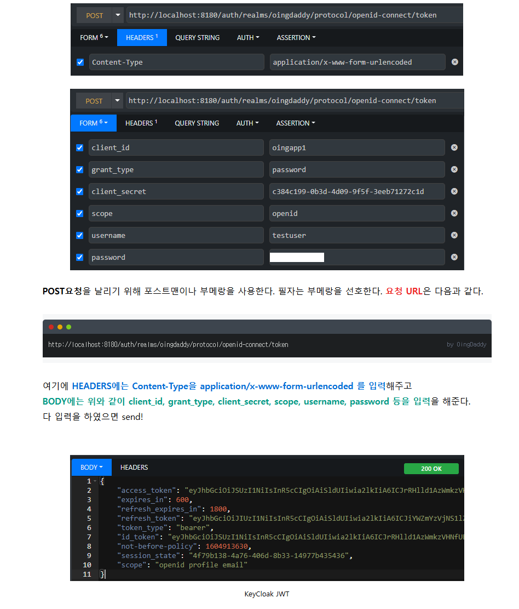
---

## **🔹 Keycloak 인증 과정 (OAuth 2.0 / OIDC)**
Keycloak은 **OAuth 2.0 / OIDC (OpenID Connect)** 기반으로 동작합니다.

1️⃣ **사용자가 로그인 요청**  
   → 클라이언트(웹/앱)가 Keycloak 로그인 페이지로 리디렉트됨.

2️⃣ **사용자가 Keycloak에서 인증 진행**  
   → 사용자는 Keycloak에서 ID/PW 입력 또는 소셜 로그인 진행.

3️⃣ **Keycloak이 Access Token 발급**  
   → 인증이 완료되면 JWT 기반의 Access Token을 클라이언트에게 반환.

4️⃣ **클라이언트가 Access Token을 포함하여 API 호출**  
   → API 서버(백엔드)는 Access Token을 확인하여 인증된 요청인지 검증.

5️⃣ **API 서버가 Token을 검증하고 응답 반환**  
   → Keycloak의 `jwks_uri`를 통해 공개키를 가져와 JWT 검증.

---

## **🔹 Keycloak 사용 사례**
🔹 **MSA(Microservices Architecture) 환경에서 인증 시스템 구축**  
   - Istio Ingress Gateway와 연동하여 **API Gateway 수준에서 JWT 인증** 가능  
   - 개별 서비스에서는 별도의 인증 처리 없이 JWT를 검증하여 접근 제어  

🔹 **기업 내부 시스템의 SSO 구축**  
   - 여러 사내 시스템을 하나의 Keycloak 인증 시스템과 연동하여 **단일 로그인(Single Sign-On)** 구현  

🔹 **OAuth 2.0 및 OIDC 기반 인증 적용**  
   - REST API 서비스에서 OAuth 2.0 기반 인증을 Keycloak으로 관리  

🔹 **소셜 로그인 연동**  
   - Google, Facebook, GitHub 등의 로그인 기능을 Keycloak과 통합  

🔹 **RBAC(Role-Based Access Control) 기반 접근 제어**  
   - 사용자의 역할(Role)에 따라 서비스 접근 권한을 다르게 설정  

---

## **🚀 Keycloak을 활용한 Istio 연동**
Keycloak과 Istio Ingress Gateway를 연동하여 **API Gateway 수준에서 JWT 인증을 처리**할 수 있습니다.

### **1️⃣ Keycloak에서 JWT 발급**
```bash
TOKEN=$(curl -X POST "https://keycloak.example.com/auth/realms/myrealm/protocol/openid-connect/token" \
  -H "Content-Type: application/x-www-form-urlencoded" \
  -d "client_id=my-client" \
  -d "username=myuser" \
  -d "password=mypassword" \
  -d "grant_type=password" | jq -r .access_token)

echo "Token: $TOKEN"
```

### **2️⃣ Istio에서 JWT 검증**
```yaml
apiVersion: security.istio.io/v1beta1
kind: RequestAuthentication
metadata:
  name: keycloak-jwt-auth
  namespace: istio-system
spec:
  selector:
    matchLabels:
      istio: ingressgateway
  jwtRules:
  - issuer: "https://keycloak.example.com/auth/realms/myrealm"
    jwksUri: "https://keycloak.example.com/auth/realms/myrealm/protocol/openid-connect/certs"
```

📌 **Istio Ingress Gateway가 Keycloak에서 발급한 JWT를 자동으로 검증**  
📌 **유효한 토큰이 없으면 API 요청을 거부 (401 Unauthorized)**  

---

## **🚀 Keycloak을 왜 사용해야 할까?**
✅ **완전한 오픈소스 & 무료**  
✅ **OAuth2.0 / OIDC 기반으로 보안 강화**  
✅ **LDAP, AD 연동 가능**  
✅ **API Gateway(Istio, Kong, Nginx)와 쉽게 연동 가능**  
✅ **SSO, MFA, RBAC 등 다양한 인증 기능 지원**  
✅ **관리 UI 제공으로 쉽게 운영 가능**  

**👉 Keycloak을 사용하면 인증/인가 시스템을 구축하는 데 소요되는 개발 비용을 줄이고, 강력한 보안 기능을 손쉽게 활용할 수 있습니다.** 🚀


### **🚀 Keycloak에 API Gateway만 등록하고 내부 서비스는 JWT 검증만 추가하는 방식 (권장)**
✅ **결론:**  
👉 **Keycloak에는 API Gateway만 등록하면 되고, 내부 서비스는 Keycloak과 직접 통신하지 않고 JWT 검증만 추가하면 됩니다.**  
👉 **OpenFeign을 사용할 때 JWT를 전달하기 위한 URL만 설정하면 됩니다.**  

---

## **✅ 최종 설정 방식**
### **1️⃣ Keycloak에서 API Gateway 등록**
👉 Keycloak에서 API Gateway만 등록하고, 내부 서비스는 Keycloak을 직접 호출하지 않음.

#### **📌 Keycloak에서 Client 생성**
| 항목 | 값 |
|------|------|
| **Client ID** | `api-gateway` |
| **Access Type** | `confidential` |
| **Valid Redirect URIs** | `https://api-gateway.example.com/*` |
| **Web Origins** | `https://api-gateway.example.com` |

✅ **이 설정을 통해 클라이언트(웹/모바일 앱)가 API Gateway를 통해 Keycloak 인증을 받을 수 있음.**  
✅ **API Gateway가 JWT를 검증하고 내부 서비스로 전달.**  

---

### **2️⃣ API Gateway에서 JWT 검증 설정**
👉 API Gateway(Istio 또는 Spring Cloud Gateway)가 JWT를 검증하고 내부 서비스로 전달함.

#### **📌 Istio에서 JWT 검증**
```yaml
apiVersion: security.istio.io/v1beta1
kind: RequestAuthentication
metadata:
  name: keycloak-jwt-auth
  namespace: istio-system
spec:
  selector:
    matchLabels:
      istio: ingressgateway
  jwtRules:
  - issuer: "https://keycloak.example.com/auth/realms/myrealm"
    jwksUri: "https://keycloak.example.com/auth/realms/myrealm/protocol/openid-connect/certs"
```
✅ **Istio가 API Gateway에서 JWT를 검증하고, 유효한 요청만 내부 서비스로 전달.**  
✅ **내부 서비스에서는 추가 검증 없이 API Gateway를 신뢰.**

---

### **3️⃣ 내부 서비스에서 JWT 검증 추가**
👉 내부 서비스는 Keycloak과 직접 통신하지 않고 **JWT만 검증**하도록 설정.

#### **📌 Spring Boot에서 JWT 검증 추가**
**📌 `application.yml`**
```yaml
spring:
  security:
    oauth2:
      resourceserver:
        jwt:
          issuer-uri: https://keycloak.example.com/auth/realms/myrealm
```

📌 **설명**
- 내부 서비스에서 Keycloak의 `issuer-uri`를 설정하여 JWT 검증 수행.

### **📌 Spring Boot에서 Keycloak 라이브러리 추가 **
``` xml
<dependency>
    <groupId>org.springframework.boot</groupId>
    <artifactId>spring-boot-starter-security</artifactId>
</dependency>
<dependency>
    <groupId>org.keycloak</groupId>
    <artifactId>keycloak-spring-boot-starter</artifactId>
    <version>20.0.3</version>
</dependency>
<dependency>
    <groupId>org.springframework.boot</groupId>
    <artifactId>spring-boot-starter-oauth2-resource-server</artifactId>
</dependency>

```
📌 이제 내부 서비스에서도 Keycloak JWT 검증 가능.
📌 JWT를 이용한 OAuth2 인증을 위해 spring-boot-starter-oauth2-resource-server 추가.


**📌 Spring Security 설정**
```java
@Configuration
@EnableWebSecurity
public class SecurityConfig {
    @Bean
    public SecurityFilterChain securityFilterChain(HttpSecurity http) throws Exception {
        http.authorizeHttpRequests(authz -> authz
            .requestMatchers("/admin/**").hasRole("ADMIN")
            .anyRequest().authenticated()
        )
        .oauth2ResourceServer(OAuth2ResourceServerConfigurer::jwt);
        return http.build();
    }
}
```
📌 **설명**
- 내부 서비스는 **API Gateway를 통해 전달된 JWT만 검증**하고, Keycloak과 직접 통신하지 않음.

---

### **4️⃣ OpenFeign 호출 시 JWT 전달**
👉 `order-service`가 `user-service`를 호출할 때 JWT를 자동으로 포함해야 함.

#### **📌 OpenFeign 인터페이스**
```java
@FeignClient(name = "user-service", url = "http://user-service:8080")
public interface UserServiceClient {
    @GetMapping("/user/{id}")
    UserResponse getUserById(@PathVariable("id") Long id, @RequestHeader("Authorization") String token);
}
```
✅ **OpenFeign 호출 시 `Authorization: Bearer {JWT}`를 포함하도록 설정.**

#### **📌 OpenFeign RequestInterceptor로 JWT 자동 추가**
```java
@Component
public class FeignClientInterceptor implements RequestInterceptor {

    @Override
    public void apply(RequestTemplate template) {
        Authentication authentication = SecurityContextHolder.getContext().getAuthentication();
        if (authentication != null && authentication.getCredentials() != null) {
            String token = authentication.getCredentials().toString();
            template.header("Authorization", "Bearer " + token);
        }
    }
}
```
📌 **설명**
- `order-service`가 `user-service`를 호출할 때, 현재 로그인된 사용자의 JWT를 자동으로 포함.

---

### **5️⃣ 최종 구조**
```
(Client) → [JWT 검증] API Gateway → 내부 서비스
                          ↳ [JWT 전달] order-service → user-service (OpenFeign)
```
✅ **API Gateway에서 JWT를 검증하고 내부 서비스로 전달**  
✅ **내부 서비스는 JWT만 검증하고 Keycloak과 직접 통신하지 않음**  
✅ **OpenFeign을 통해 서비스 간 호출 시 JWT를 자동으로 포함**  

---

## **🚀 최종 결론**
✅ **Keycloak에는 API Gateway만 등록하면 되고, 내부 서비스는 Keycloak과 직접 통신할 필요 없음.**  
✅ **내부 서비스는 JWT 검증 로직만 추가하면 됨 (`issuer-uri` 설정).**  
✅ **OpenFeign을 사용할 경우, JWT를 자동으로 포함하여 전달해야 함.**  
✅ **Istio를 사용할 경우, API Gateway에서 JWT를 검증하고 내부 서비스는 추가 검증 없이 신뢰 가능.**  

💡 **이 방식이 가장 간단하면서도 보안성을 유지할 수 있는 최적의 방법입니다.** 🚀
