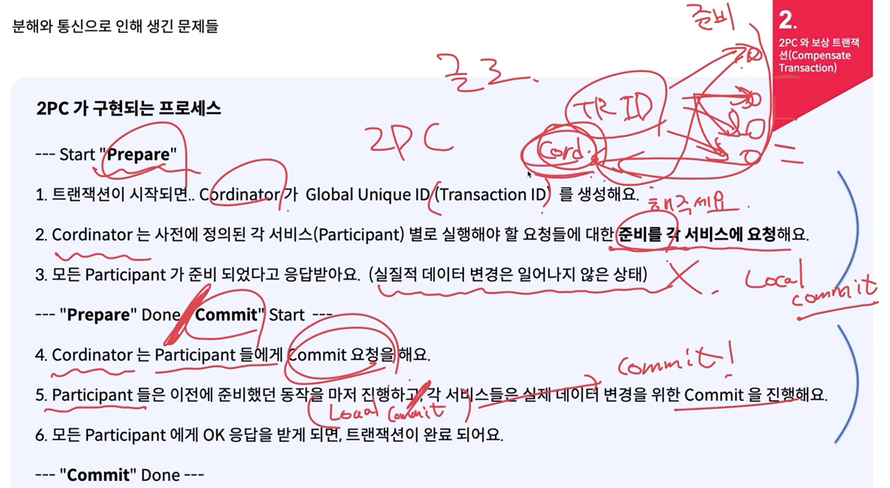
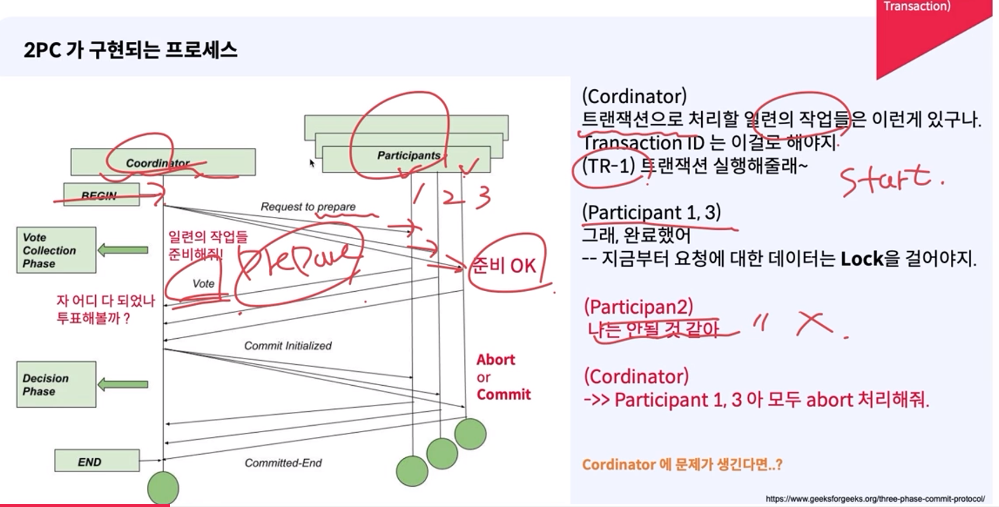
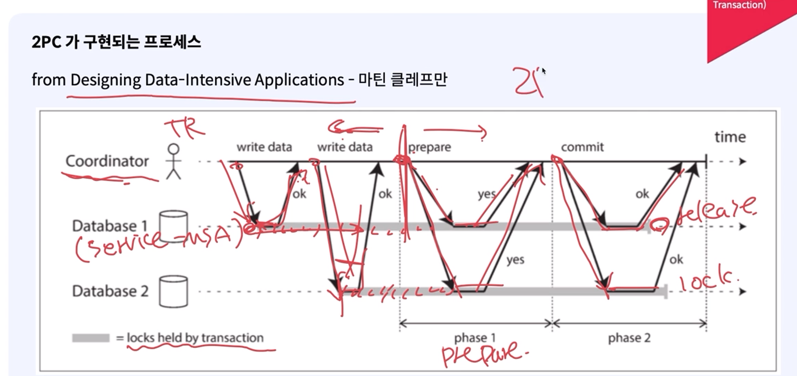

# 분산 트랜잭션
### 정석적인 방법으로는 구현이 힘듬
- MSA 환경에서 트랜잭션 실패 시 고려
다른 서비스를 호출을 하고 해당 서비스에서 트랜잭션이 실패 했을 경우 어떻게 처리해야 할 것인지 고려해야함
    

    

### 분산 시스템 환경에서 트랜잭션을 유지하기 위한 방안
#### 2PC, 보상 트랜잭션, Saga Pattern(2PC + 보상 트랜잭션)

#### 2PC(2 Phase Commit)
- 2 Phase Commit
    - 처음엔 다수의 노드를 가지는 데이터베이스(e.g. Mysql) 에서 커밋을 구현하기 위한 개념으로 시작
    - 의미가 확장 되어, 분산 시스템(다수의 노드) 환경에서 트랜잭션을 구현하기 위한 해결 방안 중 하나
- 2 Phase Commit 은 하나의 약속 규약(프로토콜)
    - 2 PC 를 위해서는 분산 시스템 환경에서 Cordinator 라는 추가적인 요소(인프라)가 필요
    - 그리고 트랜잭션을 위한 서비스들을 Participant (참여자) 라고 정의(코디네이터가 참여자를 조율)
    - 2 Phase 는 각각 다음과 같음
    - Preapare (Phase 1) 준비
    - Commit (Phase 2) 커밋
- Cordinator(조정자): 분산 트랜잭션을 위해 데이터 변경을 수행하는 서버(MSA 환경에서 각 서비스) 들의 Phase 를 관리

- 2PC 구현되는 프로세스

- 2PC 취약성

#### 보상 트랜잭션
- 보상 트랜잭션
    - 일련의 작업을 보상(보정) 하기 위한 트랜잭션을 구현하기 위한 하나의 방법
    - 개념 자체는 고전적인 데이터베이스 개념
    - "commit" 된 데이터를 "commit" 되기 이전의 상태로 변경하기 위한 작업
    - 데이터베이스 개념상으로는 작업(do)하던 내용을 다시 Undo 할 때 "보상"(Compensate) 라는 용어를 사용
    
- MSA 환경에서 보상 트랜잭션
    - "commit" 된 데이터 변경을 수반하는 요청이 정상적으로 종료 된 서비스의 데이터를 API 호출에 대해서 "commit" 되기 이전의 그 데이터 변경 요청을 하기 이전의 상태로 변경하기 위한 작업 상태로 되돌리기 위한 API
    
    - 한계
        - 보상 트랜잭션 요청에 지연 혹은 실패, 문제가 생기는 경우, 보상 트랜잭션을 호출하는 주체는 명확한 판단이어려움

#### SAGA 패턴
- SAGA 패턴
    - 이벤트 방식으로 트랜잭션에 포함된 여러 작업(각 서비스의 API Call) 의 결과를 게시하고,
이벤트를 비동기 처리하여 다음 작업들을 진행
    
    - 정상 작동 시
    
    - 실패 시
    
    이벤트 기반으로 성공 실패 여부를 전달 받고 있음
    - 결국 **이벤트 기반으로 성공 및 실패 여부**를 받고 **실패 경우 보상 트랜잭션(롤백)** 작업 실행

- 코레오그레피 (Choreography) 패턴
    - 독립적인 조율자(Ochestrator) 를 두지 않고, Saga 를 구현하는 방법
    - 구현이 비교적 간단하지만, 트랜잭션 상황을 모니터링하기 어렵다는 단점

- 오케스트레이션 (Orchestration) 패턴
    - 독립적인 조율자(Ochestrator) 를 두어, 하나의 Saga (트랜잭션) 에 대한 매니징을 담당하는 방법
    - 구현이 비교적 어렵지만, 비교적 전체적인 트랜잭션의 모니터링이 수월하다는 장점

#### 코레오그레피 (Choreography) 패턴
- 이전 작업이 확인이 되어야 순차적으로 다음 작업 진행
    
- 문제가 발생 시 실패 이벤트 게시 후 보상 트랜잭션 실행
    
- 각 서비스는 성공 및 실패에 대해서 이벤트를 정의해놓고 실행할 뿐
- 코레오그래피 패턴 적용 시 주의할 점과 특징
    - 이벤트를 Publish(Produce) 하는 작업이, 내부 서비스의 트랜잭션과 하나로 묶여야 함
그렇지 않으면, 내부(각 서비스 로컬) 데이터의 변경을 위한 작업 이후 정상적으로 이벤트가 발행되지 않을수 있어요 올바른 패턴 구현이 불가능
    - 각 서비스의 입장에서는 구현이 단순, 복잡도가 낮음
    - 각 서비스 입장에서는 사전에 정의된 이벤트만 받고, 정의된 이벤트만 보내면 되기 때문
    > 그러나, 복잡한 비즈니스가 될 수록 전체적인 트랜잭션의 상태나 Saga 의 정의에 대한 분석과 유지보수가 어려워질 수 있음
    

#### 오케스트레이션 (Orchestration) 패턴
- request 및 reply 큐를 두어(메시지 브로커) 오케스트레이터가 다른 서비스에 요청 및 응답을 받고 다른 서비스에 요청 및 응답 확인을 반복 후 마지막으로 오케스트레이터가 최종 결과를 게시하는 큐에 프로듀스하고 오더서비스가 컨슘하면서 최종 처리
    
- 실패 응답을 받았을 때 오케스트레이터가 롤백 요청을 보냄
    

#### 오케스트레이션 패턴 적용 시 주의할 점과 특징
- 추가적인 인프라(오케스트레이터) 가 필요하기 때문에, 이를 관리하기 위한 대책이 동반
    - 섣부른 적용은, 오히려 독이 될 수도 있어요
- 각 서비스에서의 구현은 비교적 간단해지고, 보상 트랜잭션만 구현
    - 관심사 분리 측면에서 유지보수 효율성이 올라감
- 트랜잭션에 대한 비즈니스 로직이 오케스트레이터에 포함될 가능성이 있음
    - 코드값에 따라 비즈니스 로직을 처리하는 경우
    - 다음 수행할 일을 static으로 정의

SAGA 패턴과 관련된 요소

### SAGA 패턴과 관련된 요소
- 카프카와 같은 메시징 시스템: 서비스를 비동기적으로 연결하고, 이벤트 기반으로 트랜잭션의 상태를 전파합니다.
- 보상 트랜잭션: 트랜잭션이 실패했을 때 롤백을 위해 실행됩니다. 예를 들어, 주문이 실패하면 결제를 취소하거나 재고를 다시 돌려놓는 작업을 수행합니다.

### SAGA 패턴과 락의 조합
- 락을 사용하는 시나리오는 **여러 개의 서비스 인스턴스(파드)**가 하나의 데이터베이스를 참조할 때, 동시성 문제를 해결하기 위한 방법으로 유효합니다. 특히, 동일한 데이터에 여러 요청이 동시 접근하여 데이터 일관성이 깨질 위험이 있을 때 락을 사용하여 그 문제를 해결할 수 있습니다.

### 락 사용의 주요 목표
- 동시성 제어: 같은 서비스의 여러 파드가 하나의 데이터베이스에 접근할 때, 동일한 자원(데이터)을 동시에 수정하지 않도록 락을 사용하여 동시성 문제를 방지합니다.
- 데이터 무결성 보장: 락을 통해 트랜잭션이 실행되는 동안 다른 트랜잭션이 동일한 데이터를 변경하지 않도록 방지할 수 있습니다.

### 결론

- SAGA 패턴은 카프카를 통해 분산 트랜잭션을 관리하고, 보상 트랜잭션을 통해 트랜잭션 실패 시 롤백을 수행하는 구조입니다.
- 락은 주로 **동일한 서비스의 여러 인스턴스(파드)**가 하나의 데이터베이스에 동시 접근할 때, 데이터 무결성을 보장하기 위해 사용됩니다.
- 두 가지를 조합하면, 분산 트랜잭션의 처리와 동시성 문제 해결을 모두 다룰 수 있습니다. SAGA 패턴으로 분산된 트랜잭션 관리 및 복구를 처리하고, 락으로 단일 데이터베이스에 대한 동시성 문제를 제어할 수 있습니다.
- 또한 굳이 카프카나 비동기 메시징 시스템을 통하지 않고 **OpenFeign과 예외 처리를 사용하여 동기적으로 보상 트랜잭션을 처리**할 수 있습니다. 이 방식은 시스템 구조가 더 단순해지고 즉각적인 응답을 받을 수 있는 장점이 있지만,**서비스 간 의존성이 커지고 성능 저하나 타임아웃 문제가 발생**할 수 있습니다.
- Kafka와 같은 비동기 메시징 시스템은 서비스 간 독립성과 확장성을 보장하면서도 더 복원력 있는 트랜잭션 관리를 제공합니다. 실패 후 재시도가 가능하며, 분산 시스템에서 더 안정적으로 사용할 수 있습니다.
- 따라서, 동기적 처리가 필요한 경우 OpenFeign을 사용하고, 더 높은 복원력과 비동기적 트랜잭션 처리가 필요할 경우에는 Kafka와 같은 메시징 시스템을 사용하는 것이 좋습니다.

