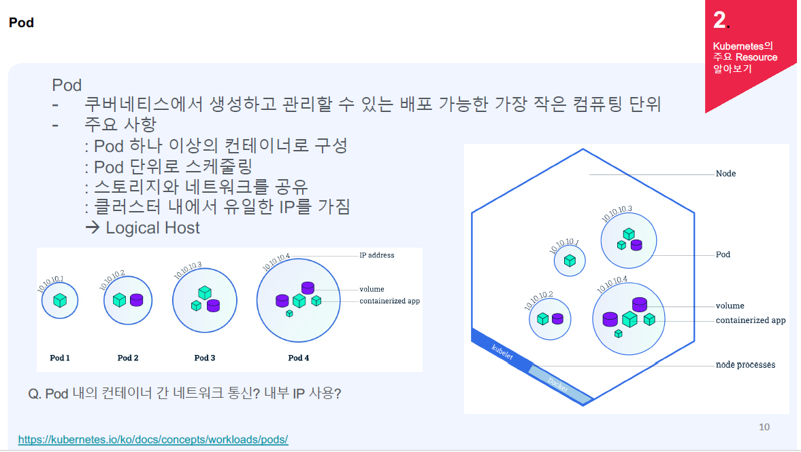
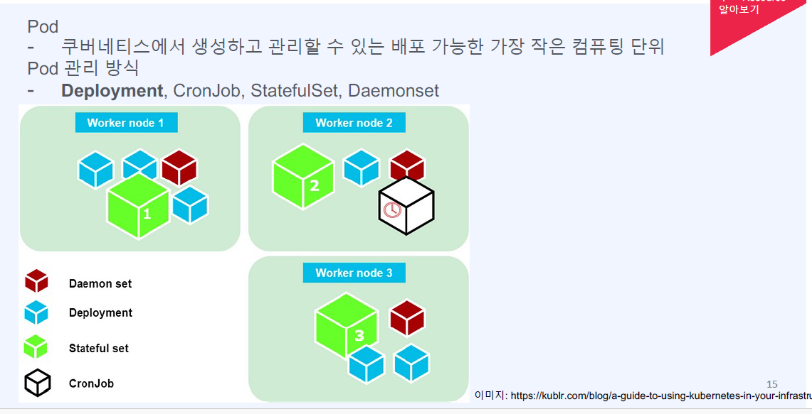
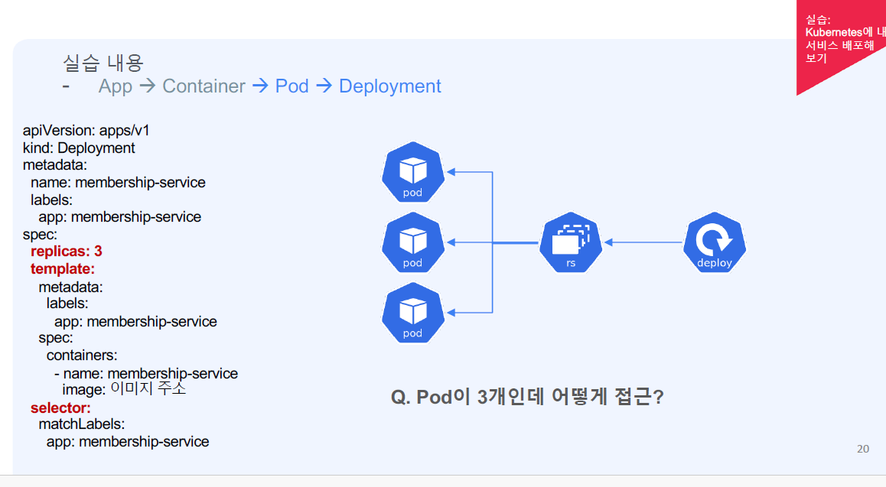
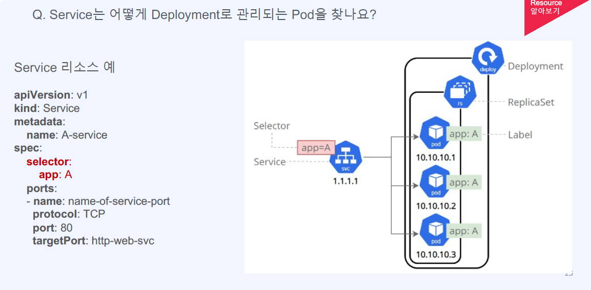
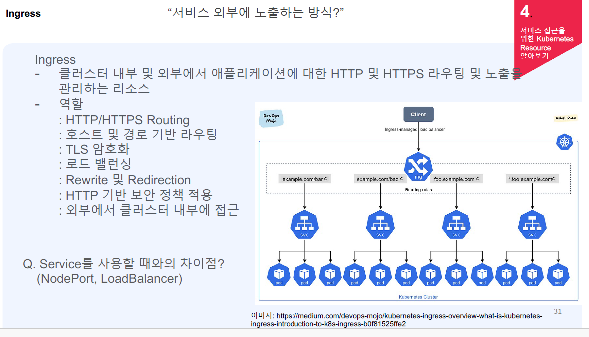
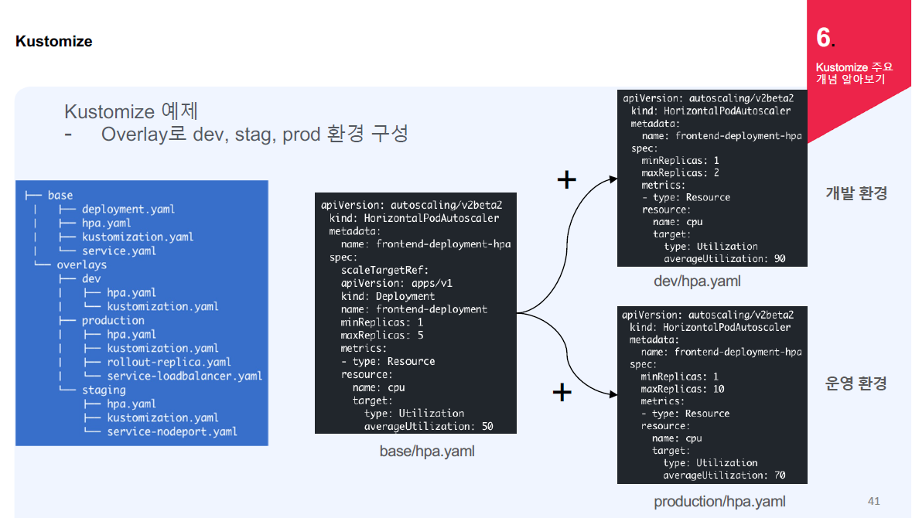
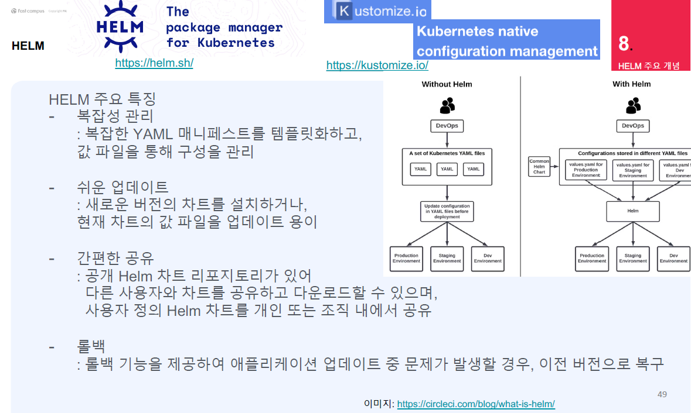
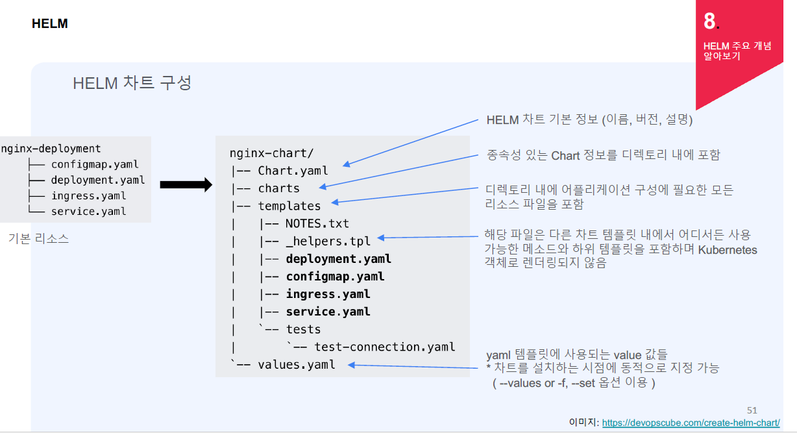

# Docker

## Dockerfile
- **FROM openjdk:8-jdk-alpine**: OpenJDK 8 Alpine이라는 베이스 이미지를 사용하여 이미지를 생성 (Docker Hub에서 검색 가능)
- **VOLUME /tmp**: 가상의 임시 디렉토리를 생성
- **COPY target/users-ws-0.1.jar users-service.jar**: 호스트의 파일을 컨테이너에 해당 명칭으로 복사 (Dockerfile 위치 기준)
- **ENTRYPOINT**: 컨테이너 실행 시 사용할 명령어 설정
  ```plaintext
  ENTRYPOINT ["java",
  "-Djava.security.egd=file:/dev/./urandom",
  "-jar",
  "users-service.jar"]


- Docker 명령어:
```plaintext 
    $ docker build -t edowon0623/users-service:1.0 . : 이미지 생성
    $ docker push edowon0623/user-service:1.0 : 컨테이너 이미지를 레지스트리에 등록
    $ docker pull edowon0623/user-service:1.0 : 이미지 가져오기
```

# Docker Compose
```
version: '2'
services:
  zookeeper:
    image: wurstmeister/zookeeper
    ports:
      - "2181:2181"
    networks:
      my-network:
        ipv4_address: 172.18.0.100

  kafka:
    image: wurstmeister/kafka
    ports:
      - "9092:9092"
    environment:
      KAFKA_ADVERTISED_HOST_NAME: 172.18.0.101
      KAFKA_CREATE_TOPICS: "test:1:1"
      KAFKA_ZOOKEEPER_CONNECT: zookeeper:2181
    volumes:
      - /var/run/docker.sock:/var/run/docker.sock
    networks:
      my-network:
        ipv4_address: 172.18.0.101

networks:
  my-network:
    name: ecommerce-network
```
# 컨테이너 이미지 배포
## 코드 배포 전략
- 롤링 업데이트
  - 순차적 업데이트 배포
  - 이점
    - 제로 다운타임. 새 버전이 준비상태가 된 후에 트래픽이 전달됨
    - 배포 위험이 적음. 새 버전에 문제가 있을 경우 일부 사용자에게만 영향을 미침
  - 고려사항
    - 느린 배포, 느린 롤백. 롤백도 점진적으로 진행
    - 이전 버전과의 호환성. 서로 다른 버전의 코드가 사용자에게 노출됨
    - 이전 버전의 데이터를 읽고 처리하는데 있어서 호환성이 필요함
- 블루/그린 배포
  - 환경을 분리하여 배포
  - 이점
    - 제로 다운타임. 신속하게 전환
    - 빠른 롤백. 문제를 감지하면 다시 이전의 환경으로 전환
    - 블루/그린의 환경을 분리해 배포 위험을 줄임
  - 고려사항
    - 비용과 운영 오버헤드. 2배의 환경을 구성해야 해서 비용이 증가. DB 커넥션 풀을 사용하는 경우 커넥션 수도 증가.
    - 이전 버전과의 호환성. 스키마 변경에 따른 고려가 필요함.
    - 컷오버. 기존 트랙잭션이나 세션에 대한 적절한 연결 드레이닝이 필요

## Pod
- 쿠버네티스에서 생성하고 관리할 수 있는 배포 가능한 가장 작은 컴퓨팅 단위
- 주요 사항
  - Pod 하나 이상의 컨테이너로 구성
  - Pod 단위로 스케줄링
  - 스토리지와 네트워크를 공유
  - 클러스터 내에서 유일한 IP를 가짐
  
- Pod 관리 방식  
  - Deployment
    - 애플리케이션의 레플리카셋을 관리하는 쿠버네티스 리소스
    - 레프리카셋
      - ReplicaSet은 컨테이너화된 애플리케이션의 복제본을 관리
      - 복제본 수를 설정하고 유지하여 원하는 수의 복제본을 유지
    - 애플리케이션을 업데이트하거나 롤백하는 데 사용되며, 롤링 업데이트 및 스케일링을 지원
    - 주로 웹 애플리케이션과 서비스의 배포에 적합  
  - CronJob
    - 일정된 시간 또는 주기적으로 작업을 실행하는데 사용
    - 주기적으로 Job을 생성하고 관리하며, 실패한 작업을 재시도할 수 있음
    - 주기적인 배치 작업 및 자동화된 작업 스케줄링에 유용
  - StatefulSet
    - 인스턴스의 순서를 유지하고 안정적인 네트워킹을 제공
    - 지속적인 상태를 가지는 애플리케이션에 적합 
      - 예) 데이터베이스와 같이 각각의 인스턴스가 고유한 식별자를 가져야 하는 애플리케이션  
  - Daemonset
    - 모든 노드에서 실행되어야 하는 백그라운드 작업을 위한 리소스
    - 모든 노드에 하나의 Pod을 유지하며, 노드가 추가되거나 제거될 때 자동으로 조정
    - 로깅, 모니터링, 네트워크 에이전트 등과 같은 백그라운드 서비스에 유용
    
    
## 서비스
  - 쿠버네티스 클러스터 내에서 실행 중인 파드(컨테이너 그룹)에 대한 네트워크 접근성을 제공하는 역할을 수행
  - 파드는 수시로 생성 및 삭제되며 IP 주소가 변경되므로 Service를 통해 파드에 접근
    -> L4 로드밸런서 역할
  - Service는 논리적 서비스 단위로 파드 그룹에 대한 네트워크 주소와 포트를 노출
  - label로 파드를 찾아서 라우팅
   
## Kubernetes Service Types
- ClusterIP: 클러스터 내부에서만 접근 가능한 서비스
- NodePort: 클러스터 노드의 특정 포트를 통해 외부와 내부 모두 서비스에 액세스 가능
- LoadBalancer: 클라우드 제공업체의 로드밸런서를 통해 외부에서 접근 가능
- Ingress: HTTP/HTTPS 라우팅을 관리하는 리소스로, 외부에서 클러스터 내부로 접근 가능

## Ingress
- 클러스터 내부 및 외부에서 애플리케이션에 대한 HTTP 및 HTTPS 라우팅 및 노출을 관리하는 리소스
- 역할
  - HTTP/HTTPS Routing
  - 호스트 및 경로 기반 라우팅
  - TLS 암호화
  - 로드 밸런싱
  - Rewrite 및 Redirection
  - HTTP 기반 보안 정책 적용
  - 외부에서 클러스터 내부에 접근
   
## Ingress 예시
- AWS ALB
```
apiVersion: networking.k8s.io/v1
kind: Ingress
metadata:
  name: my-ingress
  annotations:
    alb.ingress.kubernetes.io/scheme: internet-facing
    alb.ingress.kubernetes.io/target-type: ip
spec:
  ingressClassName: alb
  rules:
    - http:
        paths:
          - path: /
            pathType: Prefix
            backend:
              service:
                name: membership-service
                port:
                  name: http
```
- NHN Cloud
```
apiVersion: networking.k8s.io/v1
kind: Ingress
metadata:
  name: my-ingress
  annotations:
    ncp.ingress.kubernetes.io/scheme: internet-facing
    ncp.ingress.kubernetes.io/target-type: ip
spec:
  ingressClassName: ncp
  rules:
    - http:
        paths:
          - path: /
            pathType: Prefix
            backend:
              service:
                name: membership-service
                port:
                  name: http
```

## Kustomize
- 쿠버네티스 리소스 구성 관리 및 배포를 간편화하는 도구
- 기존 베이스 파일을 사용하고 각 환경에 맞게 patch.yaml 파일을 만들어서 구성
- 다양한 환경 및 설정에 맞게 Kubernetes 리소스를 커스터마이징하고 배포할 수 있도록 지원
- kubectl 에서 kustomization file지원
```
$ kubectl apply -k
```
## Kustomize 특징
- 단순성: 복잡한 템플릿 파일을 작성하지 않고도 리소스를
커스터마이징하고 배포
- 일관성: 다양한 환경(dev, stag, qa, prod)에서 동일한
어플리케이션을 배포하기 위한 일관성을 제공
- Layered 방식: 레이어 구조를 사용하여 리소스 정의를
계층화. 공통 기본 구성과 환경 특정 구성을 분리 가능.
```
apiVersion: kustomize.config.k8s.io/v1beta1
kind: Kustomization
resources:
  - base/deployment.yaml
patchesStrategicMerge:
  - overlay/deployment.yaml
```
 
- 다양한 리소스 및 설정 방법:
    - namespace: 모든 자원에 네임스페이스 추가
    - namePrefix: 모든 자원에 접두어 추가
    - nameSuffix: 모든 자원에 접미어 추가
    - commonLabels: 리소스와 selector에 레이블 추가

## Helm
- 쿠버네티스를 하나의 패키지로 관리하고 배포하는 도구
- 쿠버네티스 리소스 자원들이 명시(APP)
- 설정들을 가지고 있는 value.yaml파일 필요
 
- HELM 실행
  - Helm Chart + values.yaml
  - K8S 클러스터 내에 별도의 패키지를 설치할 필요 없음
```
개발자가 헬름 차트를 만들고 레파지스토리에 올린다
외부에서 접근가능하다면은 value.yaml을 만들어서 각 설정에 맞게 사용 가능
helm install 명령어는 Helm Chart를 사용하여 Kubernetes 클러스터에 애플리케이션을 설치하는 명령어
```
- Helm 차트 구성
```
chart.yaml :  HELM 차트 기본 정보 (이름, 버전, 설명)
charts :  종속성 있는 Chart 정보를 디렉토리 내에 포함
templates :  디렉토리 내에 어플리케이션 구성에 필요한 모든 리소스 파일을 포함
_helpers.tpl :  해당 파일은 다른 차트 템플릿 내에서 어디서든 사용 가능한 메소드와 하위 템플릿을 포함하며 Kubernetes 객체로 렌더링되지 않음
values.yaml : 차트를 설치하는 시점에 동적으로 지정 가능
```

- Helm 명령어
```
helm create membership-service-chart: Helm 차트 생성
helm install --namespace dev --create-namespace dev-membership-service . -f values-dev.yaml: 차트 설치
helm upgrade --namespace dev --create-namespace dev-membership-service . -f values-dev.yaml: 수정하여 재배포
helm uninstall dev-membership-service -n dev: 리소스 삭제
```
- values.yaml 파일 수정
```
values.yaml 파일 수정(속성값)
 - replicaCount
 - image, tag
 - fullnameOverride
 - serviceAccount
 - service
 - ingress
 - volumn
 ```
 - label을 넣기 위해 _helpers.tpl 파일에서 env:{{.Value.env}}, value에 env: dev

- 배포 전에 템플릿 렌더링 가능
 ``` 
  helm template dev-membership-service . -f values-dev.yaml
```